# 第2章 移动住房的概念与基本形态

> 当传统“重资产”定居模式的成本与流动性矛盾日益凸显时，探讨一种新型的居住形态显得尤为必要。本章将围绕“移动化、模块化、接口化”三大核心特征，探讨移动住房的定义，对比其与现有房车、集装箱房的区别，并从结构、成本和内部设计层面评估其落地的可行性。

## 2.1 居住形态的四次进化

回顾人类民居的发展史，居住形态的每一次跃迁，本质上都是材料科学与组织方式的革命：

| 类型 | 典型代表 | 核心材质 | 建造逻辑与生态代价 |
| --- | --- | --- | --- |
| **第一代** | 茅草屋、木屋 | 干草、树木、泥土 | 就地取材，随建随弃，绝对的生态降解，但无法抵御严寒与猛兽。 |
| **第二代** | 砖瓦房、土石房 | 砖、瓦、土、石 | 烧制建材的出现让房屋拥有了跨代际的寿命，但也开启了对土地和林木的大量消耗。 |
| **第三代** | 钢筋混凝土高楼 | 钢筋、水泥、玻璃 | 工业时代的奇迹，向天空要空间，极大地拉高了人口密度。但它是不可逆的“重型人造物”，建造成本与报废后的拆解代价极其高昂。 |
| **第四代** | **新型移动住房** | 轻量化合金、高分子保温材料、复合环保板材 | 工业化制造的产物。借鉴汽车制造的流水线理念，采用轻量化、可拆卸、可循环的材料，试图实现居住空间的“可移动与低消耗”。 |

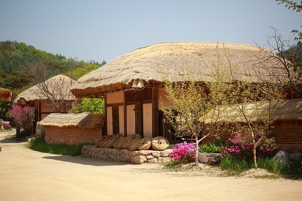
> 图注：第一代住房（就地取材的原始庇护所）

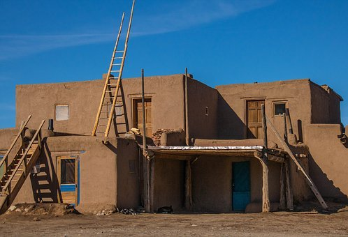

> 图注：第二代住房（砖石结构的农耕时代定居点）

> 图注：第三代住房（钢筋混凝土构筑的现代城市森林）

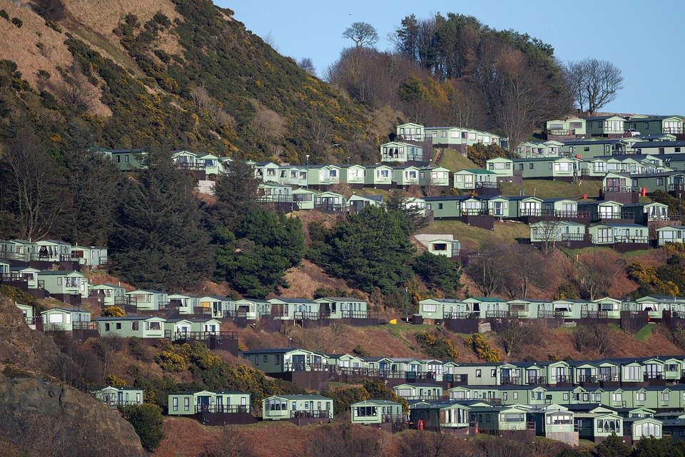
> 图注：第四代住房（高度工业化、可移动的新型居住单元）

至于爱斯基摩人的雪屋或游牧民族的毡房，属于特定极端环境下的特化产物，由于缺乏普适的舒适度与现代卫生条件，不在本书的通用讨论范围之内。

## 2.2 重新定义“移动住房”：它不是房车，也不是集装箱

一提到“可以移动的房子”，很多人脑海中浮现的要么是穷游博主的房车，要么是工地上脏乱差的活动板房。为了打破这种刻板印象，我们必须重新定义什么是真正面向未来的“移动住房”。

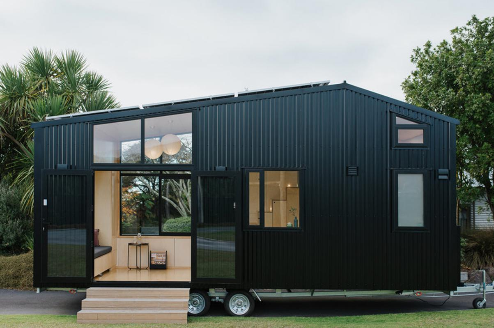
> 图注：极具现代设计感的拖挂式房车（图片源自 yanko design）。移动住房的质感与它类似，但逻辑完全不同。

目前市面上的“类移动产品”，都可以看作是第四代住房的粗糙雏形，但它们都有致命的缺陷：

1. **活动板房（太廉价）**：铁皮夹泡沫，隔音极差（风吹雨打自带立体声音效），保温拉胯（冬冷夏热），寿命只有区区三五年，仅仅是灾区或工地的临时凑合。
2. **集装箱房（太死板）**：虽然钢体结构一体成型、坚固耐用，但天然保温差，隔音也不理想，更致命的是缺乏通用的水、电、燃气模块化接口，且移动时必须重度依赖大型起重机和拖车。
3. **自行式房车（太昂贵且空间局促）**：移动性最佳，但价格高昂，因为你花大价钱买了一套复杂的汽车动力系统。如果长时间停放在营地，发动机和底盘就是巨大的资源浪费。且内部空间过于逼仄，短途旅游尚可，长年居住则极易引发幽闭压抑。

真正意义上能够承载普通人长期稳定居住的“新型移动住房”，需要在上述产品的基础上进行迭代，具备以下三个核心特征：

### 2.2.1 移动化（剥离动力系统）

与自行式房车不同，新型移动住房通常不需要自带发动机、方向盘或复杂的汽车传动底盘，仅保留居住舱本身。其日常主要处于静止居住状态；当由于工作变动等原因需要长距离迁移时，可通过呼叫专业的重卡拖挂服务完成城际转移。这种设计旨在大幅降低购房者的初始购置与长期保养成本，同时保留**“在必要时可以整体搬迁”**的物理灵活性。

### 2.2.2 模块化（标准化部件与可维护性）

传统高层住宅常将水管、电线等管线预埋在混凝土结构中。由于管线的物理寿命（通常约 20-30 年）往往低于建筑主体寿命（50 年以上），后期的暗管漏水漏电常常需要破坏墙体才能维修，导致维护成本高昂。
相比之下，移动住房的墙体、水箱、管线、电器等部件可采用标准化、可拆卸的模块化设计。当某一管线或部件老化损坏时，可以单独抽出并替换新的标准件。这种模块化的维修与升级逻辑，在理论上能够显著降低房屋全生命周期内的维护难度。

> 图注：传统建筑中复杂的预埋管线，一旦老化，维修成本极高

### 2.2.3 接口化（标准化的资源补给）

水、电、燃气、通信光纤等管线连接，应采用统一的标准化接口。
当停放在拥有配套设施的标准化营地时，可通过营地接口桩快速接入市政网络；若停放在无基础设施的场地，则可通过预约专业“补给车”来维持运转。定期进行加注净水、抽排污水及黑水、回收垃圾、补充燃气或氢气，可通过类似于上门服务的网络（如每两周一次）来实现日常消耗的闭环。

## 2.3 居住体验的核心要素

控制初始成本并不意味着必须牺牲基本的居住质量。要让移动住房从临时性住所转变为可长期居住的空间，需要在以下三个核心指标上达到现代民居的基本要求：

**1. 极致的保温隔热。**
保温做透了，能耗才会降下来，室温才能真正做到冬暖夏凉。这是决定睡眠质量和肉身体感的第一要素。

**2. 通透的采光与空气。**
居住空间再紧凑，也绝不能像地下室一样憋闷。科学的通风流场和充沛的自然采光，是让人身心愉悦、免于抑郁的基础。当暖暖的阳光洒进室内，空间的局促感会被极大地对冲掉。

> 图注：明亮的采光与通透的视野是居住尊严的底线

**3. 不妥协的卫浴系统。**
这是一切生活品质的命门。人类文明的发展史，某种程度上就是一部厕所进化史。发达国家与发展中国家、城市与乡村的差距，最直接的感官体现就是卫生间。移动住房必须搭载毫不逊色于星级酒店的抽水马桶（或干湿分离的堆肥/降解马桶）和恒温淋浴系统，绝不能有一丝一毫的异味与简陋。

> 图注：舒适的现代卫浴系统是不可触碰的体验红线

## 2.4 落地场景与成本测算

移动住房若要具备普及的潜力，其总拥有成本必须能够显著低于传统商品房，从而为工薪阶层提供经济上的可行性。

**预期的落地场景：**

- **乡村及市郊自有土地**：可放置于合法的宅基地或自有院落中。在不涉及户籍与学区强绑定的前提下，可免除部分物业管理费用，提供较为自由的居住空间。
- **城市周边的标准化营地**：有别于目前高密度的休闲房车营地，理想的居住型营地应当保证基本的物理间距与隐私。例如采用“一户一院”模式，每户分配 70 平米左右的独立地块，并配备基础的安全门禁系统。

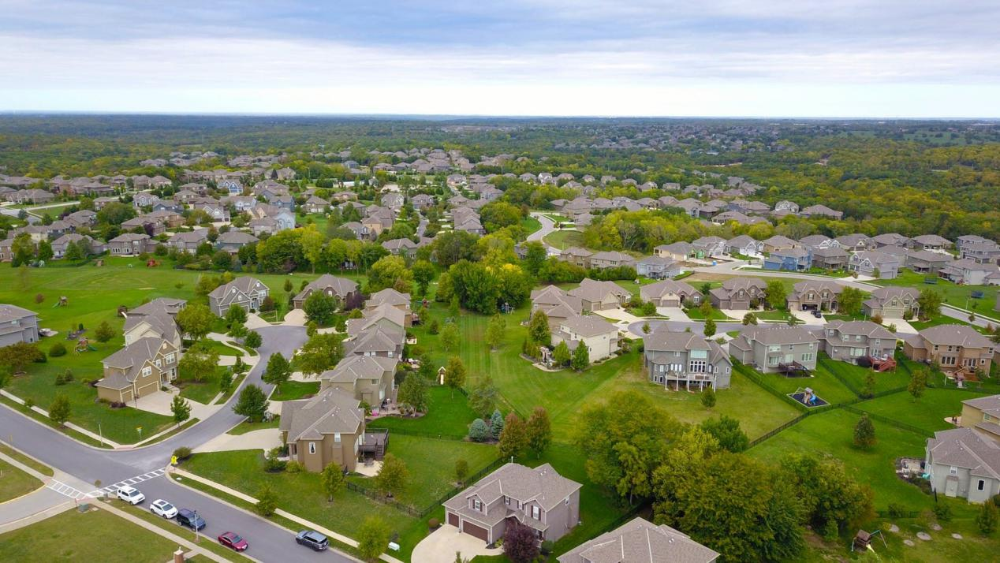
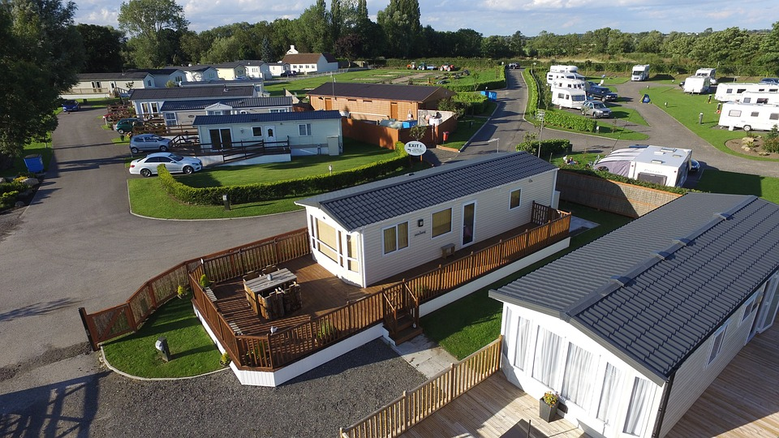
> 图注：欧美常见的宽阔居住营地

出于土地可重复利用的考量，营地内部划分不宜采用永久性的砖石水泥围墙。作为替代方案，可采用透风且具一定遮挡性的绿植藤蔓（如蔷薇、月季等带刺植物）作为自然屏障。配合红外夜视摄像头与报警系统，能够在控制建设成本的同时，保障住户的安全与隐私。

> 图注：绿植围墙与智能安防系统是营地隐私的保障

**一笔清清楚楚的经济账：**
我们以一辆长 11 米、宽 2.5 米、高 3 米的标准化移动住房为例（两室两厅一厨两卫的紧凑布局），来看看它的制造成本（参考目前网商平台中档建材价格估算）：

1. 房体高强度钢架与底盘管道布线：约 10,000 元。
2. 三明治保温墙体材料（约 244 平方米，每平米按 300 元高标计算）：约 73,350 元。
3. 拓展机构（升降墙体或滑移舱）的电机、滑轮与线束：约 1,000 元。
4. 集成水箱、精密过滤系统与增压泵：约 3,000 元。
5. 门窗五金、高级锁扣与合页（估算 100 件）：约 2,000 元。

基于上述估算，**裸房硬件材料成本约为 8.9 万元**。若计入人工与运输的溢价（约 2 万元），单台定制的初始成本约为 11 万元左右。
如果未来能够引入新能源汽车的规模化流水线制造模式，供应链成本有望进一步下探。理论上，**基础款的裸房售价有望控制在 6 至 8 万元区间。**
若加上齐全的家电与内部软装配置，整体投入可控制在 **20 万元人民币以内**。在材料维护得当的前提下，其设计寿命预期可达 20-30 年。

**日常使用成本估算：**
以一家三口的常规消耗为例：电费约 220 元/月，水费 100 元/月，燃气 80 元/月，宽带 100 元/月，全年基础水电网开销约 6,000 元。
加上假设的营地基础租赁费用（依地段差异较大，以保守估算 2,000-5,000 元/年计），以及可能发生的偶发性跨城拖车费（约 1,000 元/次）。
**全年的居住维持开销可控制在 1 万至 1.5 万元左右。** 与大城市的租金或按揭贷款相比，具备显著的经济负担优势。

## 2.5 概要设计：把房子变成“带底盘的智能硬件”

为了在现行的公路法规内合法运输，移动住房的设计尺寸必须卡在红线之内。
根据 GB 1589-2016《汽车、挂车及汽车列车外廓尺寸、轴荷及质量限值》，半挂车最大长度 13 米，宽 2.55 米，高 4 米。

> 图注：GB 1589-2016 尺寸限值示意图

为了兼顾空间与运输，我们将主体外部尺寸设定为：**长 11 米 × 宽 2.5 米 × 高 3 米**。加上重卡半挂车 0.7 到 0.9 米的底盘高度，整体运输高度刚好贴在 4 米的合法限界之内。

在这个极限空间里，我们要塞进供三口之家体面生活的“两室两厅一厨两卫”。它的设计原则必须是：**如无必要，勿增实体；毫米必争，立体利用。**

### 2.5.1 三明治保温墙体

墙体总厚度控制在 50mm 左右，防燃等级达到 B1 级。

- **外层**：铝合金或高强度玻璃钢，抗造、防生锈、抗紫外线。
- **中层**：聚氨酯高密度硬泡板，保温、隔音的绝对主力。
- **内层**：环保木塑板或竹木纤维板，防虫防潮，且没有任何甲醛困扰。

所有构件间采用高级五金铰接与汽车级橡胶密封，做到绝对的风雨不透。

### 2.5.2 底盘：高度集成的底层设备舱

整个底盘高度约为 200mm（尺寸 11000×2500×200mm），这是整栋房屋实现资源储存与设备运转的核心区域。

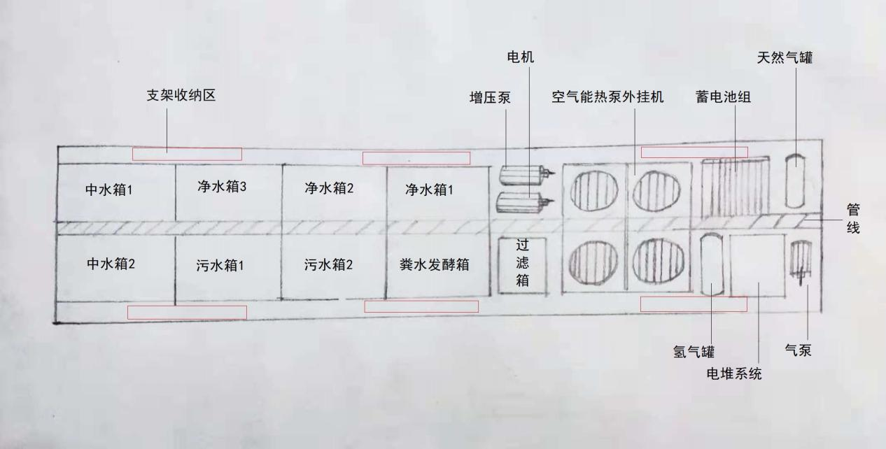
> 图注：底盘系统草图。合理分配的水箱与能源模块。

底盘内部不仅是储物空间，更是整栋房屋尝试脱离市政管网的“生态微循环处理舱”。这里排布着一套旨在探索“长效离网续航”与“环境友好”的水与废弃物处理系统：

- **净水模块**：配备 3 个容积合计约 600L 的净水箱，保障一家三口的日常清洁与饮用需求。
- **灰水与厨余综合处理中枢**：传统房车对洗澡、洗衣和厨房污水的处理仅仅是“存起来等排放”，这极大限制了离线续航。本系统尝试引入在家庭园艺中已被验证的**波卡西（Bokashi）或 EM 菌厌氧发酵技术**，将灰水管路与厨余发酵桶联接。果蔬皮和残渣在发酵中产生的富含益生菌和有机酸的副产品（EM 活性液），被引入灰水箱以抑制腐败菌繁殖并分解油脂。
  - **客观局限**：必须承认，这种“以废治废”的生物技术在小规模家庭应用中确实有效，但它对用户的操作精度（如发酵菌的配比、温湿度控制）有一定要求。若控制不当，仍可能产生异味。目前它更多是作为一种前沿的生态辅助手段，而非完全免维护的工业级净化。
- **黑水极限资源化单元（微型干湿分离生态马桶）**：为了告别传统房车极易发臭且需频繁倾倒的黑水箱，新型移动住房倾向于采用欧美离网小屋（Off-grid cabin）中常见的**干湿分离堆肥马桶技术（Composting Toilet）**，并试图将其进一步微缩化、自动化：
  - **尿液回收（液相）**：前沿方案是引入在农业污水处理中成熟的**鸟粪石（Struvite）结晶沉淀法**。通过自动添加镁盐药剂（如 MgO），锁定尿液中发臭的氮磷营养盐，转化为无异味的清液和高肥力晶体。**客观而言，这项技术在大型污水厂已极度成熟，但在微型家用设备上的自动化与药剂投加稳定性，仍是各大厂商正在攻克的工程难点。**
  - **固态好氧发酵（固相）**：大便与厕纸不再与水混合（彻底切断恶臭温床），落入底部的恒温搅拌舱。使用木粉、谷壳等干粉作为辅料，配合排气扇和自动翻拌，使排泄物在好氧菌作用下快速脱水降解。
  - **真实的用户体验折中**：虽然这种马桶能大幅拉长脱网时间，但它并非完美。它不能像城市抽水马桶那样“一冲了之”，仍需要用户定期（如数月一次）手动清理干燥的腐殖质，并且对通风防虫有较高要求。

这套水资源、粪便与厨余垃圾的源头生态闭环系统，代表了移动住房对脱网生活的勇敢探索。

**我们必须客观看待它的成熟度：** 它的底层技术在农业与离网建筑领域均有应用，但将其完美集成进狭小的移动底盘中，并在免维护性上媲美城市管网，需要一定周期的工业迭代与用户的习惯妥协。
然而，**它的战略意义依然是决定性的。** 它使得房子不再是一个必须时刻插在城市排污管网上“吸血”的寄生体。即便在使用初期需要部分手工介入，它也已经成功打碎了传统房车“每隔两三天就得四处找营地倒屎倒水”的物理魔咒，让“带着房子去远方”真正从一场苦修，变成了一种可持续的现代生活方式。

在微气候调节方面，目前传统房车多采用“驻车空调 + 燃油/燃气暖风机”的组合，虽然成熟但能耗和噪音较高。对于长租停放的新型移动住房，未来更理想的方案是引入**微型空气能热泵系统**（或变频多联机）。虽然目前受限于设备体积、抗震要求和较高的初始成本，空气能热泵在移动空间中还不常见，但在追求极致能效的全电化趋势下，它能够以极低的电耗同时解决冷风、地暖和生活热水，是未来微型空间能源管理的重要演进方向。

### 2.5.3 室内布局：空间复用与立体设计

现有的房车布局虽然精巧，但往往受限于车身走廊式的单线布局。

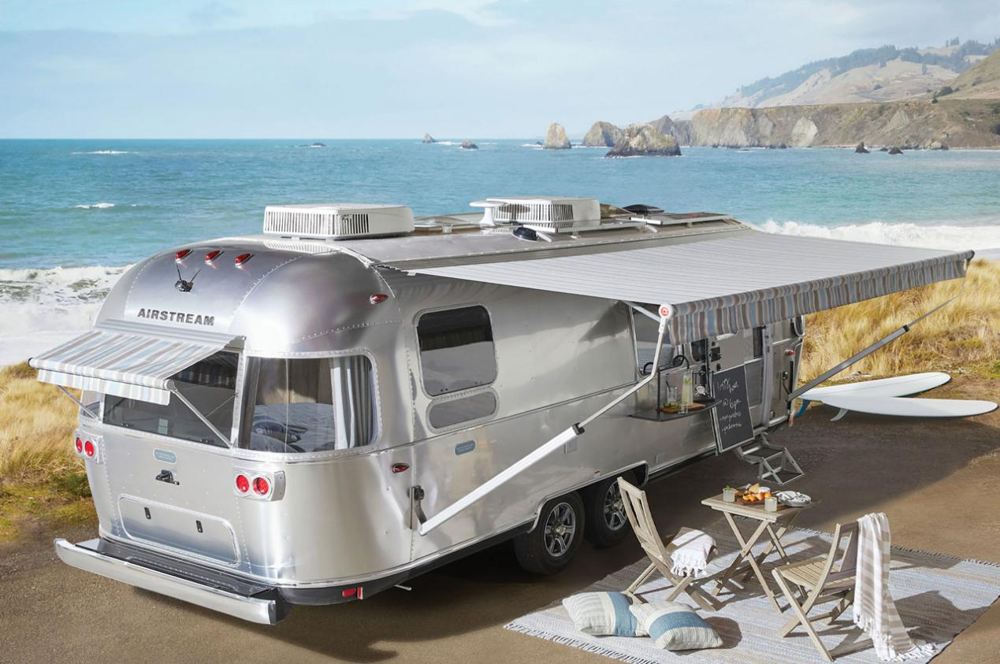
> 图注：铝合金外壳的经典流线造型，防锈坚固。

> 图注：传统的房车内部平面布局图

在极为有限的投影面积下，可通过“立体空间复用”来提升宽敞感。
一个可行的思路是**将卧室与客厅的空间功能在时间段上进行错峰重叠。**
例如，取消固定大床，改用由高强度静音电机驱动的**升降吊床**。白天起床后，被子都不用叠，一键将床铺升至天花板隐蔽锁定，底下的空间瞬间变成宽敞的大客厅；到了夜晚，按键降下，客厅秒变温馨的主卧。这种设计可以有效节约传统卧室所占用的平面面积。

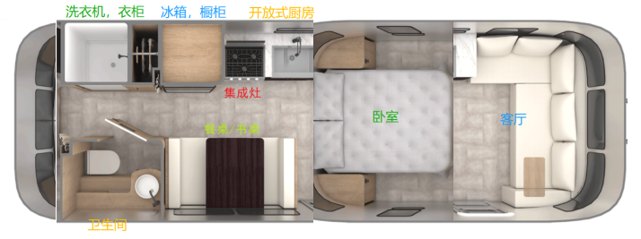
> 图注：改良后的空间布局规划，通过升降床大幅扩充公共活动区。

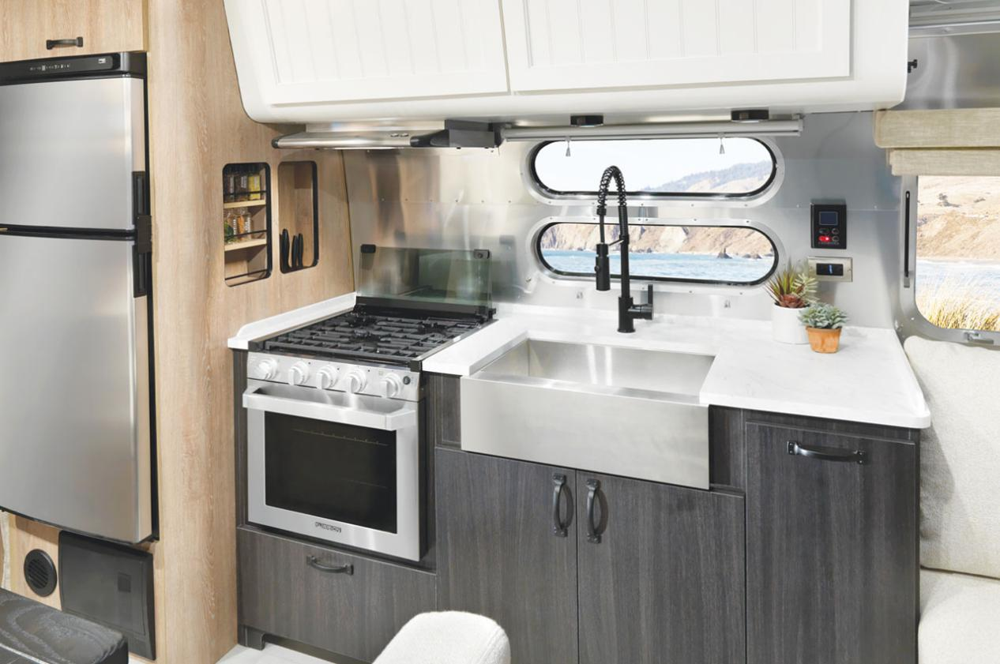
> 图注：空间利用率极高的微缩起居室示例

厨房区域同样抛弃繁冗，采用占地极小、抽油烟效率极高的**集成灶**，蒸烤一体，无需再被零碎的微波炉、烤箱占用宝贵的台面空间。

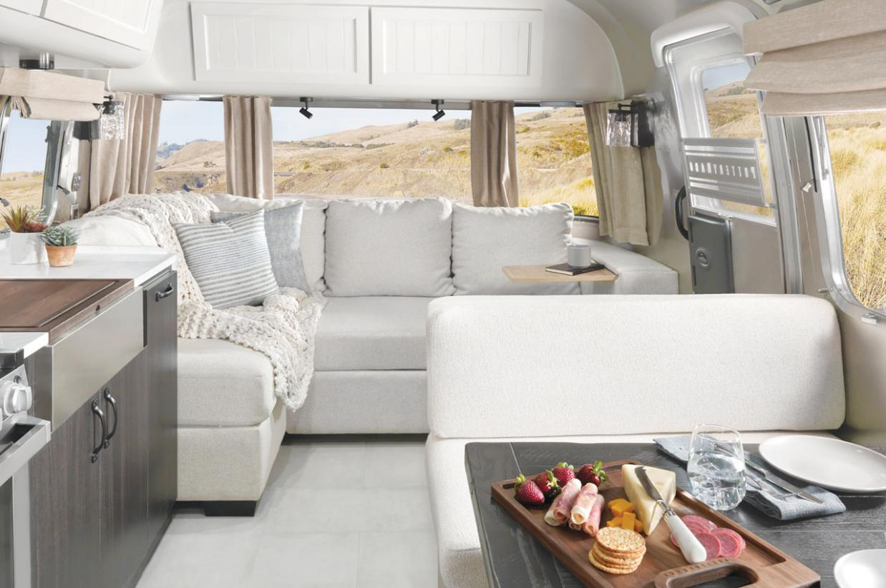
> 图注：紧凑却功能齐备的集成厨房设计（图片源自 yanko design）

经过上述物理层面的架构推演，一款造价预期可控、符合公路合法运输标准、具备灵活迁移能力且舒适度有保障的“移动居住单元”，在技术与成本上是具有一定可行性的。

过去十几年间，我国在新能源汽车、动力电池、新材料以及智能家居领域积累了庞大的工业产能与成熟的供应链。这些跨界技术的沉淀，实际上已经为这种新型住房的制造业化奠定了坚实的工业基础。

总体而言，移动住房从概念走向现实，技术层面的障碍正在逐渐消除，未来更多的考验将在于土地政策、营地法规以及市场接受度的多重验证。
