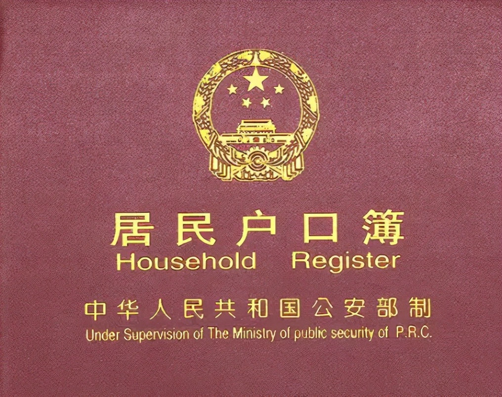
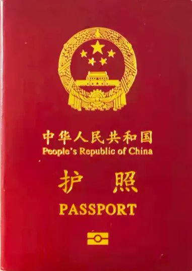

# 第3章 制度与人口流动约束

> 讨论户口、教育、高考与人口流动对居住方式选择的影响。

如果说技术决定了“房子能不能移动”，那么制度决定的就是“人能不能轻松移动，移动之后会不会立刻掉进新的坑里”。很多人以为自己在做住房选择，实际上是在为孩子教育、社保接续、医疗便利、考试资格和身份稳定性被迫买单。

在这个意义上，户口、高考和公共服务的分配方式，长期以来都在深刻塑造中国人的居住半径。它们未必总是明文禁止人口流动，却经常通过抬高迁移成本、制造身份差异、捆绑关键资源的方式，把一个家庭对“在哪里住”“要不要买房”“是否留在大城市”的判断，硬生生推向焦虑和保守。

## 制度约束如何影响居住选择

从居住决策的角度看，制度约束主要通过以下几条路径起作用：

1. **把公共服务与地域绑定。** 当入学、医保、社保、保障房、车辆指标等资源在不同城市之间难以无缝衔接时，人们就会为了获得这些资格而被迫固定在某地。
2. **把教育机会与住房绑定。** 一旦义务教育、高中升学和高考报名受到户籍、学籍或居住年限影响，房子就不只是居住空间，还会变成教育资源的门票。
3. **把流动风险转嫁给家庭。** 对年轻人而言，工作机会通常在流动中产生；但对有老人、孩子的家庭而言，频繁迁移会带来照护、上学和就医的不确定性，因此很多家庭只能采取“一个人流动、全家人固守”的折中模式。

也正因如此，讨论“移动住房”时，不能只盯着交通和建造成本，还必须看制度对流动性的惩罚有没有真正下降。制度越松，人就越能按照真实的工作机会和生活偏好重新分布；制度越紧，房子就越不是房子，而是资格容器、焦虑容器和家庭的长期枷锁。

## 户口和户籍

家为户，人为口。公民在当地公安户政部门完成登记后，形成法律意义上的户籍记录。传统上，户口曾长期区分农业户口与非农业户口，并衍生出家庭户、集体户等管理形式。近些年，很多地方在制度上已推动农业与非农业户口性质合并，但户籍所在地与公共服务之间的关系并未完全消失。

从治理逻辑上看，户籍制度从来不只是一本“身份登记簿”，更是一套与财政供给、公共服务和人口管理死死捆在一起的分配体系。大城市之所以长期对落户设置门槛，本质上就是优质教育、医疗、交通、保障房等资源不够用，于是地方政府便通过积分、社保年限、学历、房产、人才引进等条件来筛人、分层、控制人口导入节奏。

> 图注：户口本

户籍，是国家户政机关记载住户人口基本信息的法律记录，通常以户口簿等形式呈现。它记录自然人的姓名、性别、出生/死亡日期、亲属关系、婚姻状况等信息，是身份证件申领、婚姻登记、教育报名、社会管理等事务的重要基础。

通俗来说，日常口语里的“户口”，往往就是指这一整套户籍身份与所在地绑定关系，而不只是那一本户口本。

在现代社会，一个人如果没有被正常纳入户籍登记体系，很多基本身份事务都会遇到障碍，身份证件申领、上学、就业、婚育登记、出入境证件办理等都会受到影响。也正因如此，户籍看似只是登记制度，实则是个人嵌入社会治理体系的入口。

> 图注：护照

为追求更好的工作和生活，年轻一代的农村人口往往更愿意进城落户。但对中老龄群体而言，问题就残酷得多：一旦离开原有熟人社会和土地依托，却又没有稳定工作、连续社保和足够高的养老金，进城并不天然意味着更好的生活，反而很容易陷入“农村回不去，城市留不稳”的两头落空。

近些年，户口政策总体趋势是在放松，尤其是中小城市和部分省会城市，落户门槛已经明显下降。但必须看清，**“能否落户”** 和 **“落户后能否享有等量公共服务”** 根本不是一回事。真正卡住人口流动的，不只是户口迁移手续本身，而是户口背后那一串教育、医疗、社保与住房保障权益。

## 户口相关的资质

如果说户口是一把总钥匙，那么它过去打开的绝不只是“身份”这一扇门，而是一整串与城市生活密切相关的资格。近些年，这些资格与户口的强绑定程度确实在减弱，但远没有消失到可以高枕无忧的地步。

### 1. 车牌摇号

现在，各地市的户口对车牌摇号的影响很弱了，可以用社保或居住证替代，而且随着自动驾驶时代的临近，私家车的优势逐渐消失。车牌摇摇无期，不如坐等自动驾驶。

### 2. 房子

其实户口和房子不是法律上必须绑定的，但现实里有了房子通常更容易提高落户稳定性；除了炒房客，很多家庭买房根本不是为了改善居住，而是为了落户、保学位、方便孩子上学和高考，居住本身反而退居其次。

这也是中国楼市最拧巴、也最真实的地方：房子被硬生生买成了“制度接口”。它既是居住空间，也是教育门票、身份凭证和家庭安全垫。只要这些功能没有真正剥离，房地产就不可能只按纯粹的居住逻辑定价。

### 3. 教育

随着居住证与随迁子女入学政策不断推进，义务教育阶段对户口的单一依赖已经有所减弱，但不同城市、不同学段、不同学校之间，实际执行口径仍有差异；真正最硬的约束，很多时候还是在中考分流、高中阶段和高考报名资格上。

买房落户，是众多家庭为孩子考上国内名校铺垫的第一步。进入公立学校后，还会报各种补习班、XX竞赛，其目的，都是为了加分，拿到更高的分数——名校的入场券。

教育资源之所以会不断资本化、房产化，本质上是因为优质学位供给长期不足，而家庭又普遍把教育视为向上流动最稳、最硬的一条路。于是，“住在哪里”很快就会被替换成“孩子能进哪所学校”“未来能在哪个省份参加高考”。

综上来看，户口在很多领域的垄断权确实在逐步丧失，但它与教育路径、尤其是与升学节点的绑定，仍然死死拽着大量家庭的居住决策。但高考制度，将来会变成什么样呢？

### 4. 居住证与常住人口身份

在很多城市，居住证已经承担了越来越重要的过渡功能。它既不像正式户口那样意味着完整的户籍迁入，也不再只是“暂住登记”的旧概念，而是常住人口纳入本地治理与服务体系的一种接口。对流动人口而言，这种制度设计是进步，因为它意味着“先常住、再融合”，不必所有人都先把户口迁过来，才能获得最基础的城市服务。

从长远看，如果教育、医疗、社保、住房保障等公共服务，能够更多按照**实际居住和稳定缴费**而不是单一户籍地来配置，那么人口流动对买房的依赖才会继续下降，居住方式也才可能真正灵活起来。

## 高考

参加高考，从原则上说并不只是一条“在校生专属通道”。不少地区允许社会考生以个人名义报名，制度上也并非完全以学籍为前提。分应届生（当年高三毕业的学生）和社会考生（应届生以外的考生）。社会考生除了不能报提前批的院校和部分专业，其高考试卷、录取分数、入学待遇通常与应届生接近。

但高考真正牵动家庭焦虑的，不只是“能不能考”，而是“在哪里考”。由于各地在报名条件、录取结构、招生计划和教育资源供给上存在差异，高考在现实中仍然带有强烈的地域属性。对于很多家庭而言，孩子在哪个省份上学、在哪个城市参加考试，影响的根本不是几张表格，而是未来几年的住房、工作和生活布局。

高考和户口的绑定，刺激了楼市需求，进一步推升了房价。但谁曾想，由于高房价等原因年轻人不愿多生，人口增长明显放缓，使得“高考需求”减少，楼市增长少了一大助力。

除了高考，还有中考、小升初。进入XX重点、XX附中、XX实验班，通常就意味着更高概率进入名校。正因为升学竞争被层层前置，所以住房焦虑也被层层前置，不少家庭在孩子很小的时候，就已经开始为“未来可能发生的考试”提前交钱。

人往高处走，水往低处流。追求更好的教育资源、圈子，这无可厚非。只是，经费、师资等明显失衡，有失公允。如果能切实解决这些失衡，没有了激烈的择校竞争，各种培训班的热度想不降都难。

> 图注：不能输在起跑线

没有学区房就创造学区房，没有学校就创造学校，部分房地产商深谙此道。  
但当学校的真实目的不是为了教书育人，而是为了上市敛财，就必然出现掐尖抢生源、高薪抢老师的现象。

教师同区流动岗和高中名额平均分配，能够退一部分学区房的烧，但解决不了城乡教育差距的问题。城乡差距，不单单在教育上，还存在医疗、就业、基础设施等层面，是个老大难题。

因此，从一定角度看，部分核心城市和学区片区的房价，确实就是被教育利益链硬顶上去的。这也就不难理解，为什么当校外培训、“掐尖”、择校竞争被压缩时，所谓“学区房永远保值”的神话就会开始露出原形。

### 高考为什么会影响人口流动

高考看起来是教育问题，实则也是人口流动问题。因为一旦一个家庭把孩子的受教育连续性放在优先级最高的位置，父母的工作流动、居住地点和置业方式就都得围着它打转。

典型情况有三种：

1. **为了学位而买房。** 即便家庭原本不想在大城市长期定居，也可能因为孩子的教育安排而被迫提前买房、锁定片区。
2. **为了稳定而不敢换城。** 很多人明明有更好的工作机会，却因为孩子正在关键学段，不敢轻易搬家。
3. **为了成本而家庭分居。** 一方留在教育资源更好的城市陪读，另一方去外地工作挣钱，形成“人随工作走，家随教育留”的割裂状态。

### 高考路线

首先要明确，义务教育≠公立教育。  
走高考路线，可以在公立学校上学，也可以在私立学校或者其他地方。总之，能够进行人文和自然科学学习就行。

进不了好的公立学校，可以考虑进好的私立学校；  
如果好的私立学校也没有，或者太贵，也可以考虑更灵活的教育路径，例如线上课程、线下小班、兴趣训练与家庭教育相结合。当然，这条路对家庭的时间投入、自律要求和合规边界要求都更高，不是嘴上说说就能走通的。

> 图注：足球

> 图注：合唱团

> 图注：水彩

高考之后，除了大学教育，还有职业技术教育，但国人认同度较低。有专家认为是“万般皆下品，惟有读书高”、“劳心者治人，劳力者治于人”这些旧观念导致。诚然，但两类教育在教学质量、升学通道、校企对接和社会回报上的现实差距，也是无法回避的。  
同样是追求实用主义，德国的职业教育做得比较好，我们照抄了却相差甚远，值得深思。

### 非高考路线

不走高考路线的，可以考虑成人教育、开放大学、在线教育等替代性学历路径，考试通过后同样能拿到相应文凭。此外，尽早考取企业普遍认可的技能证书、积累真实项目经验，往往比空有一张文凭更直接。

有一定经济基础的家庭，也可以考虑留学或跨境职业教育路径。不同国家和地区的费用、语言要求、签证政策、就业回流难度差别很大，真正重要的不是“去哪儿镀金”，而是所学专业能否与未来职业路径形成闭环。

> 图注：图书馆

## 对移动住房的启示

这一章真正想说明的，不是户口和高考有多复杂，而是：**只要关键公共服务还被牢牢绑在少数城市和少数片区，人就不可能单纯按照居住成本和生活品质来做选择。**

换句话说，妨碍“低成本自由居住”的，往往根本不是房价本身，而是房价背后那整套资格分配机制。只要一个家庭还在担心“离开这套房，孩子就没法顺利上学”“离开这个城市，医疗和社保就会断档”，它就不可能真正拥抱更灵活、更低成本的住房方案。

因此，移动住房要成为普遍选项，离不开两类变化同步发生：

1. **技术变化**：更便宜的移动住宅、更可靠的营地配套、更低成本的跨城通勤。
2. **制度变化**：公共服务更多按常住人口和缴费记录配置，教育资源差距逐步缩小，户籍与住房资格进一步脱钩。

只有当“人可以更自由地流动、孩子不必再为一套房绑定未来、老人也能跨地区稳定获得基本保障”时，居住方式才会真正从“买资格”转向“买体验”，从“沉重定居”转向“灵活安家”。

随着社会发展，户口、高考的角色不断在变化。无论怎么变，不变的是——想要保持社会竞争力，就得不断地努力奔跑，终身学习，随时充电转型。
