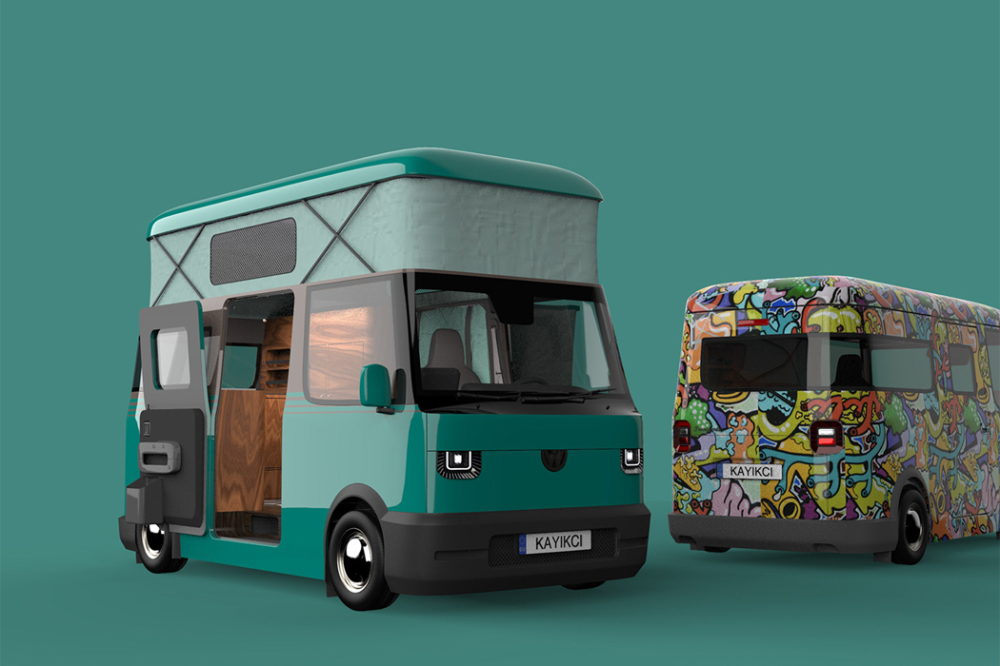
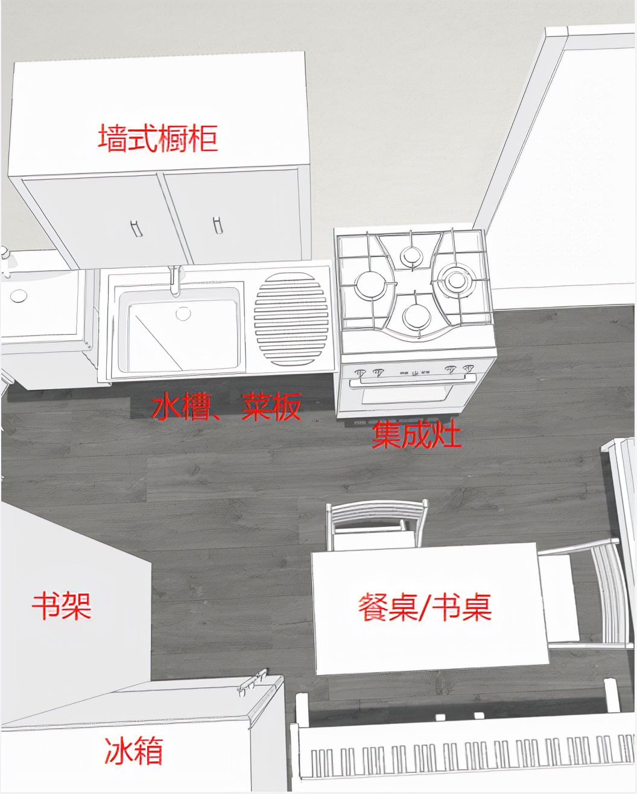
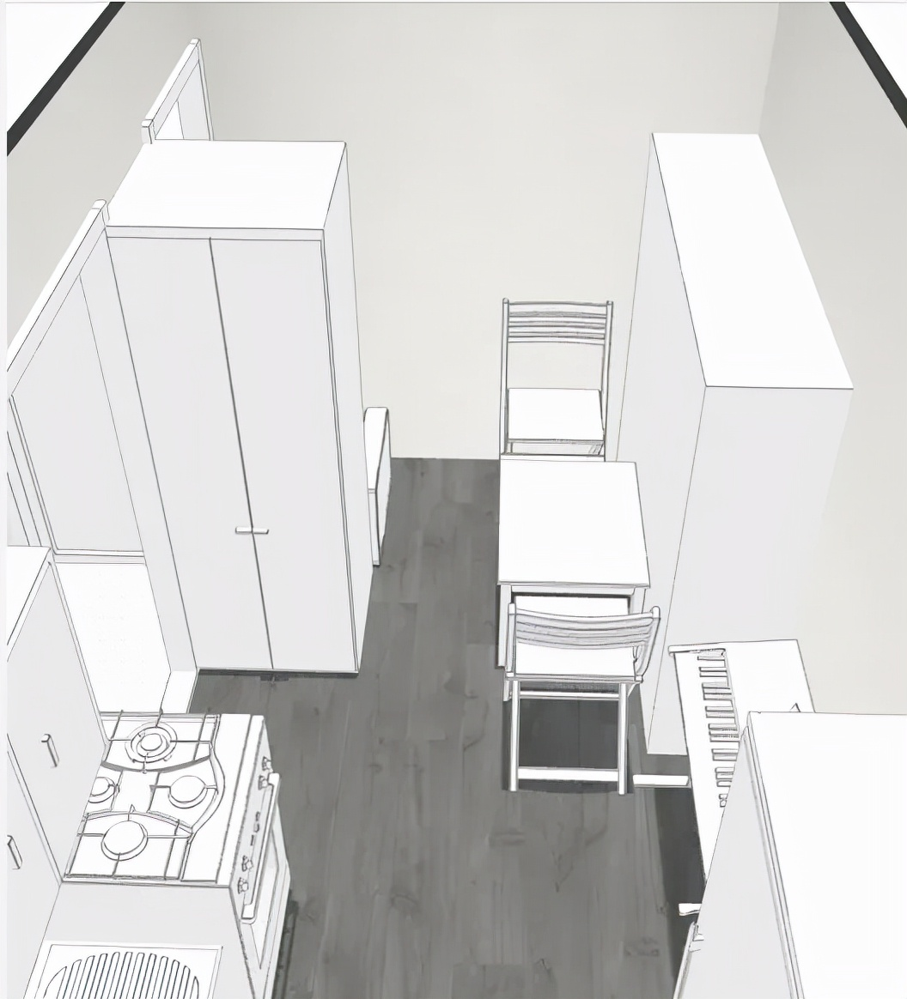
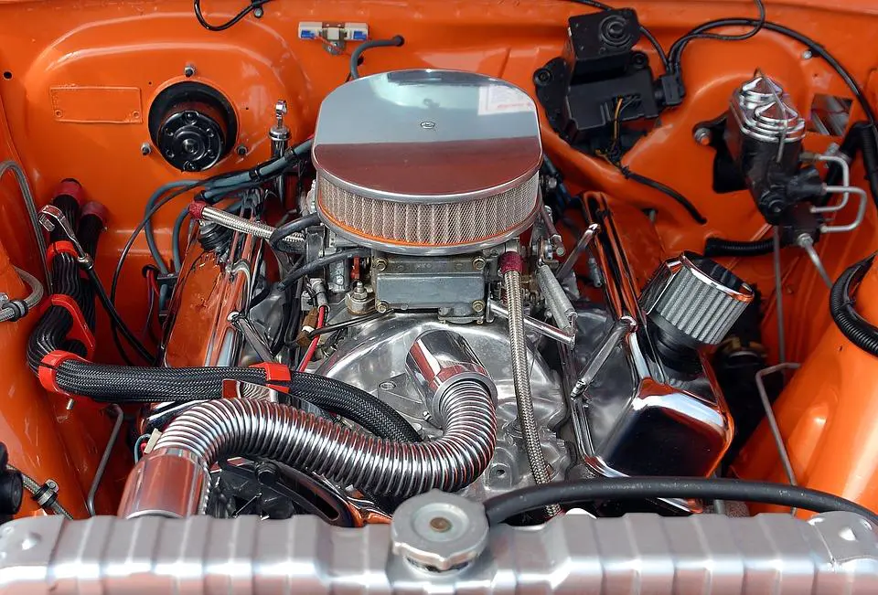
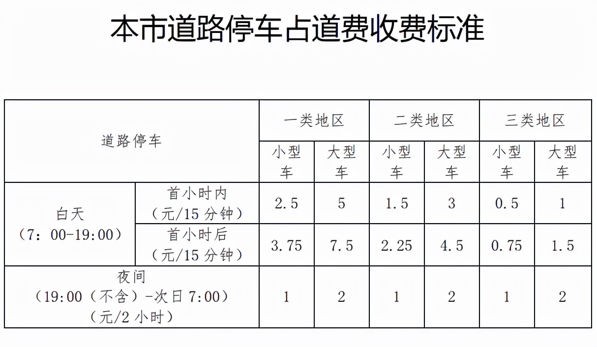
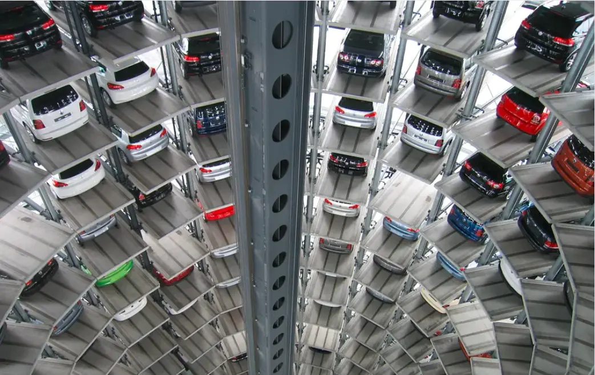

# 第4章 核心产品方案：电动房车公寓

> 集中呈现电动房车公寓的用户定位、内部设计、补给、驾驶、停放与通勤方案。

## 方案概述

### 电动房车公寓

> 图注：图片源自 yanko design

### 居住在房车，已经不是新鲜话题。看似方便，实则痛点不少，比如：

房车价格高，

水电补给难，

房车营地贵。  
在此，根据现有的技术条件和常见基础设施，笔者提出一个新型电动房车设计和居住方案，并给出经济成本可行性分析。

这一章讨论的，不是“周末露营的玩具车”，也不是有钱人的第二套休闲消费品，而是一种面向真实城市生存压力的核心产品设想：**把车做成可以长期住人的微型公寓，把公寓做成可以低成本转移的电动设备。**

传统租房的问题是，房子不跟人走；传统房车的问题是，能走，但住得差、补给烦、停放贵、产品逻辑太偏旅游。电动房车公寓试图做的，是把两边最糟糕的部分都砍掉，只保留真正有价值的能力：

1. **它必须像房子一样能住。** 卫浴、厨房、睡眠、储物、洗衣这些功能不能是“勉强可用”，而要达到长期居住的最低尊严线。
2. **它必须像电动车一样好养。** 构造尽量简单，补能方式尽量接近现有充电体系，避免燃油房车那套高噪音、高维护、高故障率的老逻辑。
3. **它必须像租房一样算得清账。** 一旦总成本明显低于长期租房，它才有资格成为产品；否则就只是一个漂亮的设想。

说得更直白一点，这套方案不是为了让人“去远方”，而是为了让普通人在大城市里少交一点冤枉钱，多保留一点选择权。

### 用户群体

适合单身一族，或者单亲带娃的家庭，新婚夫妻居住可能会略挤。即使没有驾照，也适合买这种电动房车（每周预约一次代驾，60元）。

更进一步看，这类产品最适合以下几类人：

1. **城市轻资产打工人。** 不想把大半收入交给房租，但又不愿意住群租房、地下室或远郊老破小。
2. **工作地点经常变化的人。** 例如项目制从业者、自由职业者、跨区通勤人群，住址的可转移性本身就是一种生产力。
3. **单亲家庭或一大一小结构家庭。** 对空间要求高于单身，但又没有标准三口之家那么大的面积需求。
4. **把“居住成本可控”放在第一位的人。** 他们未必追求体面的大平层，但非常在意每月现金流是否还能喘气。

当然，它也不适合所有人。三代同堂家庭、重度囤积型生活方式、极其依赖学区和固定社区关系的人，都不适合作为首选方案。

### 居住成本费用明细表

不同补给方式价格比较（停车费依据北京市三类地区小型车标准）。

具体内容如下，仅供参考。任何个人或组织、企业请勿抄袭。

从产品定义上看，电动房车公寓的核心卖点，不是“能开”，而是**用小型车的管理成本，换来接近微型公寓的独立生活单元**。只要这个等式成立，它就有现实意义；反之，只要停车费、补给费和购置成本失控，它就会重新退化成昂贵的小众玩具。

## 车内布局设计

这一部分不能只看平面图，更要看居住逻辑。普通房车最大的失败，不是空间小，而是把“旅游过夜”和“长期生活”混为一谈。旅游过夜容忍弯腰、凑合、折叠、将就；长期生活不行。人一旦长期住进去，所有偷懒的设计都会变成每天都要吞下去的烦躁。

相比电动房车这个名字，笔者更倾向于电动汽车，因为它的尺寸较小，C1驾照可驾驶。外径长宽高尺寸为5.95\*2.45\*2.8m，内部空间尺寸为5.8\*2.3\*2.2m。长度小于6m，根据中国机动车规格规定属于小型车，停车位按小型车计费。

把长度控制在6米以内，不只是为了“能开”，更是为了把产品硬塞进现有城市基础设施的缝隙里。超过这个尺度，驾驶压力、停车难度、收费标准、场地适应性都会迅速恶化。产品一旦脱离了现有规则体系，推广成本就会暴涨。

驾驶位在右下角，用单人沙发表示，实际是隔离的封闭空间，既遵守新冠疫情的防控要求，又保护车主隐私不被代驾看到。

驾驶位，也是快递柜，内外均有摄像头，车门使用智能锁。网购后，把单号的后六位设置成有时限的一次性密码，如果不在家，快递员就可以打开放入。

这类设计看似细碎，实则非常关键。因为只要把它作为长期住人的产品，快递、外卖、代驾、上门补给、维修人员都会高频接触这台车。没有清晰的“前台空间”和“私密空间”分隔，住户的安全感会很差，产品就很难进入日常生活。

内部主要分三个区域，三室分离卫生间、开放式厨房、卧室。

把内部功能尽量做成真正的分区，而不是一堆折叠家具临时切换，目的只有一个：**减少日常动作之间的相互打架。** 做饭不应该占掉洗澡的路径，洗澡不应该影响睡觉，洗衣也不应该把整台车弄得潮湿憋闷。空间小不是原罪，功能冲突才是。

### 三室分离卫生间

更衣凳上脱掉衣物，扔进洗烘一体机里，然后直接进淋浴间洗澡。  
淋浴间有风暖系统和伸缩衣架，可以作室内阳台。

卫生间决定了这个产品到底是“可长期居住”，还是“假装能住”。很多房车一进卫生间，人的尊严就开始缩水：转身困难、潮气难散、上下水敷衍、异味处理粗糙。这套方案把更衣、洗浴、洗衣尽量串联起来，本质上是在做一件事：让最高频、最容易出问题的生活流程顺起来。

所谓“三室分离”，不是为了炫技，而是为了降低潮湿、异味和交叉干扰。对小空间来说，分离得越清楚，日常体验越稳定。

### 开放式厨房

气电两用集成灶是开放式厨房首选，油烟吸净率高达99%，具体优点在此不细述。至于做饭使用燃气还是电磁炉，看个人习惯。

厨房是移动住宅里最容易被低估的模块。很多产品为了省空间和省成本，默认用户只泡面、点外卖、不正经做饭。问题是，一旦一个人真的长期住在里面，厨房不好用，生活成本立刻上升，人的耐心也会被迅速消磨光。

如果担心安全问题——其实没有绝对的安全，燃气有泄漏的可能，而电磁炉有辐射。燃气泄漏的主因是构件老化，所以定期及时检修很重要。

现在，新一代的液化气钢瓶自带二维码，可以查到生产商和各零部件的使用寿命信息，每次何时、何地、何人充气或检修，均有记录，全链可查，准确溯源追责。

此外，室内应安装燃气泄漏报警器，监测到燃气泄漏时，会发出不低于80分贝的声光报警，并自动关闭阀门。

> 图注：不同燃气的报警浓度

液化气爆炸的空气浓度范围是1.5% ~ 9.5%。

电动房车可以给燃气使用增加一层安全防护：  
报警器预警时自动启动空调和集成灶的油烟机，以最大功率通风换气，将危险消除于萌芽状态。（如果这时没电了。。。这运气也是没谁了，去买彩票吧）

这类联动逻辑非常重要，因为小空间里最怕的不是单点故障，而是“故障发现太晚”。固定住宅里，燃气泄漏还有更大的扩散空间；在车内，一旦处理迟缓，风险放大得更快。所以这套产品如果要落地，厨房系统、报警系统、通风系统必须从一开始就按一套完整安全链路来设计，而不是后期东拼西凑。

### 卧室

红线标注部位是旋转轴，白天可以把床折叠收起，增大室内走动空间。

床铺的设计原则也很简单：白天别碍事，晚上别受罪。很多所谓“空间优化”说穿了就是让用户不停变形、折叠、搬来搬去，最后把人训练成了家具管理员。折叠床可以有，但不能把收放动作做成每日体力劳动。

### 卧室

车顶是平板型太阳能集热器，无惧冰雹；辅助加热功能，保证冬天也能正常使用。  
车底部是动力系统和电池组（60千瓦时），以及各种水箱。

这里其实已经不仅是“卧室”，而是整车的能源与后勤系统。把动力、电池、水箱都压到车体下部，有利于重心控制，也能把上部尽可能留给人真正要用的生活空间。对这种产品来说，机械系统越安静、越低存在感，居住体验才越接近真正的房子。

车底净水箱尺寸2.0\*1.0\*0.2m，除去保温层，有效容积70%，容纳280L净水，可满足一周的洗衣、做饭、洗漱用水；  
带有水回收功能的10KG洗烘一体机，每次用水50L，每周两次，累计100L。每天洗菜、做饭用水20L，洗漱5L，一周175L。

中水箱同净水箱尺寸，存储过滤后的洗衣、洗澡水，可以拖地、冲马桶等；

热水箱尺寸1.0\*1.0\*0.2m，容纳140L热水，可满足一周的淋浴洗澡用水；每天20L，一周140L。

粪水发酵箱同热水箱尺寸，可容纳一至两周的卫生间粪水和厨余废水。

这些数字真正说明的是：这台车不是靠“天天跑补给”才能活，而是尽量把补给频率压到周级别。只要用户必须两三天就跑一次水电燃气，这种产品就会从住宅退化成麻烦制造机。补给频次越低，它就越像房子；补给频次越高，它就越像负担。

### 燃油房车

当前的各种房车，以燃油车为主，加上花里胡哨的内饰，大多售价较高。常见的内部设计，让人直不起腰的床暂且不说，卫生间设计得更是一副不想让人久住的样子，简直了呀。

此外，燃油房车用电不方便，使用的车载电器大多需要定制，成本更高。有的为解决用电问题，安装了燃油发电机，可是这样噪音很大，生活体验糟糕。

相比燃油汽车，电动汽车没有这些问题，而且构件简单，生产、使用、保养成本都更低。虽然现在已有十几万元的电动汽车，但还是太贵，至少要再降一半，降到平民价才能走向市场化。  
我国有6亿人月均收入不足1000元！

这句话虽然扎心，但非常重要。任何想面向大众市场的居住产品，都必须承认一个现实：真正有规模的用户，不是消费升级人群，而是被房租、通勤和生活成本压得喘不过气的人。价格如果打不下来，再好的设计也只是展会样车。

> 图注：汽车发动机

燃油汽车主要成本在发动机，而电动汽车成本主要在电池。随着电池技术的井喷式发展，价格还有很大下降空间，锂电池并非是唯一选项。10万元以内的电动房车具备量产可能性。

从产业逻辑看，电动房车公寓的希望，恰恰在于它可以吃到电动车产业链成熟后的红利。电驱、热管理、低压电器、智能门锁、摄像头、传感器、车联网模块、储能电池，这些能力一旦足够通用，移动住宅就不必再从零发明一整套昂贵系统，而是可以像拼成熟工业模块那样降低成本。

## 水、电、燃气等怎么补充

居住面临的关键问题：水，电，燃气——用量多少，价格多少，怎么补给。

说到底，移动住宅不是造出来就算成功，**补给体系**才是真正决定它能不能活下去的基础设施。如果补给全靠用户自己东奔西跑，这种方案永远不可能普及；只有当补给像点外卖、叫快递、约代驾一样逐渐服务化，它才会真正像一种可复制的生活方式。

### 补给方式有两种：

定期代驾至快充充电站补给。

另一种则是等待上门补给网络成熟，通过移动充电、送水、收废、换气等服务完成居家式运维。前者依赖现有基础设施，后者代表更完整的未来形态。

### 水

自来水每立方米价格5元，受限水箱体积，每次补给420L，充电站补给成本为2.1元。上门配送较贵，服务费10元起。  
中水和粪水有回收价值，会有厂商做低价回收，假设服务费5元。推荐在充电站免费排放至公共下水道系统。

水系统的关键，不只是便宜，而是闭环。净水、中水、粪水如果能被拆开管理，整车的卫生体验就会稳定得多，也更容易形成标准化运维服务。

### 电

> 图注：充电桩

快充充电站或者换电站比较便宜（有的停车场自带电桩，用电充电更方便）。上门配送可以预约氢燃料电池快充充电车。  
氢燃料电池应用于移动快充充电车，相当于一个超级充电宝，一次加氢可满足几十辆电动车的充电需求，具备经济可行性（使用氢燃料快充充电车，每度电成本约为4 ~ 5元）。

单人生活月用电50千瓦时，夏季较多，可能超过80千瓦时，快充充电站每度电1.8元，电费90 ~ 144元。郊外没有电力设施的地方，可以预约氢燃料快充充电车上门充电，成本略高些，月电费250 ~ 400元（随着氢气燃料成本下降，还有很大下降空间）。

对电动房车公寓而言，电不是“附属能源”，而是第一能源。照明、空调、热水、洗衣、通信、安防都靠它。也正因为如此，60 千瓦时电池并不是为了追求长续航，而是为了给居住功能留出安全缓冲。真正的产品思路不是“开很远”，而是“住得稳”。

### 燃气

### 燃气

液化气站若和快充充电站紧邻，补给会方便很多。  
上门配送15KG的液化气罐，一次120元左右，可用一至两月。

从长期看，燃气最好被理解为补充能源，而不是唯一能源。能电气化的模块尽量电气化，燃气保留给高热负荷、应急或用户习惯难以替代的场景，这样整套系统才更容易维护，也更容易被更严格的城市管理接受。

### 冬季取暖

可以租用柜式可移动燃气取暖器（有倾倒保护、缺氧保护、熄火保护等装置，体积如同一个登机箱），以便检修和充丙烷，过了冬季不必再放在车里。（即便有缺氧保护，也应注意取暖时要保持空气流通）  
取暖成本约1元/小时，即用即开，一月720元。实际没这么高，可能连三分之一都不到，因为大部分人不会全天在家。

冬季热管理是这类产品能否在北方落地的生死线。保温差一点、漏风多一点、换气粗糙一点，最后都会转化成高能耗和差体验。所以取暖设备只是补丁，真正的核心还是整车保温、密封与热桥控制。

### 上网

使用车载4G/5G移动上网终端，费用和宽带相当，年费1500左右。

在今天，网络已经不是锦上添花，而是水电气之外的第四基础设施。很多人之所以还能接受小空间居住，前提就是线上娱乐、远程办公、网购和线上服务足够成熟。断网的移动住宅，很快就会从“灵活”变成“闭塞”。

### 安全

一颗摄像头比两堵墙更有威慑力。如果有骚扰或威胁，先报警，再开车转移。尽量停在有安保服务的停车场。停郊区的道路停车位时，不要一个人住在太偏僻的地方，尤其是单身女性。

安全问题不能被浪漫化。移动住宅最大的优点是能走，最大的弱点也是“看起来好像更容易被盯上”。因此这类产品的安全，不能只靠车门厚不厚，而要靠**停放地点、照明条件、摄像记录、远程告警、快速转移能力**共同构成。它不是绝对安全，但至少不该让住户毫无反制能力。

## 怎么驾驶

自动驾驶普及之前，每隔一两周可以让代驾去附近的快充充电站补给水电燃气。  
对代驾人员而言，20公里交通半径往返，加上水电燃气补给时间大约一小时，服务费60元，一天9单，月工作日21.75天，则收入11745元。

自动驾驶普及之后，自动驾驶功能可能收费较贵，届时和代驾相比看哪个更划算。

驾驶这一节背后，其实是在回答一个关键问题：**用户到底需不需要亲自会开这台车？** 如果答案是“必须会，而且经常开”，那受众会立刻缩小很多。代驾化、服务化、未来自动驾驶化，实际上是在把“开车能力”从用户准入门槛里剥离出去。

换句话说，这个产品想要扩大用户池，最好让用户把它当成“会移动的家”，而不是“需要经常操控的大车”。

## 怎么停放

由于车身长度小于6m，停在市内较方便。房车营地补给方便，但是大多位置偏远，价格昂贵，不太推荐。

> 图注：北京市

三类地区（五环路以外），停车占道收费标准为每天41元。月停车费1230元。  
停车场按月停车大都会有价格优惠，但是北京市区内停车场价格差异较大，玉渊潭附近的停车场包月150元；中关村西区包月则是500 ~ 800元。

居住在这种电动房车，停车成本决定租房成本，如果你能找到免费的停车位，那你的租房成本就是0。等买这种车的人多了，停车位会变得紧俏。对于届时停车费是否会乱涨，大家不必太过担心。  
涨是肯定会涨的，尤其是三环以内，但是停车费比不上房租，溢价难持久。  
从公共角度看，停车位紧张，应该加快立体停车场的建设步伐，而不是简单的禁停卡堵。

停车，才是这类产品最大的现实约束之一。它比造车更难，因为造车是工业问题，停车是城市治理问题。只要一个城市默认“车只能停，不能住”，这类产品就很难大规模展开。所以长期看，真正需要出现的，不只是更多停车位，而是**面向居住型车辆的合法停放规则、补给接口和分级管理制度**。

> 图注：立体停车场

根据国家部门出台的《关于推动城市停车设施发展的意见》，不但对市场定价进行改革，还明确要求所有停车点的费用必须透明化，同时向社会全面公开。若不符合市场定价标准，则被视为扰乱社会的违规经营。

这意味着，未来如果这类产品真的形成规模，停车收费、配套服务和停放区域边界都更有可能被纳入公开治理，而不是永远停留在灰色地带。这对用户是好事，对产品落地更是必要前提。

## 如何减少上班通勤的时间？

公司周边的道路停车位或停车场，夜间一般都是空的，晚上包月价格100多元。  
预约好代驾，早上上班后让代驾开到便宜的停车场，晚上再开回来。代驾费用+车辆耗电成本 约80元，低于市区一类地区白天停车价格。每月有21.75天需要这样，费用支出1740元，略贵，但节省的通勤时间很可观。  
实际上，不少公司附近的停车场全天包月是低于这个价格的，不必这么麻烦。

这一节其实点出了电动房车公寓最狠的价值：**它不是简单替代租房，而是在重写“通勤”和“定居”的关系。**

传统租房逻辑里，人为了便宜住远、为了上班忍通勤；而这种产品允许人在不同时间尺度上重新分配位置:  
工作日尽量贴近工作地，减少时间损耗；  
周末或阶段性工作变化时，再把整套居住单元挪走。

这才是“移动住房”真正值钱的地方。它卖的不是四个轮子，也不是几块板材，而是让人不必再把未来几年的人生，全部锁死在同一个通勤半径里。

## 这套产品真正要解决什么问题

归根到底，电动房车公寓不是为了证明“车也能住人”，而是为了集中解决传统城市居住中的四个痛点：

1. **房租太贵。** 现金流长期被房东抽走，年轻人很难积累缓冲垫。
2. **通勤太长。** 住房和工作被硬性分隔，时间被交通系统大量吞噬。
3. **搬家太伤。** 一次工作变动，往往意味着重新找房、重新付押金、重新适应环境。
4. **居住太被动。** 租客对空间几乎没有改造权，对未来也缺乏稳定预期。

如果这四个问题不能被明显改善，这个产品就没有存在意义。它之所以值得写进本书，不是因为它新奇，而是因为它有机会把“居住成本”“通勤时间”“搬迁摩擦”这三笔大账同时往下砍。

## 现实约束与下一步演化

当然，这套方案也不是没有门槛。它至少还面临几道硬坎：

1. **法规边界。** 哪些地方可以长期停放、是否允许过夜居住、如何接入上下水与电力，未来都需要更明确的规则。
2. **产品标准化。** 水箱、接口、报警、废弃物处理、消防要求，必须形成标准，否则很难规模化。
3. **服务网络。** 没有代驾、补给、清污、检修、驻车点服务，这个产品就只能靠用户自己死扛。
4. **社会接受度。** 很多人会本能地把“住车里”和“混得不好”画等号，这种偏见不会自动消失。

但反过来看，只要电池更便宜、补给更服务化、停车管理更精细、自动驾驶更成熟，这套产品就会迅速从边缘方案变成有实际竞争力的主流备选。

今天看，它像电动房车；再往前一步，它更像一种低成本、可迁移、可联网、可维护的个人居住终端。那时，人买的不再是一台车，而是一套能够跟着自己工作、生活、迁移的微型公寓系统。
