# 第5章 移动空间的扩展应用

> 把居住之外的移动空间场景归为一组，包括酒店民宿影响、移动会议室与 mini 电动巴士公寓等案例。

这一章讨论的重点，不是“把所有固定空间都搬上车”，而是观察一个更现实的变化：当电动化、自动驾驶、远程调度和模块化内装逐步成熟后，一部分原本必须依附固定地产的服务空间，是否可以变成按需移动、按时停靠、按场景部署的“轻资产空间产品”。

从居住逻辑看，这类变化的重要意义在于，它会让“空间”与“地点”不再完全绑定。过去，人们为了获得会议、住宿、办公、零售等功能，往往必须前往某个固定建筑；未来，部分功能也许可以反过来“来到人身边”。这不代表固定建筑会消失，而是意味着城市空间的组织方式可能出现一层新的弹性。

## 酒店、民宿与移动居住服务

### 对酒店、民宿的影响

这种电动房车普及，会大幅提升自驾游品质，传统酒店、民宿如果不调整，势必会受到冲击。但如果转型及时，利润收入可能不降反升。  
为什么？  
以前旅游住宿，运营方需要有固定的房产，非热门景点空置率高，资金投入大，还要做床品保洁（实际做不做不一定）。

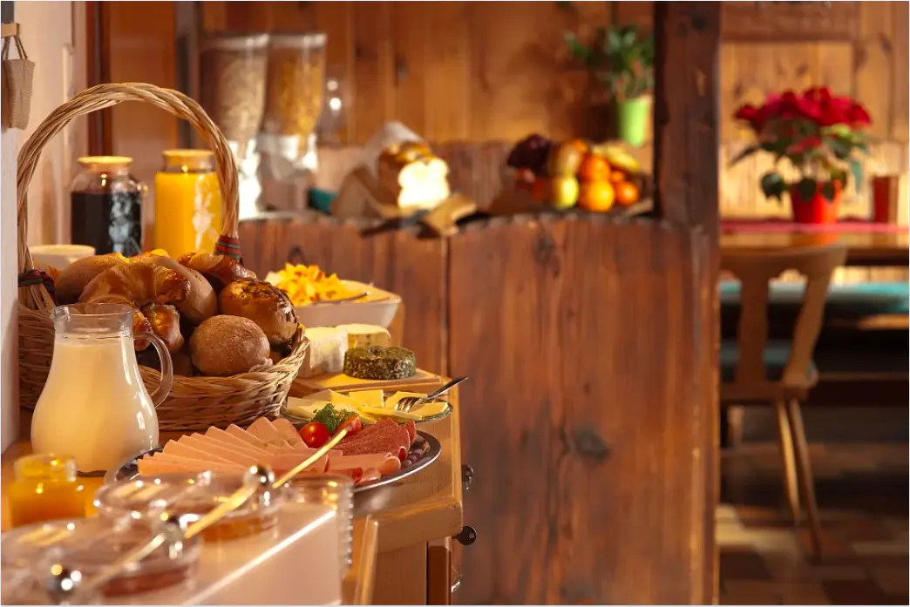

> 图注：自助餐

电动房车普及后，运营方只需要有停车位，能提供水电补给、垃圾分类回收等服务即可。资金投入少，订单量增加，总利润不会太低。运营方之间的竞争点不再是住房是否豪华，而是餐饮、娱乐设施、安保等服务的质量。

换句话说，传统酒店和民宿行业未来未必只会被“替代”，也可能被“重构”。过去比拼的是地段、建筑规模和装修投入，未来可能更多比拼营地网络、补给效率、卫生标准、在线调度、会员体系和目的地内容运营。谁能把“住一晚”做成“住+玩+补给+社交”的综合服务，谁就更有机会从移动居住浪潮里获益。

对景区、郊野公园、县域旅游点和城市边缘休闲区来说，这种模式还有一个潜在优势：它比新建大体量住宿地产更灵活。旺季时可以临时增加停靠位和配套服务，淡季则减少车辆调度，避免传统住宿业常见的固定资产长期闲置问题。当然，前提是地方管理能够跟上，例如夜间停靠、消防、污水处理、噪声控制和公共安全都需要有明确规则。

对于准备落户城市的农村人来说，买房要掏空几代人的钱包，连给父母养老看病的备用金都搭进去了。换来的是什么呢？

房子使用寿命很长，但混凝土建筑内部管线的寿命大都不超过30年，超过年限后，出现跑冒滴漏是常态。  
6米以内的自行式房车，属于小型非营运载客汽车，没有报废年限。

因此，对部分仍处于流动就业阶段、暂未确定长期定居城市的年轻人而言，在城市租/买这种电动房车居住、在老家保留宅基地，可能是一种更轻资产、也更保留回旋余地的过渡方案。至于是否值得因此放弃传统购房路径，还要看工作稳定性、家庭结构、子女教育和本地政策，并不能一概而论。

虽然面积小，  
但是没有了坐电梯的风险，  
或者爬六楼的疲惫，  
也不怕地震，  
甚至能省去一俩小时的通勤。  
有更多的自由时间，  
做自己喜欢的事。

说走就走的旅行，  
周五下了班，  
就能出发!

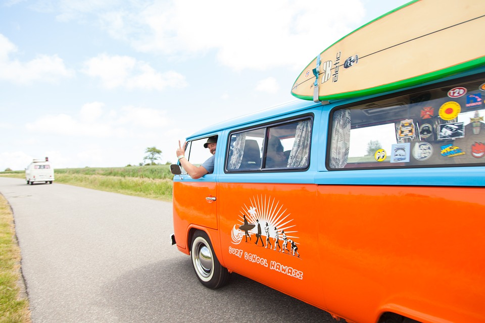

> 图注：出发

## 移动会议室

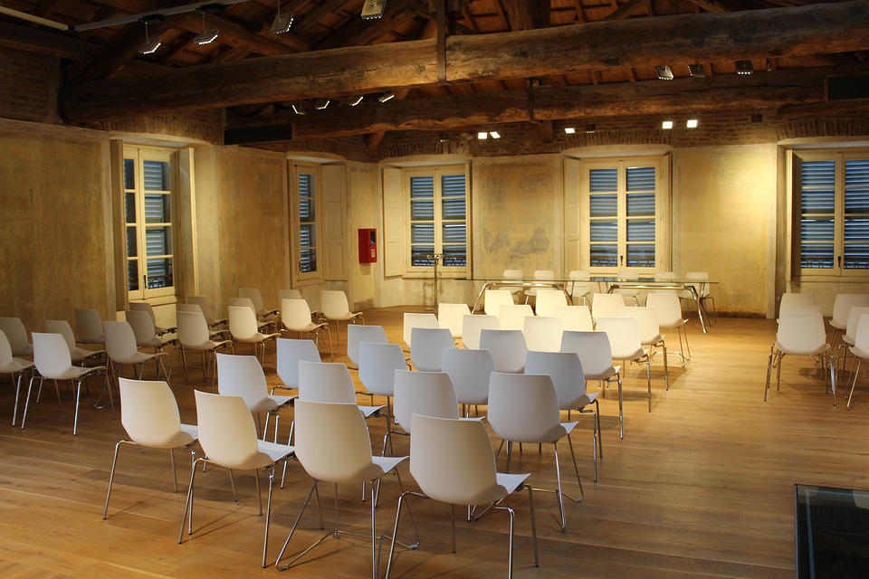

会议室的场地不单单可以用来开会，沙龙活动、茶话会、演讲报告等皆能用。由于是商业性场地，价格往往比较贵，大型的高端会议室日租金甚至高达几十万元。在一线城市，即便是容纳百人的中小型会议室，日租金也和普通民宅一月的租金差不多了。

会议室场地的价格主要受地段、环境和场地大小这些因素的影响。以北京为例，四环周边的中档酒店，100人左右的会议室，租一天（8小时）的费用一般是10000+，即便租半天，也得5000多元；五环和六环周边的酒店会议室，由于离市区较远会便宜些，价格是三四千元起步。这个价格，仅仅是场地的使用费，如果需要其他服务，则额外增加费用。

会议室不像写字楼或者居民楼，很少签长期合同，一般都是短租，日租和按时计费居多。这样就造成了它的空置率偏高，成本通过抬高价格来转移。

这正是“移动会议室”值得讨论的原因。很多活动真正需要的，并不是一整栋长期存在的固定建筑，而是某个时间窗口里的可用空间。如果一个会议空间能够像网约车一样被调度到大学园区、产业园、景区、社区中心、展会外围甚至县城广场，那么场地成本结构就会发生变化：固定建筑成本下降，调度与运维能力的重要性上升。

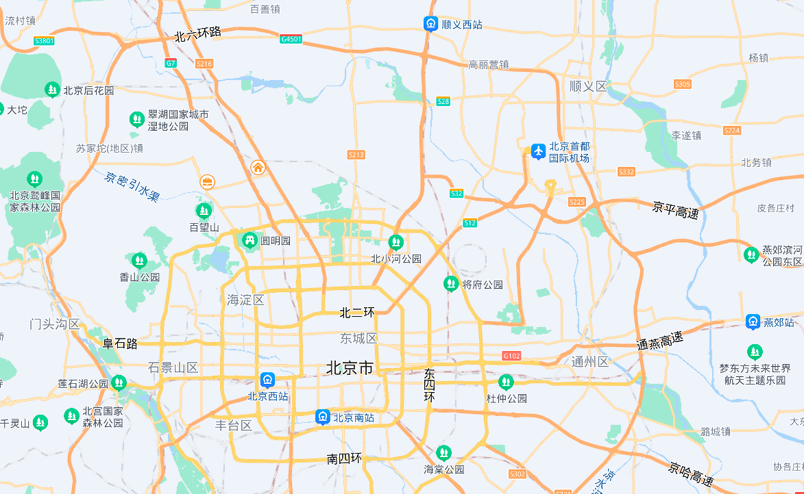

### 移动会议室概要设计

随着电动汽车的普及和自动驾驶技术的落地，笔者认为中小型会议室场地的成本是可以大幅下降的。其外形和大巴车相似，以下是简要设计方案：

长宽高尺寸：12000\*2500\*3500 mm

内部可用空间尺寸：11800\*2400\*2300 mm

车体内部集成有音响、音控、灯光、投影、空调等系统。由于采用无人化的自动驾驶，没有驾驶位。

空间布局上，车体前部分是演讲席；

中间部分是8个1.6\*0.5\*0.7m的长椅，后座均有可折叠收纳的小桌板（类似高铁和飞机上的那种），方便听众做笔记，每个长椅可坐4人；

尾部是洗手池和男、女两个马桶卫生间；

过道宽度0.8m；为减轻空间的拘束感，车体两侧是4m宽的落地窗。

总体上，该车标准容纳人数为33人，具备音控、投影等会议需要的基本硬件设施，自带卫生间，可以满足30人左右的小型会议需求。若未来自动驾驶调度、车辆折旧、停车组织和设备运维都能进入相对成熟阶段，这类移动会议室的主要成本可能转向电费、清洁维护、设备折旧、保险与停车费，而不再主要是高额固定场租。文中这里把“一天300元左右的基础运行成本、600元左右的定价”作为示意性测算，用来说明其潜在成本结构，不代表现实市场报价。[待核实：移动会议室运营成本测算口径]

如果是接近百人的会议，则可以采用三辆协同停靠的方式。这样做的优势不只是便宜，还包括部署快、撤场快、可以靠近用户、适合临时活动和下沉市场。但它也有明显边界：对停车场地平整度、电源补给、卫生管理、噪声控制和周边交通组织都有要求，因此更适合中小型、短时长、标准化程度较高的活动，而不是所有会议场景。

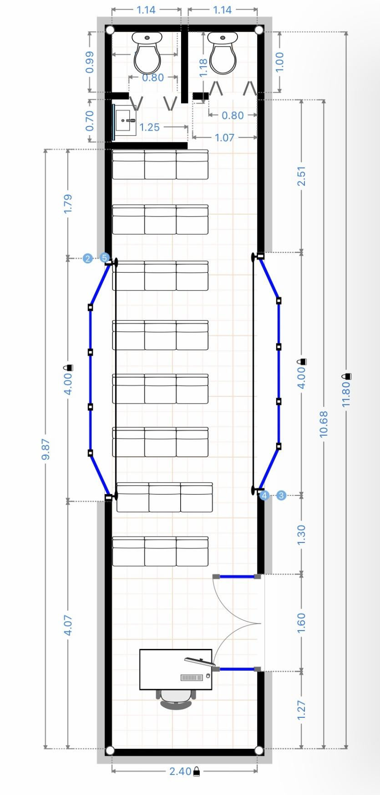

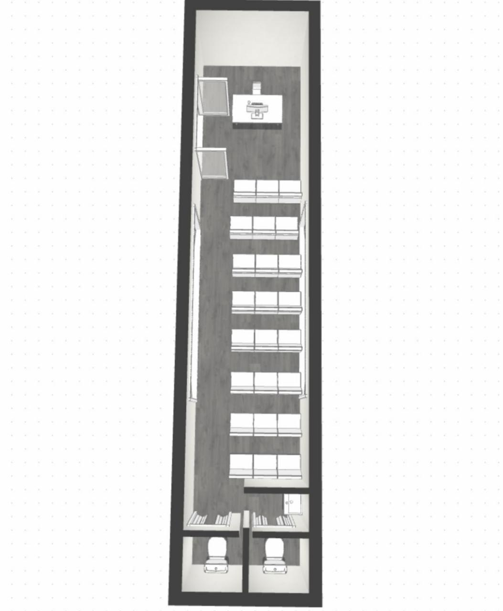

### 模型图

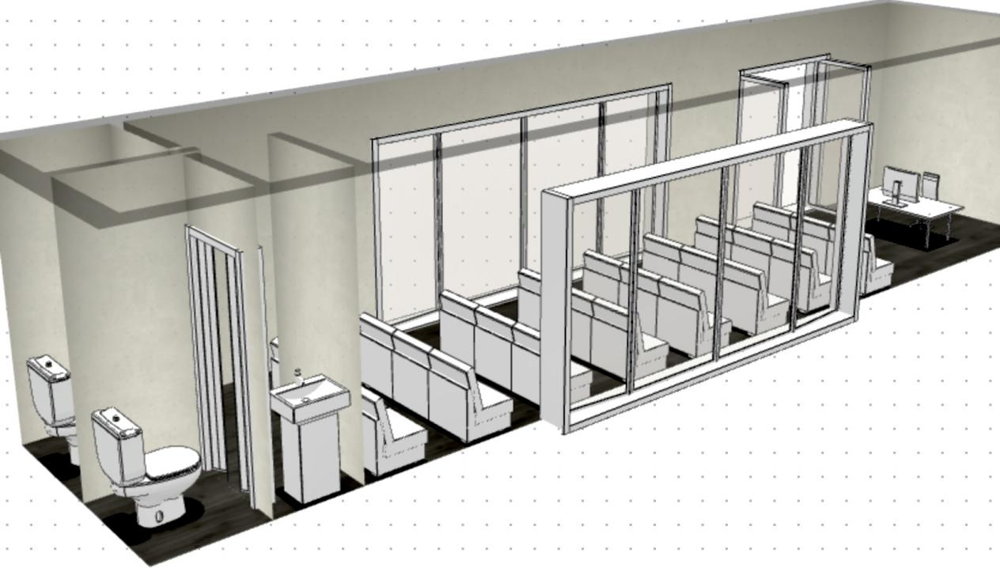

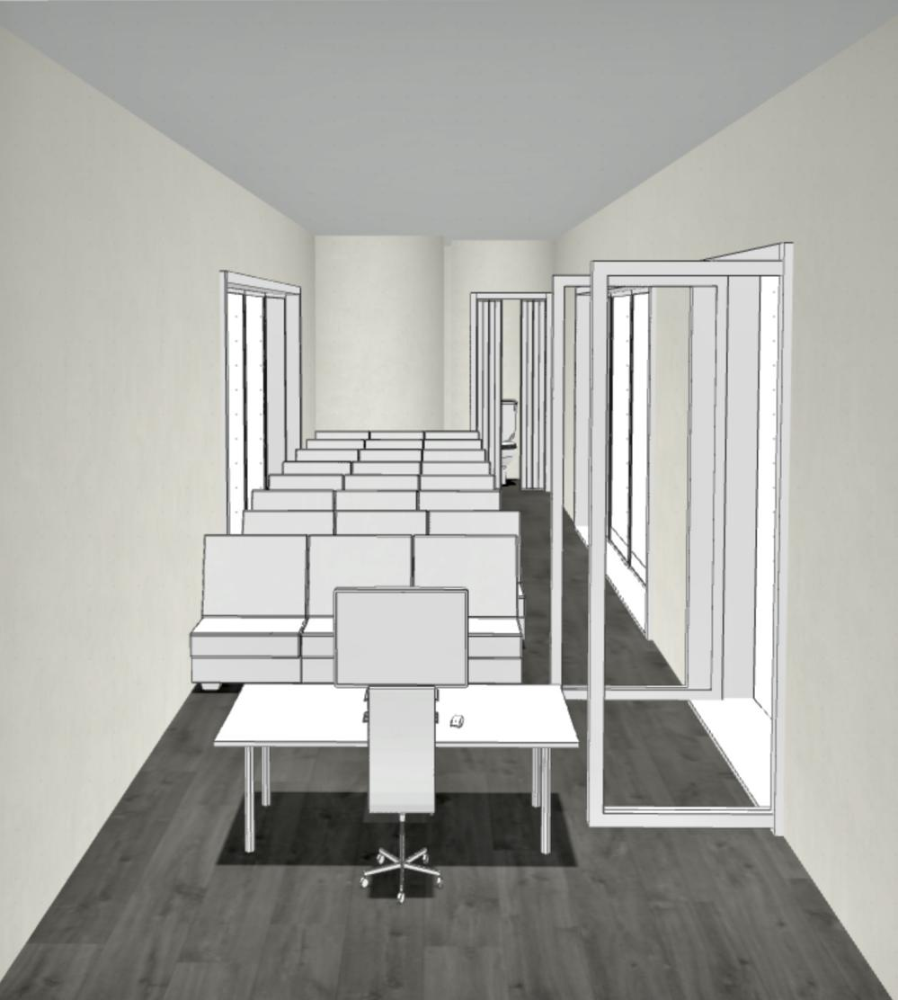

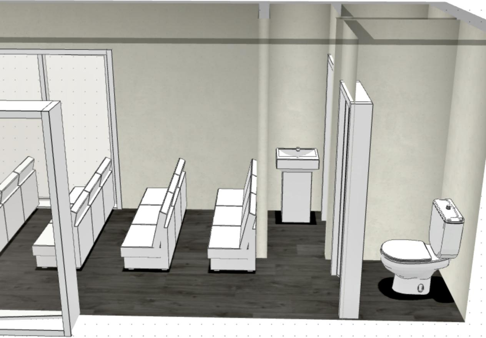

如果是上百人的会议怎么办？稍加改进，也是可以用的。

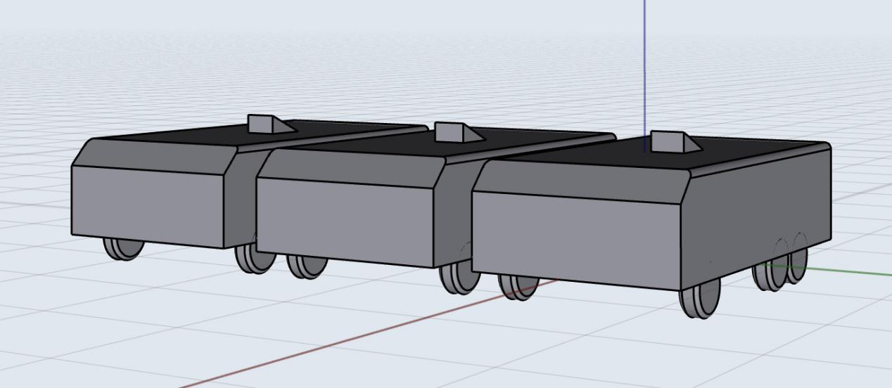

一辆不够就两辆，两辆不够就三辆，只要停车场场地停的下，就能继续加。多辆车停靠在一起，空间很容易相通。

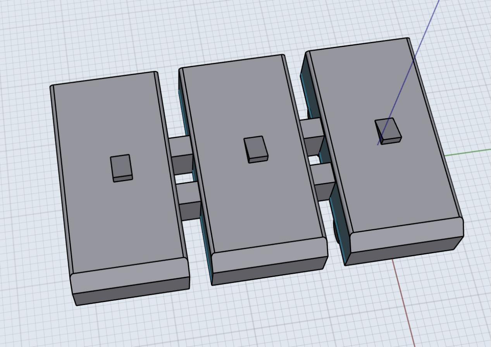

如上图所示，演讲者在中间，左右两边车中的听众可以通过投影同步观看。由于在同一场地，问答交流环节基本不会有障碍。

不只是会议室，很多商业场地都可以做类似的改造，大幅降低场地租用成本。比如移动教室、移动咖啡馆、移动电影院、移动鲜花店、移动工作室等。

### 移动鲜花店

鲜花零售的一个典型难点，是客流与损耗同时存在。固定门店需要承担房租，但鲜花又属于高损耗商品，天气、节日、商圈变化都会影响销售。移动鲜花店的价值，在于它可以把“店”主动开到需求更密集的地方，例如婚礼现场、音乐节、市集、写字楼楼下、医院周边、地铁口和节庆活动区域。

这样一来，鲜花店经营者可以把有限的库存更精准地投放到高转化场景，减少无效陈列时间。对消费者来说，移动花店也更容易形成“顺手购买”的冲动消费场景。未来若接入线上预订和即时配送系统，移动花店甚至可以兼具前置仓、展示柜台和快闪零售三种角色。不过，它仍要解决冷链保鲜、补货频率、城市占道管理与节假日调度等问题。

### 移动咖啡馆

咖啡是非常适合移动化的一类消费品。它对厨房面积要求不算极端，却对位置、氛围和客流非常敏感。传统咖啡馆一旦签下长期租约，就必须承受淡季、工作日与周末客流波动带来的经营压力；而移动咖啡馆可以更灵活地在写字楼、校园、体育赛事、展会、夜市、公园和营地之间切换。

从商业模式上看，移动咖啡馆未必只是“便宜版咖啡店”，它还有可能成为品牌获客工具。对于连锁品牌，它可以承担新品推广、社区触达和活动联名；对于独立经营者，它则提供了用较低初始投入测试产品和客群的机会。当然，真正决定成败的，仍然不是“能不能移动”，而是出品稳定性、排队效率、供水供电、卫生合规与复购能力。

### 移动工作室

“工作室”是一个很宽的概念，可以是摄影棚、直播间、录音室、美甲室、心理咨询室、短视频拍摄舱，甚至是面向设计师和自由职业者的小型共享办公单元。它们的共同点是：对空间有一定功能需求，但对长期固定地段的依赖，往往没有传统门店那么强。

如果移动工作室足够模块化，就可以形成一种新的服务逻辑：不是客户去找空间，而是空间被调度到客户附近。摄影团队可以把移动影棚直接开到婚礼场地；直播团队可以在商圈快闪活动现场开播；设计师和咨询师则可以在社区、园区或县城做阶段性驻点服务。这种模式特别适合需求不连续、但客单价相对较高的服务业。

不过，移动工作室对隔音、隐私、电力、网络和设备减震的要求通常比移动咖啡馆更高，所以它更像是一种专业化场景的延伸，而不是万能模板。换句话说，越专业的移动空间，越依赖标准化改装和稳定运维。

## mini 电动巴士公寓

对于单身人士，如果不想住郊区，又想节省房租，怎么办？

有法子——mini电动巴士公寓。受限于车辆空间不设厨房，只有卫浴间、书房、卧室。舒适度可能差些，但生活居住非常方便。

下班了，把mini电动巴士从停车场一键远程召唤过来。这时车在路上，先在公司附近吃饭，吃完饭车差不多也到了。

有人欢喜有人忧。这时住宿是方便了，可能也意味着加班更频繁了。。。

mini电动巴士公寓的出现，会冲击传统的中低端酒店和公寓行业。但如果酒店和公寓行业能提前布局转型，率先推出mini电动巴士公寓，凭借自身的运营优势和保洁餐饮等服务，低价出租这种公寓，危机就会变成新的机遇。

从产品定位看，这类 mini 电动巴士公寓最适合的，不一定是“长期家庭住宅”，而更可能是以下几类人群：刚进入大城市的单身青年、项目制工作者、季节性就业者、频繁换区工作的服务业人员、展会演出从业者，或短期驻场的技术支持人员。对他们而言，最核心的价值不是空间有多大，而是“离工作地点近、搬迁成本低、切换城市或片区更快”。

如果再进一步设想，这类公寓还可以接入平台化运营：夜间集中停靠在具备卫浴、充电、安保和洗衣设施的服务站，白天根据用户需求在不同片区调度。这样一来，它就不只是“单车式居住单元”，而更接近一种由车辆、营地、补给点和数字平台共同组成的居住服务网络。

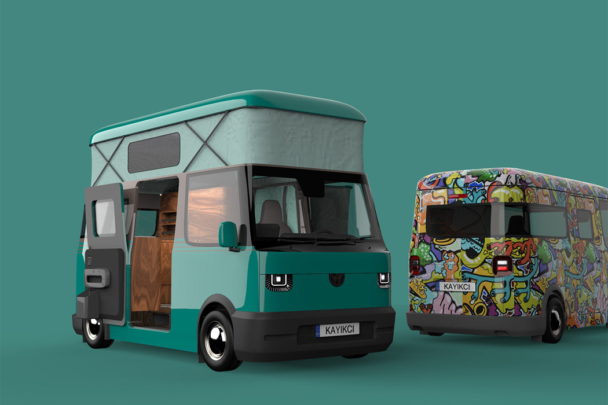

> 图注：图片源自 yanko design

假设简装修的mini电动巴士15万一辆，报废期限20年，作公寓出租1万/年，除去10%的养护开支，扣除成本，还剩15%的利润。那么，其日租金在理想化测算下有可能做到30元以内，但这仍未充分计入保险、停靠场地、平台运营、折旧不确定性和城市合规成本，因此更适合作为方向性示意，而不是现成商业结论。

如果这种 mini 电动巴士正式量产，并形成较完善的停靠与服务网络，它确实可能对高租金、低品质、位置尴尬的传统公寓形成明显压力；但对通学家庭、长期定居家庭和重视完整厨房客厅的人群来说，固定住宅仍会长期存在。更合理的判断不是“谁彻底取代谁”，而是城市会出现更多居住层级：固定住宅满足稳定生活，移动公寓满足高流动性阶段，两者共同构成更有弹性的城市住房体系。

### 本章小结

本章列举的移动会议室、移动零售、移动工作室和 mini 电动巴士公寓，看上去各不相同，但它们背后的共同逻辑是一致的：把一部分原本沉淀在固定建筑中的功能，重新拆分为“可调度的空间服务”。一旦技术、法规与基础设施逐步跟上，城市中最昂贵的资源之一——位置——就有机会被更高频率地复用。

这并不意味着所有空间都应该移动化。凡是对稳定性、长期社群关系、复杂管线系统和多成员共同生活要求很高的场景，固定建筑仍然更有效率。移动空间真正擅长的，是高流动、高时效、阶段性、临时性和可复制的需求。对《移动住房时代，凤凰来仪》这条主线而言，它的意义正在于：居住不再只是“买一套房”或“租一个房间”，而可能逐渐扩展为一组可按人生阶段自由组合的空间服务。
