# 第6章 关键支撑技术

> 把自动驾驶作为应用导入，把 AI 扩展为面向青少年的基础科普主轴，并用电池与氢能解释智能交通的现实边界。

## 6.1 自动驾驶：为什么它需要 AI

这一部分先从自动驾驶讲起，不是为了把它讲成产业新闻，而是为了回答一个更适合青少年读者的问题：一辆车如果想像人一样安全上路，它到底需要学会哪些“智能”能力？带着这个问题进入后面的 AI 基础部分，会更容易理解算法究竟在解决什么。

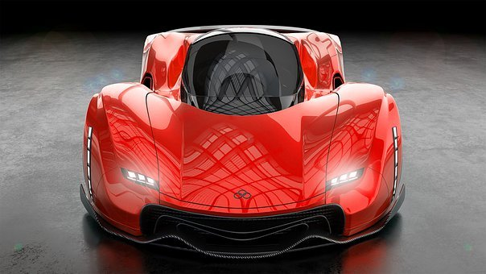

### 6.1.1 自动驾驶分几级

五年前，李世石对战AlphaGo败北，标志着着机器学习进入了新时代。受益于此，汽车自动驾驶领域的研发不断突破。相比人开车，自动驾驶优势很明显：

不会疲劳分心，

不会违反规则，

更加灵敏精准。

自动驾驶的发展分两大阶段：

第一阶段——载物，主要应用在物流行业；

第二阶段——载人。物流验证升级后，自动驾驶技术和法规更加安全完善，开始载人。

现在是两个阶段的过渡期，国家市场监督管理总局对自动驾驶制订出了《汽车驾驶自动化分级》国家推荐标准(GB/T 40429-2021)，2022年3月1日起正式实施。

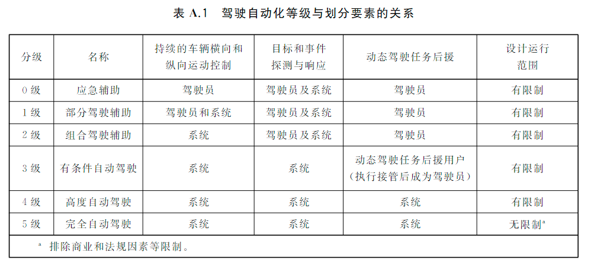

> 图注：国际汽车工程师学会标准

若只从技术目标看，L4级自动驾驶被认为有望覆盖相当一部分城市路况；不过不同公司的测试口径、运营边界和安全冗余并不一致。谷歌 Waymo、特斯拉、百度 Apollo 等都曾给出较高水平的能力表述，但距离大范围、稳定、可复制的城市应用仍有差距。

对于车企急功近利，把L3级的辅助驾驶系统兜售成L4级的自动驾驶，不断发生事故，这是违反法律和道德的问题，不是技术问题。

如同手机的迭代更新，自动驾驶汽车的成本也在持续下降。较早落地的场景主要出现在物流行业，起初多局限于港口或封闭园区，如今正逐渐扩展到物流配送末端。美团、京东、阿里、百度等企业都曾测试自己的无人配送车或无人机。

受新冠疫情影响，由于自动驾驶能有效减少人际接触，相关政策审批有所加速。

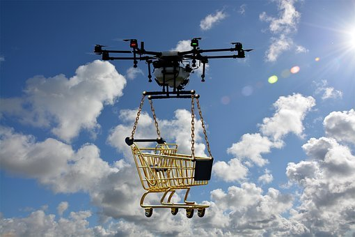

当前自动驾驶普及的障碍主要有两个：

#### 1、政策法规

#### 2、量产成本

此外，还存在一种较少被普通读者注意到的障碍：自动驾驶相关企业的人才流动频繁，技术核心人物出走创业或团队重组，往往也会拖慢商业化进程。

自动驾驶更可能优先在公交、出租车、园区接驳和物流等高频、可调度场景中推广，私家车普及通常会更慢。若未来自动驾驶网约车能够稳定运营、供给充足，其使用成本可能低于部分自购自养车辆，但这仍取决于法规、运力调度、恶劣天气运营能力和平台定价机制。

就像共享单车改变了部分短途出行习惯一样，自动驾驶共享出行也可能改变部分私人汽车的使用方式，但这更像结构性替代，而不是简单的“一刀切”取代。

需要注意的是，自动驾驶的常见载体之一——电动汽车，并不自动等于清洁能源车，因为我国目前的电力结构仍以火电为主。此外，废旧电池回收也是现实难题。若只关心生产销售而忽视回收，环境成本就可能被转移到更长的时间周期里。

### 6.1.2 自动驾驶会带来哪些改变

若自动驾驶车辆能够在闲置时自动调度，停车场的使用方式可能会发生明显变化。过去必须长期停放的车辆，未来也许可以在空闲时参与运营或转移停放。此外，自动驾驶有可能扩大可接受的通勤半径，使部分人更愿意居住在性价比较高的郊区，但这并不必然意味着整体租房成本都会下降。

以30公里通勤为例，坐公交可能需要一个小时左右，打车约半小时。若自动驾驶出行在规模化运营后降低单位成本，其打车费用理论上可能低于当前人工驾驶网约车；但相比住在市中心是否真正划算，还需要把通勤频率、等待时间和房租差额一起计算。

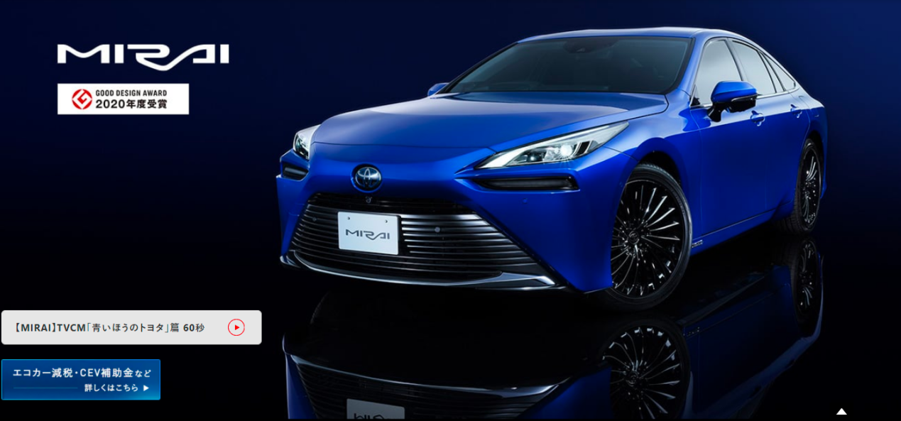

> 图注：图片源自 [Toyota Mirai 页面](https://toyota.jp/mirai/)

使用成本方面，可以参考氢燃料电池汽车——丰田二代Mirai，氢气容量为5.6公斤，可供电70多千瓦时。目前在日本每公斤氢气的价格为1100日元（人民币65元，零售价格，含税，含存储运输费用），加满氢气的成本为364元人民币，续航里程约650KM，相当于每公里0.56元人民币。这样的成本与国内的燃油家用车相当。

按照特斯拉方面公开过的设想，自动驾驶出租车每英里成本可低至0.18美元（每公里约7毛5）；若再计入现实运营成本，此处暂按1元一公里作示意性估算，以对比当前人工出租车约3元一公里的量级。[待核实：自动驾驶出租车单位成本的公开出处与年份]

如果某位上班族住在北京沙河、在五道口附近工作，我们可以用这个场景做一个示意性的往返通勤测算。

若按通勤距离约30公里、高峰期单程45分钟、月工作日20.83天、每公里1元估算，月通勤费用约为1249.8元。若再假设会员制预约通勤可带来20%的降价空间，则约合999.84元。这只是基于若干前提的示意性测算，不代表稳定市场价格。

如果自动驾驶技术真正达到稳定商用，它有机会在安全、便利和可达性方面带来一系列社会效益，降低房租只是其中一种可能结果。下面两个例子更适合作为情景设想：

1 女性在夜间独自乘车的安全性有望提升，例如车辆全程留痕、远程协助和车内监控等机制可能降低部分风险，但并不能保证风险完全消失。

2 在法规和校内管理体系允许的前提下，自动驾驶接送也许能减轻部分家庭的接送压力；例如在家门口上车、途中远程查看状态、到校后再由校方完成身份核验与交接。

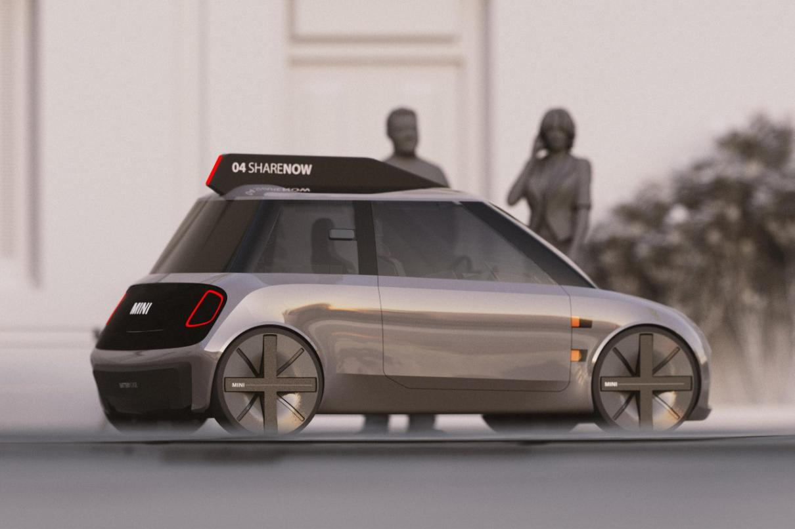

> 图注：图片源自 yanko design

### 6.1.3 自动驾驶为什么离不开感知与算法

自动驾驶的开路先锋当属Alphabet（谷歌）公司旗下的Waymo，于2009年作为谷歌的自动驾驶汽车项目启动，2016年独立成为子公司。Waymo的训练方式除了现实世界道路测试，还有仿真软件的虚拟世界测试。截至2020年，路测累计2000万英里（3200万公里），仿真里程超过100亿英里（160亿公里），测试地覆盖美国25个城市。

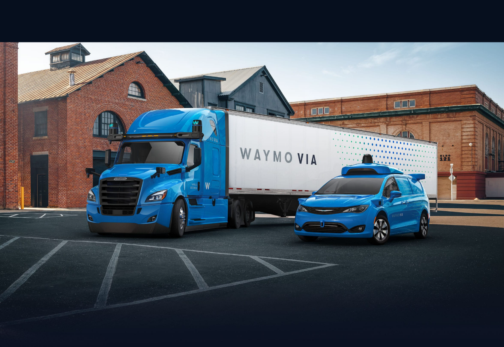

其第五代无人车平台——Waymo Driver，针对四大使用场景：打车服务、卡车运输、货物递送和私人乘用车。摄像头、雷达、激光雷达等传感器和AI计算芯片都接近顶配，仅摄像头就有29颗，此外还配备了清洁和加热系统。硬件配置虽然豪华，但Waymo官方只说性能多么好，对具体参数和实际成本则保持沉默。

2020年10月9日，Waymo正式宣布通过旗下的叫车服务软件Waymo One在凤凰城提供完全无人驾驶服务。

Waymo 的目标一直较高，强调 L4 以上的无人化自动驾驶。但高目标也意味着更长的验证周期和更高的商用门槛，因此其大规模商业化推进速度并不算快。作为行业早期的重要探索者，它在技术示范上影响很大，但在市场扩张节奏上也面临来自其他竞争者的压力。

除了 Waymo，自动驾驶领域还有一家经常被提及的公司是 Mobileye。这是一家以色列汽车科技研发公司，其单目视觉高级驾驶辅助系统（ADAS）曾长期占据较高市场份额。1999 年创立，2017 年 3 月被英特尔以 150 亿美元并购。目前，全球已有大量汽车安装了 Mobileye 高级驾驶辅助系统，奥迪、宝马、通用、本田、现代/起亚、日产、大众等汽车制造商都曾采用相关方案。其被广泛采用，通常与成本、集成度和量产适配性有关。

一个重要原因，是其产品在成本、集成度和量产适配性上确实具有较强竞争力。

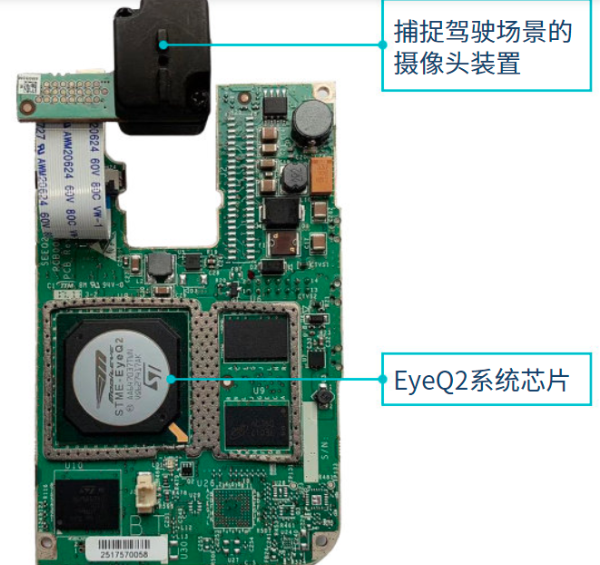

该公司的Powered by Mobileye 产品专为从事高级驾驶辅助系统（ADAS）的制造商而设计。系统包括了一个多合一印刷电路板，由EyeQ2®提供技术支持，是一款专用型视觉计算芯片系统（SoC）。EyeQ2芯片每秒能执行260亿次操作，功率消耗却仅有6瓦。

同时该系统还包括一个摄像头，可以与汽车制造商的其他系统集成，客户用最低限度的软件开发能力便可实现自定义的高级驾驶辅助系统（ADAS）功能。

从技术角度看，自动驾驶分两大路线：

一个是多种传感器融合路线，激光雷达的精准测距，结合毫米波雷达、高分辨率摄像头等多种传感器。设计上冗余较多，说是安全（成本高），大部分厂商采用的是该方案。这种方案看似安全，实际上有不少潜在风险。

首先，多源数据更庞杂，实时融合和处理的难度更高，这可能带来反应延迟；其次，当摄像头和雷达的判断发生冲突时，系统就必须依赖更复杂的权重分配和容错策略来决定该相信哪一路信息。

另一种是纯视觉路线，即仿生路线（人类司机驾驶就是纯视觉）。摄像头模拟眼睛感知路况信息，AI 神经网络系统模拟大脑进行导航决策。看似简单，传感器少，实现却最难。目前特斯拉在纯视觉路线上的态度最为鲜明，其他厂商大多仍在观望。特斯拉这么做并非单纯出于成本考量，更大的目标是开发更具通用性的视觉自动驾驶系统，并尝试把这一路线扩展到汽车之外的应用场景，例如机器人领域。

特斯拉早期曾跟Mobileye 合作，在2014年10月推出了L2级自动驾驶系统 AutoPilot，沿用到了2016年。和Mobileye分手后，特斯拉陆续发布了自研的自动驾驶解决方案——Hardware 2.0（HW2.0），基于 HW2.0 的 Enhanced Autopilot（增强自动辅助驾驶，EAP）和Full Self Driving（全自动驾驶能力，FSD）。目前，最新一代是与博通合作研发的 HW 4.0 自动驾驶芯片，采用台积电 7 nm 工艺制造，预计2021年第四季度开始生产。

纵观特斯拉的自动驾驶产品线，其特点之一是不但软件自研，芯片硬件也尽量自研，体现出较强的垂直整合能力。不过，也有报道提到苹果公司早在 2014 年就开始了自动驾驶 Apple Car 的研发，并曾提出较激进的产品构想。相关设想能否如期实现仍存在不确定性，但如果未来形成更多高水平竞争，通常有利于技术迭代和消费者选择。

特斯拉起初走的并不是纯视觉方案。在发生多次与白色卡车相关的碰撞事故后，其技术团队逐步调整传感器策略，后来开始考虑放弃毫米波雷达。早期激光雷达价格较高，马斯克也曾多次公开表达对激光雷达路线的质疑。很多人因此认为，等激光雷达成本下降后，特斯拉可能会重新采用，但事实并未如此发展。

然而，事情的发展出乎意料，特斯拉非但没用激光雷达，连毫米波雷达也放弃了——宣布使用纯视觉方案。一时在业内引起轩然大波，有的甚至批评特斯拉太激进，置用户安全于不顾。

特斯拉之所以敢于这么做，是因为其 FSD 系统能够利用多相机融合感知汽车周边环境，以 8 个摄像头输入的数据为基础绘制 3D 模型鸟瞰视图，再叠加时间标签形成 4D 的空间道路信息，为车辆规划驾驶路径。根据特斯拉 AI 高级总监 Andrej Karpathy 在 2021 年计算机视觉与模式识别大会上演示的案例，纯视觉方案在部分功能上已经显示出与激光雷达、毫米波雷达方案竞争的潜力。

总而言之，纯视觉路线的自动驾驶难度很高，仍需时间验证；多传感器融合路线则在现阶段更容易形成工程化落地。两条路线各有优势与约束，谁更具长期普及性，还要看成本、法规和安全验证的持续进展。

从技术定义上看，过度依赖高精地图或远程接管的方案，并不等同于高度自主的自动驾驶。更高水平的自动驾驶，通常需要在断网等不利条件下，依靠离线地图、惯性导航和车载感知完成基本自主导航。至于车路协同方案，其价值与边界仍存在较大争议，后续还需要更多工程验证和成本评估。

自动驾驶不可能做到绝对安全。它是否能在统计意义上显著优于人类驾驶，最终仍要依赖长期、大样本、可复核的运营数据来证明。从工程视角看，强调量产落地与持续迭代的路线，通常更容易积累可比较的实际数据。

参考特斯拉在美国的运营数据，在启用自动辅助驾驶功能的驾驶活动中，特斯拉车辆平均每行驶一百万英里发生的事故为 0.2 起，而美国境内车辆平均每行驶一百万英里发生 2.0 起事故，是特斯拉车辆的 10 倍。

总之，自动驾驶大概率会在若干细分场景中持续推进，但它真正走向广泛普及的节奏，仍取决于技术成熟度、法规演进、商业模式和公众信任。

## 6.2 AI 基础科普专题

如果你是第一次系统接触 AI，可以把这一部分当成一条逐级上坡的路线：先理解 AI 在解决什么问题，再理解计算机如何表示信息，接着理解机器怎样从数据中学到规律，最后再回到自动驾驶这个最典型的应用场景。这样阅读时，不容易把术语背成一堆互不相连的碎片。

人工智能（Artificial Intelligence，简称 AI）属于计算机科学的一个分支，本质上是一类通过计算机程序模拟人类部分推理、分析、交流和规划能力的技术体系。这个概念很宽泛，也因此容易被不同公司和产品作不同程度的延展使用。

### 6.2.1 AI 是什么

先分清三个常被混用的词：`人工智能` 是大概念，`机器学习` 是常见方法，`神经网络` 是机器学习里非常重要的一类模型。带着这个框架再往下读，后面的内容就不会混在一起。

人工智能、机器学习、神经网络之间的关系如下图所示

最近几年比较火的卷积神经网络是神经网络算法的改良版。

名词解释 算法：通过计算机指令，按照数学逻辑实现的解题方法。

例如：如何把大象放进冰箱？

可能有的人不了解什么是程序函数，这里举一个自定义加法函数的小例子：

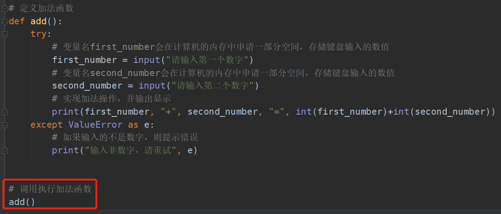

执行程序，输出结果（键盘输入的是绿色数字）

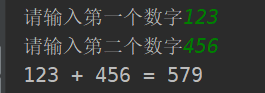

程序员用编程语言写的代码（又名 程序），需要编译器编译一下计算机才能执行。程序代码好比不同语言（python，java，C）的人话，编译器则将这些程序代码翻译成计算机能“读懂”的汇编代码，最底层的硬件可以把汇编代码自动转换成可执行的机器码。

编译器 也是一种程序，可以把程序翻译成计算机能执行的机器指令。

用户运行某程序，就是让程序告诉计算机执行某种指令，产生不同的电磁信号操作，从而达到想要的功能。

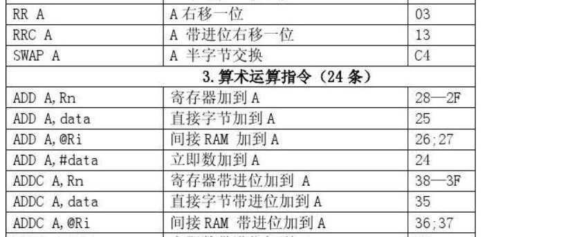

以输出“Hello”字符为例（下图红框部分是汇编代码，黄色区域是机器码）

> 图注：示例来自 [RISC-V 示例页面](http://tice.sea.eseo.fr/riscv/)

人工智能的水平，通常可以理解为其模拟和完成特定智力任务的能力。即便人工智能在某些场景中表现得以假乱真，它是否具有“真实思维能力”仍然是一个涉及哲学、认知科学与技术边界的问题。就当前工程实践而言，它仍主要是在既定目标和规则范围内完成模式识别、预测与生成。

随着人工智能技术的进步，仿真机器人的拟人化程度可能会越来越高，声音、表情、动作，甚至情绪表达都可能更加逼真。届时，关于机器人是否应被赋予更高社会地位的讨论，也许会变得更加常见。

如果把人当成机器看待，会削弱对人的尊严、责任与情感的理解；

如果把机器完全等同于人，也可能模糊主体性、责任边界与伦理判断。

因此，在讨论人机关系时，仍应谨慎区分“工具”“主体”与“责任承担”的不同层次。

### 6.2.2 为什么计算机用 0 和 1

先别急着看模型。任何 AI 系统都建立在一个更基础的前提上：现实世界里的文字、声音和图像，必须先被变成机器能处理的数字。理解这一步，就等于找到了后面所有 AI 内容的共同起点。

#### 二进制

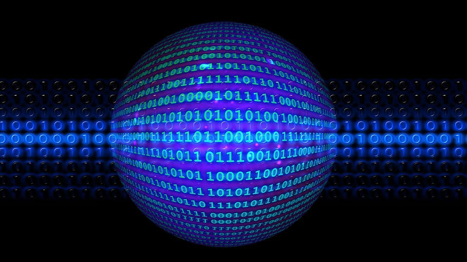

> 图注：比特流数据

在计算机的眼中，所有的数据都是以二进制的形式表达的，即只有0和1，没有0.5之类的第三者。通过解析转码，然后显示成不同类型的数据。计算机之所以采用二进制，主要是因二元状态对电子元件来说比较容易表达——电路的开关，电压的高低，磁性的南北，平面的凹凸等，都适合二进制的形式表达。

#### 二进制的传播与常见误读

关于莱布尼茨与二进制的传播，还有不少带有演绎色彩的民间说法，阅读时应注意区分史实与趣味联想。

类似地，人们也常把《周易》、算盘等传统文化对象与现代计算机思想联系起来。这类联系在启发层面颇有意思，但若要上升为严格的技术史结论，仍需要更审慎的证据支持。

1位数字代表1比特（bit），8比特 = 1字节（byte）。数据在不同设备或元件之间以比特或字节的形式传输，如同水流，故被称作比特流或字节流。

我们在通信运营商办理宽带或者光纤服务，会涉及到“带宽”这个概念，这里的带宽指的就是bit位，即每秒能传输多少比特位的数据。这个“带宽”除以8，就是我们通常拷贝文件的速度（文件大小的单位是 字节）。简单说，如果你在运营商购买了10M（bit）的宽带服务，那么网络流畅的情况下，下载文件的速度是1M（byte）多一点。

#### 从摩尔斯电码到数字信号

除去停顿，摩尔斯电码的信号单元有点（·）和划（—）两种，发送信号时也就是短按和长按的区别，因此我们可以看作0和1。

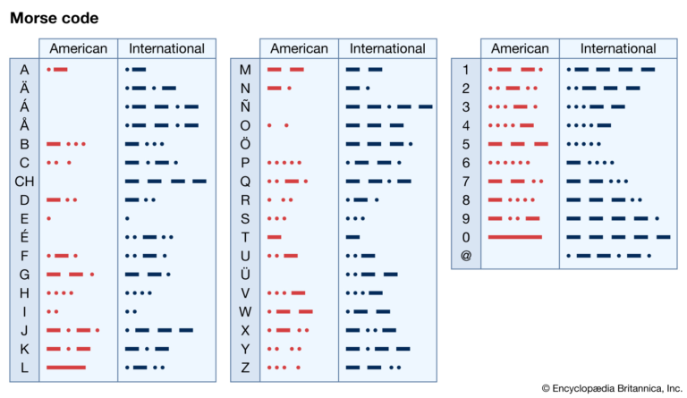

1832年，41岁的塞缪尔·摩尔斯（Samuel Finley Breese Morse）放弃了已小有成就的绘画事业，努力学习电磁领域的知识，在贫困潦倒中坚持研发电报机。

1844年5月24日，他发出了人类历史上第一份电报。谦逊如牛顿，他认为自己只是发现了规律，而不是创造了规律本身，因此电报内容是：“上帝创造了何等奇迹！”。那时的电报传输还是线缆的方式，不是无线电，但足矣称得上是人类通讯方式的一次巨大飞跃。

随着电磁技术的不断突破和电子元件的微型化，电话、网络、计算机接连诞生，信息的传递方式更加丰富便捷。

在计算机和网络中，数据以比特流的形式传输，而比特流在硬件层面实际上是以电信号的方式传递的。居民日常使用的是交流电——电流强度和方向会周期性地变化，通常波形为正弦曲线，加以处理就能作为一种信号载体。

> 图注：示波器屏幕

电信号可以借助示波器以图形的形式表现出来，可以观察到是一个连续的波浪形状，改变其振幅或频率就可以传递信息，我们称之为模拟信号；通过模数变换器，将它“方块儿”化，高位代表1，低位代表0，这时我们称之为数字信号。光纤通信的原理与此类似，只是用到的设备元件不一样。

> 图注：一个字节的比特流

我们日常生活中见到的条形码、二维码，也是基于二进制。条形码由多个宽度不等的黑条和空白组成，有对应的编码规则。黑色和白色反射率相差很大，所以当扫描器发出的光在条形码上反射后，扫描器内部的光电转换器能把强弱不同的反射光信号转换成相应的电信号，最终转换成0和1的比特流。

二维码利用很多黑点白点表示二进制数据，相比一维的条形码数据量更大，可以表达更复杂的数据，如网址、文字、图片等。此外，二维码还有两个特性：

1 定位标记。这使读码机器无论从哪个方向扫描，都能够快速地识别解读。

2 容错机制。即便二维码有污损，在信息缺失不大的情况依然能被正确解读。

> 图注：文字编码类型

电子设备之间的信息通过发送数据包传递。我们可以把数据包看作设备之间的“虚拟快递”，数据包的头部信息包含

IP、MAC编号、端口号、校验码 等信息，如同快递单上的

地址、手机号、姓名、商品重量 等信息。

数据包中的文本数据经过不同格式的编码解码，最终以人能看懂的字符形式在屏幕上显示出来。最常见的是ASCII 码，可以表示大小写字母、数字、以及一些符号，共计128种字符；中文字符有7万多个，无法通过ASCII码表达，有专属的一些编码方式，如GB2312、GBK、GB18030等。

不同语言需要不同编码，这就导致同样的数字可能被解读成不同的含义。比如，有时文档中会出现一些莫名奇妙的乱码，这就是编码错误的问题。

为此，计算机领域制定了一个公认的标准编码——Unicode码，又称万国码，为每种语言中的每个字符设定了唯一的二进制编码，以满足跨语言、跨平台的文本转换需求。Unicode码的单个字符长度是ASCII 码的两倍，两个字节（16 bit）。

下图以ASCII 码为例（只看第1列和第5列即可）

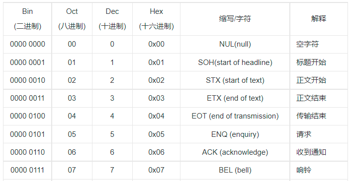

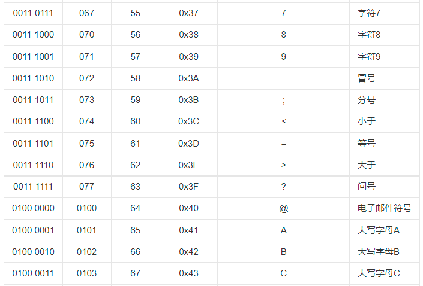

### 6.2.3 文字、声音、图片如何变成数字

当文字、声音、图片都能被编码成数字，机器才真正拥有了“学习材料”。这一节最重要的不是记住所有格式名称，而是理解：不同媒体，最终都可以变成可计算的数据。

声音本质上是一种能量波，由物体振动产生。

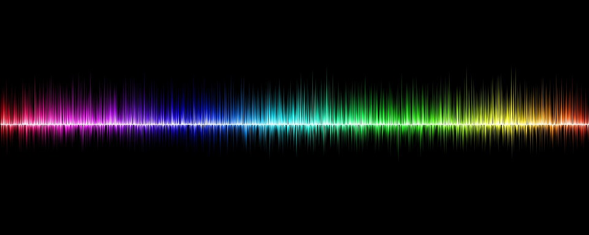

当一个物体收到击打时，实际上会有很多具体部位同时振动，因此人听到的声音是很多波的叠加效果。将声波分解，就会像下图这样（实际更复杂）

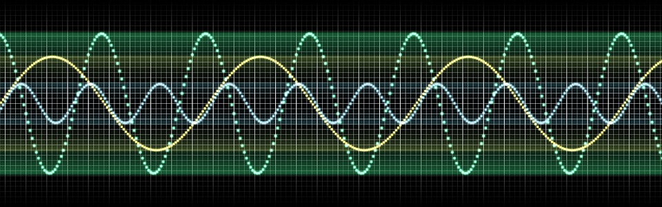

话筒可以将声音转换成电信号。声音引起话筒的振膜振动，继而引起磁场或电容变化，产生不同强度的微弱电流。之后，音频电子设备便将电信号转换二进制的比特流。类似文字有不同编码，声音的比特流也有不同编码，如MP3，AAC，WAV，WavPack(WV)等。

电子屏幕上显示出来的图片实际由很多“像素点”组成，放大看的话是肉眼难以察觉的细小方格。如显示分辨率为2340 x 1080的手机，屏幕就是2340 x 1080个像素点。分辨率数值越大，所能表现的图片清晰度就越高。

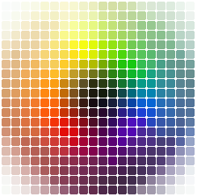

电子设备的显示屏可以精确控制每一个像素点，每个像素的颜色和亮度由对应的红、绿、蓝三种光元件叠加控制（详细参考RGB颜色标准）。每个颜色的光元件电信号取值范围在0 - 255之间，占8个比特位（1字节）。

实际应用中常以16进制的数字代表RGB的具体颜色

数字代表RGB颜色，可以代表一个像素，而众多像素组成一张图片。因此，电子图片实际上就是一定格式的数字，对计算机而言就是0和1的比特流。

图片也有不同类型的编码，常见的有jpg，png，gif，svg，psd等。

视频由一系列静态图片依次快速显示形成，这些图片又被成为“帧”，帧率（FPS，每秒帧数）超过24时人眼便难以察觉出静态图片，帧率越大动作画面就越流畅，其中的差别较大的几张图片称为“关键帧”。

图片构成视频，因此，视频对计算机而言也是0和1的比特流。

视频常见的编码格式有mkv、mp4、mpeg、avi、mov、wmv等。

从二进制，到文字、声音、图片、视频，啰嗦了这么多，都是为了下面这几句话做铺垫：

一句语音，可以录音转换成音频文件，经过压缩提取变成非常短的比特流，得到音频特征；

和语音内容相同或相近的文字，经过压缩提取变成非常短的比特流，得到文本特征。

把这个音频特征和文本特征相匹配，就是语音转文字或文字转语音。

把一种语言的文本特征和相同含义的另一种语言的文本特征相匹配，就是翻译。

图片也类似，先黑白化处理去掉颜色信息，再经压缩提取变成非常短的比特流，得到图片特征。把图片特征和对应的文字标签相匹配，就是图像识别。而图像识别的准确率是上一章介绍的自动驾驶的命门。

### 6.2.4 机器学习：让计算机从数据里学

这一节的关键不是背定义，而是理解一个思路：与其把所有规则都提前写死，不如让计算机从大量样本里自己总结规律。机器学习真正改变的，是“计算机怎么得到答案”的方式。

#### 机器学习的基本思路

简化来说，机器学习就是计算机自动确定感知机参数的过程（稍后介绍什么是感知机）。

监督学习从人工标记好的训练数据集中设计出一个函数（或者叫做程序模型），当新的数据到来时，可以根据这个函数预测结果。

无监督学习与监督学习基本类似，不同的是训练数据未经人工标记或分类，程序自行去分类识别。结果难以预测，效果无法量化评估，但有助于发现异常的数据，有时会有意外收获。

强化学习也被称为近似动态规划，不同于监督学习和无监督学习，最大的特点是在学习过程中没有正确答案，通过不断试错，得到奖励（加分）或惩罚（减分）来学习，为某一问题（比如下棋、电子游戏）制定最优策略。强化学习主要包含两种模拟对象，一个是决策者（有的称之为智能体），另一个是环境。决策者面对环境，根据观测条件作出动作，会从环境得到奖励和反馈。

### 6.2.5 感知机与神经网络

从感知机到神经网络，可以看作从“少量人工规则”走向“多层参数学习”的过程。先理解最简单的模型，再去看更复杂的网络，难度会低很多。

#### 感知机示意图

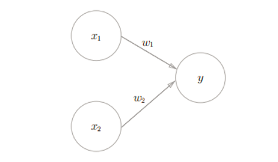

#### 感知机如何做出判断

x1、x2是输入信号，y是输出信号，w1、w2是信号的权重，权重越大，对应的信号的重要性越高。输出的结果只有两种，我们可以赋予它不同含义，比如 0代表否，1代表是。可以用函数表示为：

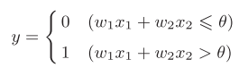

θ是一个临界值，超出这个值则代表“激活神经”。

下面，我们先设计一个判断是否是猫的 感知机，x1、x2代表两个描述特征，

w1=0.6、w2=0.3、θ=0.55（当然也可以是其他值）

输入样本1的数据（x1=1，x2=1），根据函数计算1x0.6+1x0.3 > 0.5，故y=1，样本1被感知机判断为 是猫。

#### 神经网络结构示意

#### 神经网络和感知机有什么不同

上图是一个简单的两层神经网络，形状看起来像多层感知机。两者的区别主要有以下几点：

1 感知机的权重由人工设定、调整，从而达到符合预期的输出；神经网络的权重由它自己从数据中学习得出，最终找到合适的权重。

2 感知机只有一层网络；神经网络有两层以上网络，输入层和输出层之间的为隐藏层。

3 感知机的神经元之间传递的是0或1的二元信号；神经网络中传递的是连续的实数值信号。因此，两者使用的函数也不一样，神经网络用到的更加复杂多样。

依然以上图为例，输入样本1的数据（x1=1，x2=1），隐藏层m1、m2、m3这些神经元的值可能是小数，无需关注，输出值也不再局限为0或1。随便假设一个结果，如y1=0.8 代表喜欢挠东西的概率，y2=0.33 代表喜欢摇尾巴的概率。

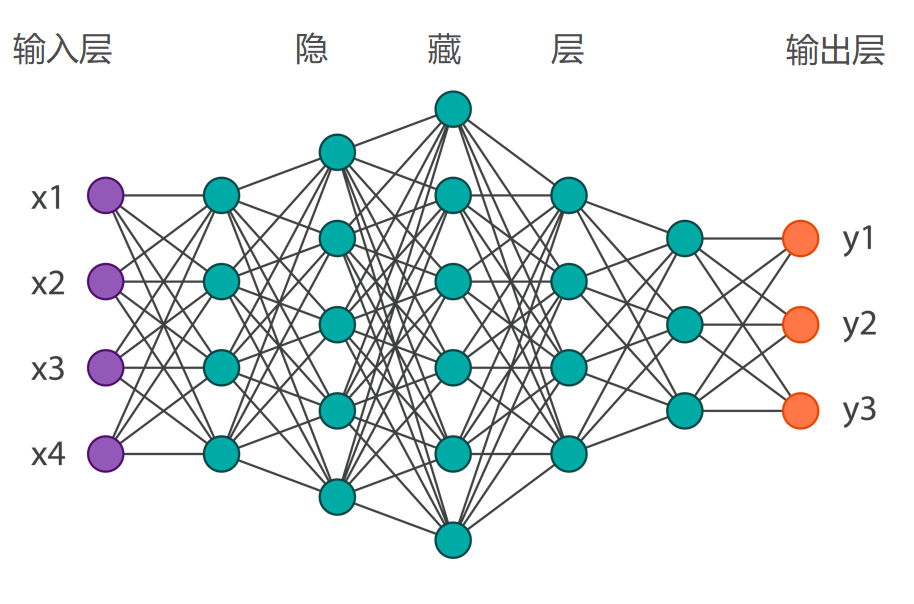

#### 训练为什么需要算力

实际应用中，神经网络非常庞大，其权重参数高达几十万甚至几十亿个，这就比较考验计算机的性能了。神经网络的分布特点恰好适合矩阵运算，用矩阵来代表神经元和权重参数的值。

矩阵运算可以分布式并行计算（请参考《线性代数》），而并行计算是图形处理器（GPU，又称显卡）的强项，所以有些公司为追求更高的性能，干脆自己设计适合机器学习的芯片。他们所说的训练模型或自主学习，指的就是神经网络中确定合适权重参数的过程。

### 6.2.6 图像识别与自动驾驶

自动驾驶最依赖的一类 AI 能力，就是把摄像头看到的像素，逐步变成对车道线、行人、车辆和障碍物的理解。卷积神经网络之所以重要，正是因为它特别擅长处理图像这类二维信息。

#### 卷积神经网络

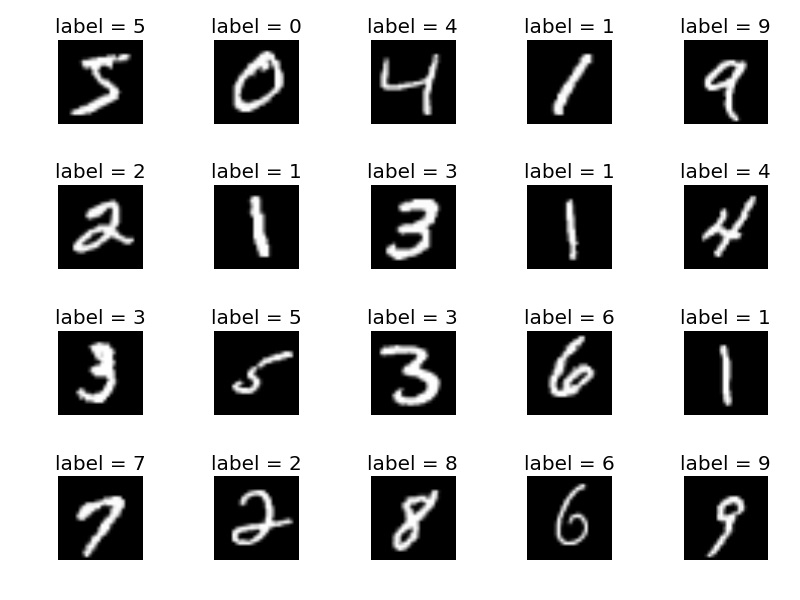

两张手写体数字1的图片特征分别是：

010 010 010,

010 010 011

两张手写体数字3的图片特征分别是：

011 011 111,

111 011 111

两张手写体数字7的图片特征分别是：

111 001 000,

111 001 010

从这个示意例子可以看出，同类数字的特征值通常更接近，不同类别之间的差别则更明显。

数字1和3的特征：

010 010 010，

011 011 111

数字1和7的特征：

010 010 010，

111 001 000

苹果官网提供了一些可免费下载的机器学习模型，可作为补充阅读与实践材料。

#### 延伸阅读资源

[Apple 机器学习资源页面](https://developer.apple.com/cn/machine-learning/)

#### 为什么需要更深的网络

关于深度学习，目前并不存在完全统一的定义。可以先把它理解为由很多层神经网络构建成的模型；从数学角度看，也可以把它视作一个多变量复合函数。根据逼近论，一个复杂的函数可以通过复合多个简单函数来近似表示。

一般的神经网络只有几层，深度学习则可高达到十几层，参数数量也会快速增长。

深度神经网络的调参是一项相当艰巨的任务，不但需要经验，有时也需要反复试验。一个参数的调整就可能牵一发而动全身，导致模型性能明显波动。

### 6.2.7 AI 的能力边界与责任

学到这里，还需要再问一个问题：AI 能做什么，又不该被想象成什么？这一节讨论的不是编程技巧，而是青少年读者同样需要建立的技术边界感。

人工智能（AI）的发展进入新世纪后，也带动了一轮新的产业热潮。面对这样的热潮，个人和企业都不宜盲目跟风。尤其是在缺少资源、经验和试错空间的情况下，进入新领域更应保持克制，先理解其技术门槛、商业模式与风险结构，再决定投入程度。

AI 更适合作为一种助手工具，而不是简单理解为到处与人类“抢饭碗”的竞争者。它会提高工作效率，将人们从机械重复的劳动中解放出来，投入到更有意义的事情当中。如果无视新岗位的涌现，就容易片面地把 AI 理解为单向度的岗位替代。

蒸汽机时代，大量手工纺织者失业了；

内燃机时代，很多人力车夫失业了；

互联网时代，很多纸媒报社倒闭了。

人类相比 AI，仍有一些难以替代的优势，比如人际沟通、社交、运动、设计创造等。AI 可以帮助你更好地运动，告诉你哪个动作不对，但无法替你运动；可以帮你做跨语言翻译，但无法替你沟通；可以帮你更快速地渲染、上色，但无法替你完成真正的创造性判断。

AI 的功能很强大，但它本身并不天然具备法律意识和道德判断。若缺少治理和约束，就可能在现实应用中放大风险。因此，主导权不能交给系统自行扩张，而应始终放在人类决策、法律规范和伦理框架之内。

时代在变，依赖一次学习便长期不更新知识结构的时代已经过去。天地万物都在变化，人类也很难置身事外。

## 6.3 电池与氢能：为什么能源决定智能交通的边界

再强的算法，也离不开真实世界的能量供给。对移动住房、自动驾驶和飞行器来说，能源不仅决定续航，更决定成本、安全、载荷和普及速度。因此，这一部分相当于给前面的“智能”补上现实边界。

电池的种类繁多，本书仅介绍主流的化学电池，其他的略过。当前电池技术的总趋势是 使用寿命、能量密度稳步提升的同时成本逐步下降。

### 6.3.1 为什么电池决定交通上限

能量密度(Energydensity)指单位体积或质量的物质中储存能量的大小。对电池而言，能量密度越高，意味更小的体积、更多的能量存储，但受限于技术条件和安全控制水平，实际低于理论值。锂电池的能量密度不是最高，但在生产工艺、成本、使用寿命等方面优势明显，成了电池领域的佼佼者。

锂电池是以含锂的化合物作正极，石墨或其他碳材料作为负极的一种可充电电池。按正极材料分类的话，主要有镍钴锰（三元）锂电池，磷酸铁锂电池，钴酸锂电池，锰酸锂电池等（均已商用）。

其中，能量密度的最高的是三元锂电池，低温性能相对较好；磷酸铁锂安全性高，成本低，但是能量密度也低，低温性能差。

此外，锂硫电池也是一个常被讨论的锂系方向。其理论能量密度显著高于三元电池，同时在材料成本和低温性能方面也常被认为具有潜力。不过，受限于循环寿命等技术难点，目前仍难以稳定量产；它是否会早于氢燃料路线进入大规模商用，还需要继续观察。

举两个具体例子：

Li-S电池的两个电极具有不稳定性，导致电池的循环寿命短。对此，莫纳什大学Mainak Majumder教授团队提出了一种糖基粘结剂体系。通过设计实验，验证了该体系可大幅提高Li-S电池的性能，Li-S电池在循环达到1000次(9个月)后，硫利用率可达到97%，且容量保持约为700 mAh/g。

相关研究成果以“A saccharide-based binder for efficient polysulfide regulations in Li-S batteries”为题发表在Nature Communications上。

材料公司 Lyten（官网：[lyten.com](https://lyten.com)）推出了 LytCell EV™ 锂硫电池，公开参数显示其能量密度约为传统锂电池的三倍，约 900Wh/kg；充电速度较快，不超过 20 分钟；可在零下 30 至零上 60 摄氏度的环境下运行。

技术核心是Lyten 3D石墨烯®，可以解决多硫化物穿梭问题，原型设计超过1400次循环。

总之，这家公司的锂硫电池公开参数看起来颇具吸引力，但仅凭目前可查到的部分资料，还很难充分评估其技术成熟度与商业可信度，因此更稳妥的做法是保持审慎观察。

锂电池的应用非常广泛，比如手机、平板、笔记本电脑等移动设备中的电池部件。随着它的生产成本下降，拓展到了电动汽车领域。目前电动汽车每度（千瓦时）电的电池储能成本是1400元左右。50千瓦时的电池组价格高达7万元。

十年间（2010年起），锂电池的市场售价下降了89%，平均每年下降20%，这一状态未来仍会持续。2025年，50千瓦时的电池组价格有望降至2.3万元。

这并不是盲目乐观，因为当前主流的电池设计方案，约有1/2的体积和1/3的重量没用来存储能量，改进空间很大。

把锂电池在汽车上推进到大规模应用阶段的企业之一是特斯拉。其在 2020 年发布的 4680 电池，被不少观察者视为重要的工程路线更新；不过它是否足以成为电动汽车全面形成成本优势的转折点，仍需结合量产、良率和整车集成效果继续观察。

电动汽车在历史上曾经有过辉煌时代。

1900年，以蒸汽、电力或汽油为动力的汽车在4200辆汽车中分别占比40%、38%和22%。1905年，电动车辆的占比超过50%。传统观点认为，汽油车胜出是因为更低的成本，但有新的证据分析表明，电力基础设施是电动汽车当时推广受限和发展停滞的关键。

2015年，国务院发布了《中国制造2025》，对动力电池的发展做出规划：2020年，电池能量密度达到300Wh/kg；2025年，电池能量密度达到400Wh/kg；2030年，电池能量密度达到500Wh/kg。

尤其值得期待的是400Wh/kg，这是电池在航空飞行器上商用的一个基本条件。马斯克曾表示，电池达到400Wh/kg的能量密度才能实现可行的商业电动飞行，并且他认为，这将在3 - 4年内成为可能。

### 6.3.2 为什么氢燃料值得讨论

燃料电池，是通过氧化还原反应将燃料的化学能直接转换成电能的装置，有很多种类，按电解质分类有：

碱性氢燃料电池（AFC）、质子交换膜氢燃料电池（PEMFC）、磷酸氢燃料电池（PAFC）、熔融碳酸盐氢燃料电池（MCFC）、固体氧化物氢燃料电池（SOFC）等。现在多指以纯氢为燃料的固体高分子型质子交换膜燃料电池（PEMFC），技术最成熟，具有能量转化率高、噪音低、低温启动、环保等优点。

#### 产业与系统构成

与锂电池产业链相比，氢燃料电池产业涉及范围更广，涉及制氢、储运、加注和整车系统等多个环节。它是否能在未来承担更大角色，不仅关系碳减排，也关系能源结构与基础设施建设能力。

车载氢燃料电池系统，一般采用质子交换膜燃料电池（PEMFC）技术。由燃料电池堆、氢气储罐、动力电池、直流升压转换器、动力控制器和电机等部件组成。目前成本最高的部分是电池堆（尤其是使用贵金属铂的质子交换膜）和储氢罐。

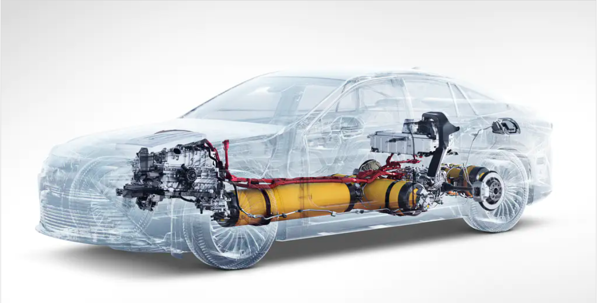

#### 制氢、储运与基础设施

电量的存储对许多国家来说都是现实难题。由于电力系统存在波动性，可再生能源在某些时段确实会面临消纳压力；而氢气常被讨论为一种可用于跨时间尺度储能和运输的能量载体，但它是否能有效解决相关问题，还要看制氢成本、储运损耗和基础设施建设水平。[待核实：弃风弃光弃水数据的统计口径与年份]

当前瓶颈：制氢，运氢，储氢，电堆。

从一定角度看，氢燃料常被视为未来能源体系中的一个候选方向。至于超导电机、液氢燃料与交通工具的组合是否会带来明显跃迁，仍需要更多工程验证。

制氢的方式主要有：化石燃料制氢、化工副产制氢、生物制氢、电解水制氢等。前两种是目前的主要制氢方式，后两种虽然对环境友好，但工艺还需提升。

我国工业体系具备较强的氢资源供给能力，年产氢规模常被引用为约 2200 万吨，占全球较大份额。[待核实：国内年产氢规模与全球占比的统计来源]

氢气的运输方式有多种，短距离最适合管道运输，长途适合LOHC（液态有机氢载体）方式，管束车或低温液态输氢也可以，但是成本较高。

不少业内人士看好电解制氢方向，认为清洁、可持续的太阳能光电制氢值得关注。当用电价格、设备效率和利用小时数满足特定条件时，电解水制氢的成本有望下降；但不同地区的电价、设备折旧和运输方案差异较大，不能简单一概而论。[待核实：电解水制氢与汽油成本对比的公开出处]

截至2021年3月末，我国加氢站已建成131座，在建65座，规划中122座。[待核实：加氢站统计来源与更新时点]

### 6.3.3 其他值得了解的电池路线

#### 铅酸电池

电极主要由铅及其氧化物制成，电解液是硫酸溶液。放电状态下，正极主要成分为二氧化铅，负极主要成分为铅；充电状态下，正负极的主要成分均为硫酸铅。优点是电压稳定、价格便宜；缺点是能量密度低、重量大、使用寿命短。老式铅酸蓄电池一般寿命在2年左右，而且需定期检查电解液的高度并添加蒸馏水。

由于成本低廉，这种电池在照明、通讯基站、电动两轮/三轮车等领域应用广泛。

#### 一次性干电池（又叫锌锰电池）

干电池有100多种种，如锌-锰干电池、镁-锰干电池、锌-空气电池、锌-氧化汞电池、锌-氧化银电池、锂-锰电池等。锌锰干电池是以糊状电解液来产生直流电的一次性化学电池。中心是正极碳棒，外包石墨和二氧化锰的混合物。最外层是负极金属锌皮筒。常用于手电筒、收音机、遥控器、电子钟表、玩具等。

早期的干电池含汞等有毒重金属，不过国家出台了政策，从2005年起停止生产含汞量大于0.0001%的碱性锌锰电池。如今，随着技术和生产工艺的进步，大多数干电池主要含铁、锌、锰等元素，已不再含汞、铅等重金属。

#### 固态电池

是一种使用固体电极和固体电解质的电池。由于不含任何液体，相比于传统的锂离子电池，安全性和能量密度都更高。不过，当前固态电池还停留在实验室阶段，造价高昂。

#### 钠离子电池

能量密度与磷酸铁锂电池相近，在低温性能和快充方面更具优势。工作原理与锂离子电池相似，使用钠离子在正极和负极之间移动来存储或释放电能。钠离子电池使用的电极材料主要是钠盐，相较锂盐而言储量更丰富，价格更低廉。目前工艺技术基本成熟，有望在大规模储能中取代传统铅酸电池。

#### 镁电池

以镁为负极，某些金属或非金属氧化物为正极的电池。现在常见的种类有镁锰干电池和储备型电池（使用时加清水或海水使之活化，活化后半小时内即可使用，主要供军事通信、气象测候仪、海难救生等使用）。

#### 铝离子电池

工作原理与锂离子电池相似，使用铝离子在正极和负极之间移动来存储或释放电能。优点是超快充电、安全性高、成本低廉。

#### 钾离子电池

#### 生物燃料电池示意

#### 生物燃料电池的研究起点

1911 年，英国植物学家 Potter 用酵母和大肠杆菌进行实验，宣布利用微生物可以产生电流，标志着生物燃料电池研究的起点。

2007年，索尼宣布开发出了一种生物电池，利用酶作为催化剂，通过活性有机体产生能量，在碳水化合物（糖类）中生成电流。该款电池以葡萄糖溶液为燃料，体积39立方毫米，输出功率为50毫瓦。

航天领域对生物燃料电池也颇为青睐——用航天员的尿液来发电，一举两得。

#### 太阳能电池

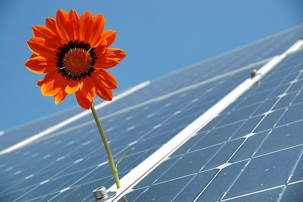

可以把太阳的光能直接转化为电能的电池，分类有硅太阳能电池、有机化合物太阳能电池、无机化合物半导体太阳能电池等。

#### 太阳能与自然系统的启发

有确切文字记载的人类发展史已有数千年，但人类至今仍难以完全复制植物光合作用那样高效而稳定的自然能量系统。把植物绿叶视作一种启发，并不意味着现代电池可以直接照搬自然机制；它更像是在提醒我们，未来能源技术仍有很大的学习空间。
