# 第7章 空中交通与居住半径扩张

> 保留飞行器谱系与“如何改变住行”的核心论述，用来解释未来居住半径为何会被重新定义。

## 电动飞行器谱系

### 电动垂直起降飞行器

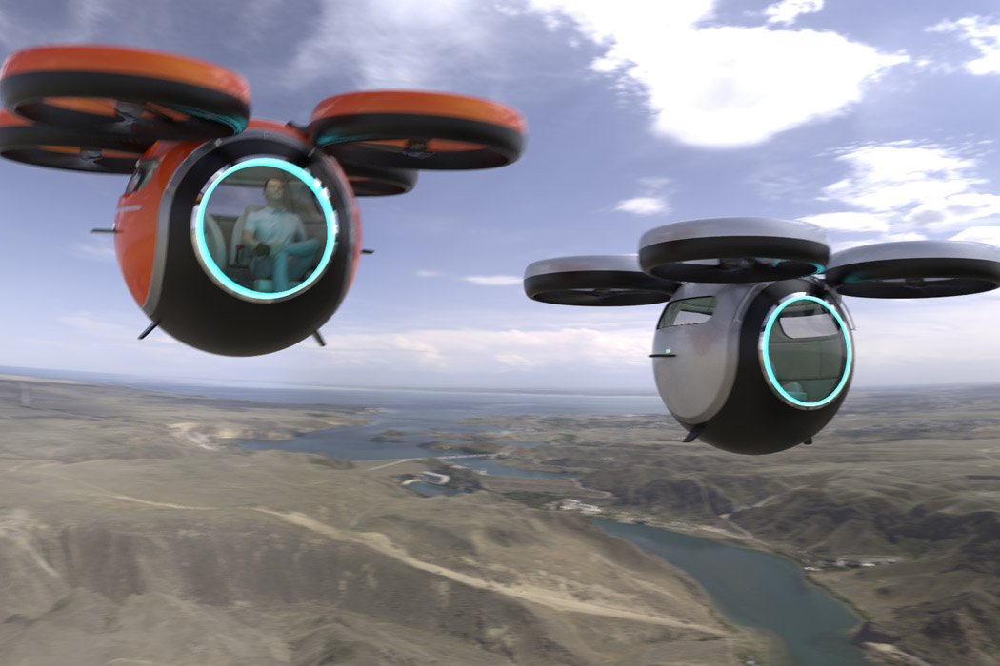

英文简称eVTOL（ Electric Vertical Takeoff and Landing），可以垂直起降，无需广阔的飞机跑道，普通广场或较宽阔的楼顶加以改造即可运营，省去了高昂的机场建设和维护成本。

相比于传统民航飞机和直升机，成本投入少、飞行高度低、点对点通勤灵活、噪音小、低碳环保，能够给乘客更舒适的乘坐体验。固定航线可以自动驾驶飞行。

全球许多航空航天和汽车公司正在加大对eVTOL的投资，如波音、空客、雷神、通用、劳斯莱斯、霍尼韦尔、丰田、现代、吉利等公司。受益于航天工业优势，美国eVTOL的明星公司最多，有Joby Aviation、Archer Aviation、Jaunt Air Mobility和Beta Technologies等；英国有Vertical Aerospace；法国有Ascendance Flight Technologies；德国有Lilium、Volocopter；日本有SkyDrive；中国有亿航智能（EHang）。

除了亿航，国内做eVTOL飞行器的还有小鹏、峰飞、时的、磐拓、沃兰特等公司。不过，eVTOL不是那么好切入的领域，相比造车，除了更加烧钱，它对技术标准和供应链的要求都更高。但这些风险似乎无法阻挡资本涌入的热情，eVTOL可能会是继元宇宙之后的另一个泡沫。

电动垂直起降飞机最前沿的厂商是Joby Aviation公司，计划2024年商用。届时交通从2D平面升级到3D立体时代，交通拥堵的景况也许将一去不返。

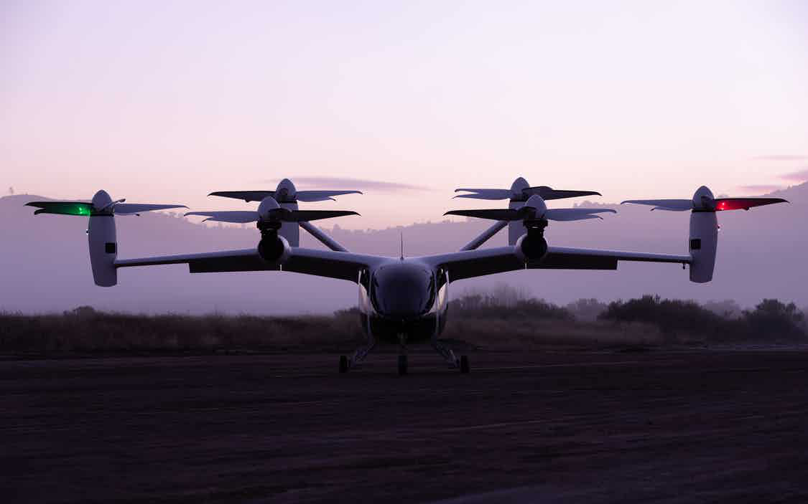

> 图注：视频一 点击链接观看

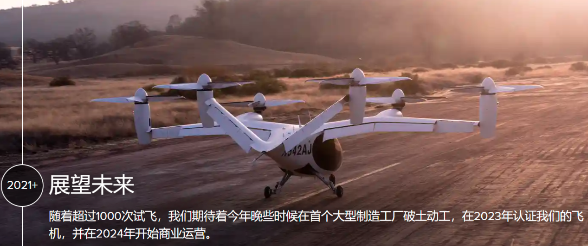

> 图注：视频二 点击链接观看

旋翼桨叶的独特设计大幅降低了音噪，低至88分贝，比航拍的mini无人机略高一点。

### 电动固定翼飞行器

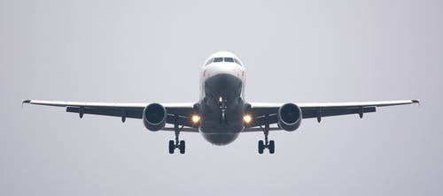

固定翼飞机是指由动力装置产生前进的推力，利用机身的固定机翼产生升力（伯努利原理），在大气层内飞行的重于空气的航空器。相比旋翼飞行器，固定翼具有更高的速度和气动效率，现在常见的的民用客机就是固定翼。

缺点是需要较长的跑道升降，油耗大，碳排放高，成本高昂。为了大幅降低飞行成本，zunum公司提供了一种电动化的固定翼飞机方案。相比传统燃油飞机，成本能降低40%-80%。详细数据请见官网https://zunum.aero

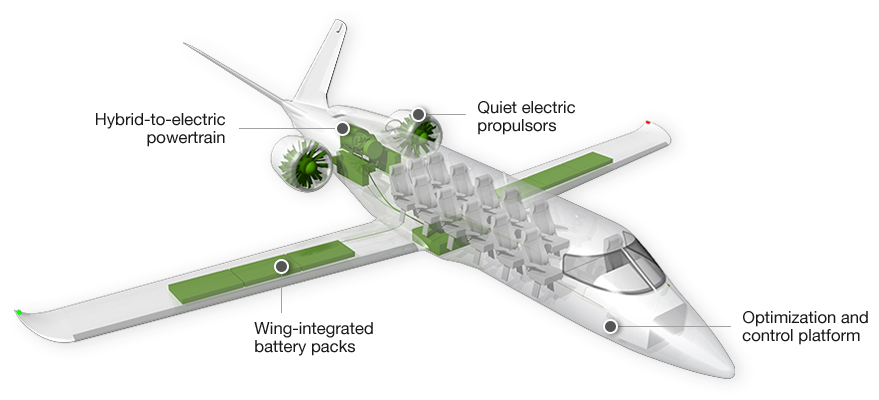

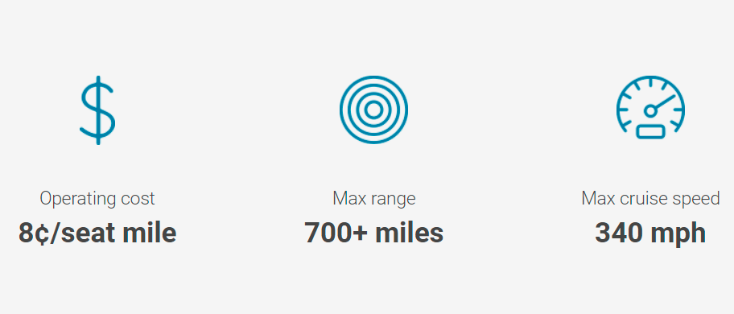

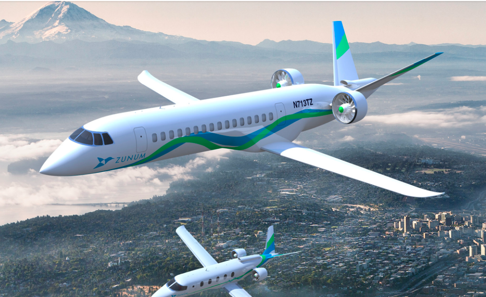

### 仿生扑翼飞行器

人类向往天空久矣，但天空似乎只属于鸟儿。为了实现梦想，尚未建立空气动力学体系的人类便模仿鸟类飞行，制造了各种扑翼飞行器，无一不以失败告终。直到1809 年，英国科学家凯利发表了题为 On Aerial Navigation 的论文，提出应该将推进动力和升力面分开考虑，人类才转向固定翼的飞行。

15世纪，意大利全才科学家达芬奇曾设计过这种飞行器，并有草图手稿流传下来。

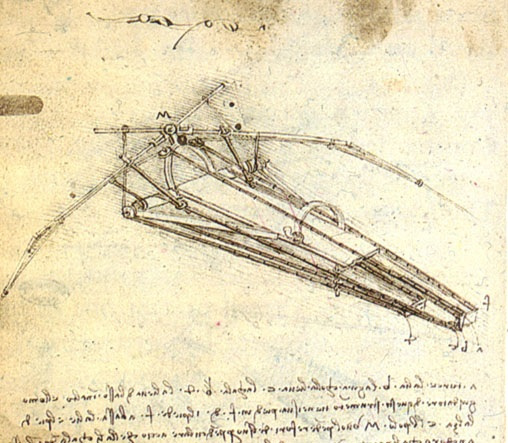

> 图注：达芬奇的扑翼飞行器手稿

鸟类飞行看似简单，不过要想真正仿制出来，对材料、动力系统、控制系统等都有着非常高的要求，人类目前的技术还达不到。不说鸟类的飞行，单是昆虫的飞行技巧人类都相形见绌。让人讨厌的苍蝇和蚊子，其飞行时的风骚闪避走位，令人类的各种飞行器望尘莫及。

目前最好的仿生扑翼飞行器应该是德国公司Festo的Bionic Swift，仿生领域的天花板。Bionic Swift飞行视频 点击链接观看

官网 https://www.festo.com.cn/group/zh/cms/10238.htm

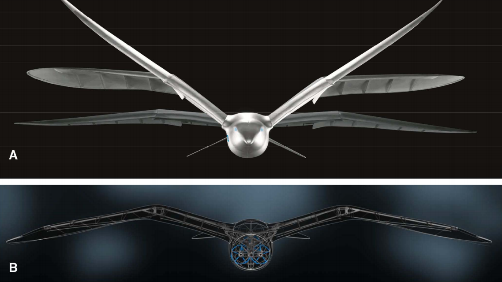

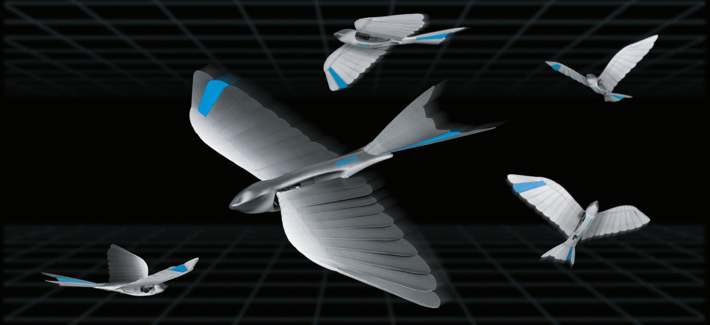

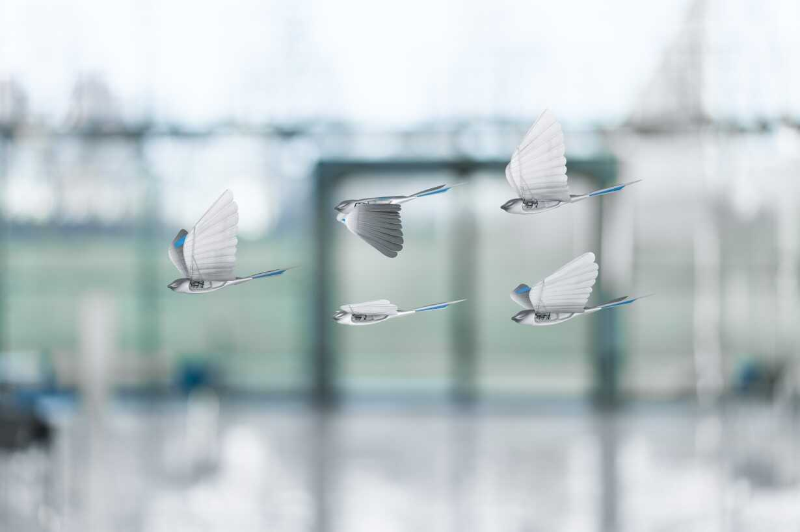

除了仿生鸟，Festo公司还有其他仿生飞行器，如蝙蝠、蝴蝶、蜻蜓等产品。

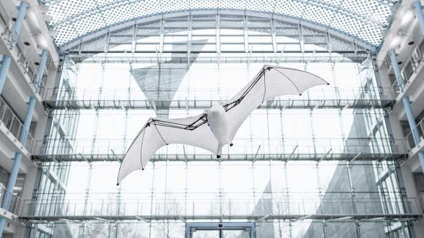

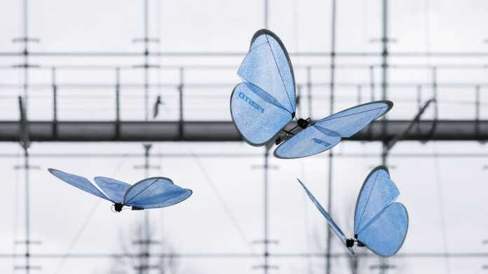

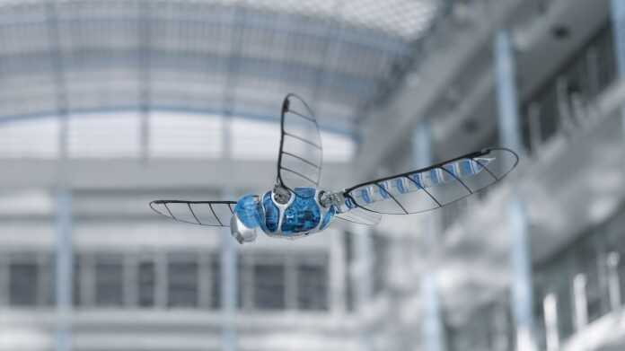

### 地效飞行器

翼地效应：在同样的速度和推力下，近地（或水面，小于或等于1/2翼展的高度）飞行会比空中飞行有更大的升力，更高的升阻比使得能源消耗更少。

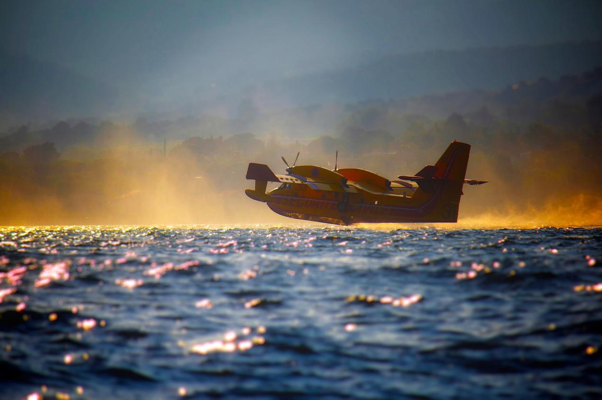

准确的说，它接近滑翔，不是真正意义上的飞行。在宽阔的河面有较高应用价值（陆地路况复杂，安全系数低）——在码头采用电磁弹射装置起飞，节省电力进一步提升续航；遇到桥梁或大型船只，可升高越过。

当前最大的挑战可能不是起飞或降落时的飞行控制，而是低空飞行时产生的音噪，这无论是对河流中的生态环境，还是对周边的居民生活，都会产生一定干扰。

相比飞机，地效飞行器能耗大幅降低，其航速500公里/小时的运输成本和40公里/小时的常规船舶相当。

简言之，地效翼飞行器有航运水平的运输成本、不输飞机的速度，性价比十足。如果对河道运营高标准规划，甚至可以替代造价高昂的高铁运输。

### 东山再起的飞艇

飞艇是利用轻于空气的气体来提供升力的一种飞行器，与热气球的主要区别是具有动力系统和可以控制飞行状态。外形一般为流线型，分硬式飞艇和软式飞艇两大类。

硬式飞艇由其内部骨架保持形状，最外层覆盖蒙皮，内部有许多提供升力的独立气囊；软式飞艇，通过调节气囊中的压力来实现保持形状。

与传统航空工具相比，飞艇更加安静、易悬停、长续航、超大运力，碳排放量减少80-90%。缺点是速度较慢，容易受极端天气影响。飞艇很适合救灾运输和山区的大宗农产品运输，其成本能做到低于卡车，不受地形和公路限制。若有政策支持，必然是扶贫攻坚的一把利器。

19世纪60年代，蒸汽机、内燃机、电动机相继发明，为飞艇的诞生创造了条件；1884年，法国的军官路纳德和克里布制造了人类第一艘能操纵的飞艇——“法兰西”号，长51米，前部最大直径8.4米，用蓄电池供电的电动机作动力。8月9日凌晨4点试飞，历时25分钟，飞行速度最高达每小时24公里。

真正将飞艇发扬光大的是德国退役将军菲迪南德·格拉夫·齐柏林，硬式飞艇的发明者，被后人称为“飞艇之父”。1900年，齐柏林制造了第一架硬式飞艇，相比以前的软式飞艇，安全性大幅提升。后来齐柏林和法兰克福时代报的记者艾肯纳成立了世界上第一家航空公司——德国飞艇运输有限公司，简称DELAG。齐柏林逝世后，继承人艾肯纳于1927年7月建成了一艘环球飞艇，命名为“格拉夫·齐柏林”号，以纪念逝去的友人。

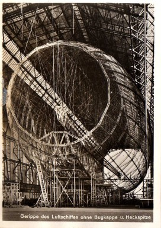

硬式飞艇的成功，吸引了德国军方的注意，很快被应用于英国战场。当时飞机还不成熟，英国人对飞艇空袭一度束手无策。飞艇即便被子弹打成了筛子，依然能够平稳返航降落。后来，英国人找到了克制之法——用特殊的高爆子弹结合燃烧弹，一起攻击飞艇，可以引爆填充飞艇的氢气（最大氦气生产国美国限制氦气出口，德国不得不改用易燃的氢气填充飞艇）。

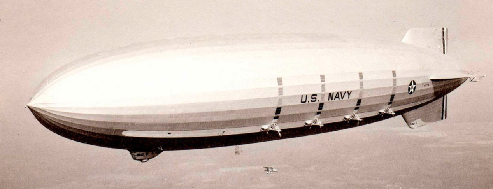

1929年8月8日，“格拉夫·齐柏林”号飞艇开始了伟大的环球飞行，载着16名乘客和37名乘务人员从美国新泽西州的海军航空站出发，经过德国、苏联、中国、日本，于8月29日返回，整个航程历时21天。

1937年5月6日的兴登堡事件是飞艇时代的标志性转折点，大约下午七时三十分，空中的泰坦尼克号——兴登堡号飞艇在新泽西州莱克赫斯特海军航空总站准备着陆时，意外爆燃烧毁（真正的爆燃原因至今是未解之谜），97名乘客和乘务人员中有36人遇难。事故发生前，兴登堡号飞艇已十次安全地往返大西洋两岸之间，共载客1002人次。此后，再没有公司用氢气来填充客运飞艇（改用氦气）。

1939年8月27日，世界上第一架喷气式飞机试飞成功，人类进入喷气飞行时代。新旧交替，飞艇的黄金时代一去不返。

随着现代工艺的进步，当年兴登堡号飞艇的悲剧不会再重演。功能多样的新材料、更加灵敏的传感器、高效的动力系统以及准确的气象监测手段，使得新式飞艇在“碳中和”的大背景下被重新唤醒。飞艇体型虽大，但能耗比飞机低得多,载重量也大。大型飞艇载重可达50吨以上，运输货物有良好的经济效益，空运移动房完全没问题，许多人梦想的飞屋环游也有望实现。

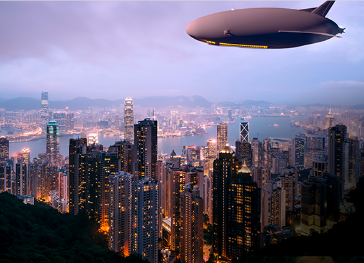

目前，全球最大的现役飞艇是英国Hybrid Air Vehicles公司的Airlander 10。2016年8月17日完成首飞，第二次试飞降落时撞上了一个电线杆，无人伤亡。由于其造型独特，自带网红特质，被网友戏称“飞天屁股”。

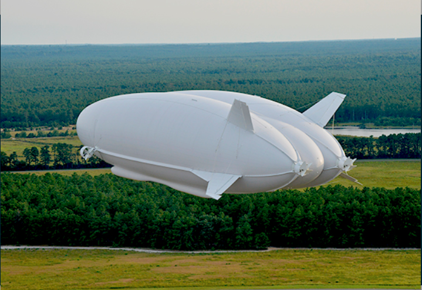

> 图注：视频一 点击链接观看

HAV公司的目标是从2025年起交付混合动力Airlander 10。下一代产品Airlander 50的市场定位是重型货运。Airlander 50 将拥有50吨有效载荷，可携带6个20英尺的ISO集装箱和48名乘客，航程超过2200公里，完全两栖。除了水陆上，还可以在雪地，冰面，沙漠，停机坪，或其他平坦表面起飞和降落。

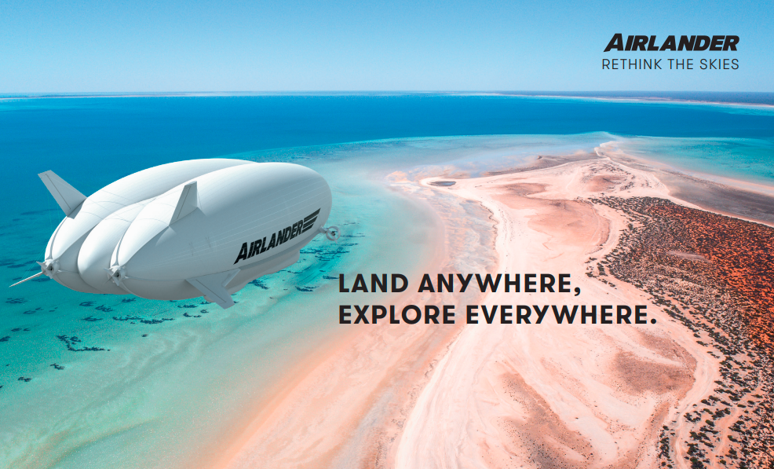

## 电动飞行器如何改变住行

交通工具全面电动化已经开始。电动汽车淘汰燃油汽车，电动飞机淘汰燃油飞机，是越来越明显的趋势。

自动驾驶扩大了交通半径，但30-50公里已达极限。真正带来革命性突破的是电动飞机，能把交通半径扩大到数百公里，抹平城乡房源差异。

曾经，马车是人类出行的主流交通工具，后来是火车，汽车。飞机虽然发展了百年，由于价格高昂依然不是主流。电动垂直起降飞机相比传统飞机，它的制造成本和难度都大幅降低，会让更多人消费得起。

不需要卡脖子的航空发动机，

不需要昂贵的航空燃油，

不需要专业的飞行员，

不需要广阔的跑道场地。

生产、使用、维护等各环节都更加的方便，平民化只是时间问题。

它商用之时，就是租房时代花黄之日——打工人可以住在自己老家的房子，把日常生活中最大的开支留给电动飞机通勤。至于押一付三、年年涨租什么的，可以说拜拜了。

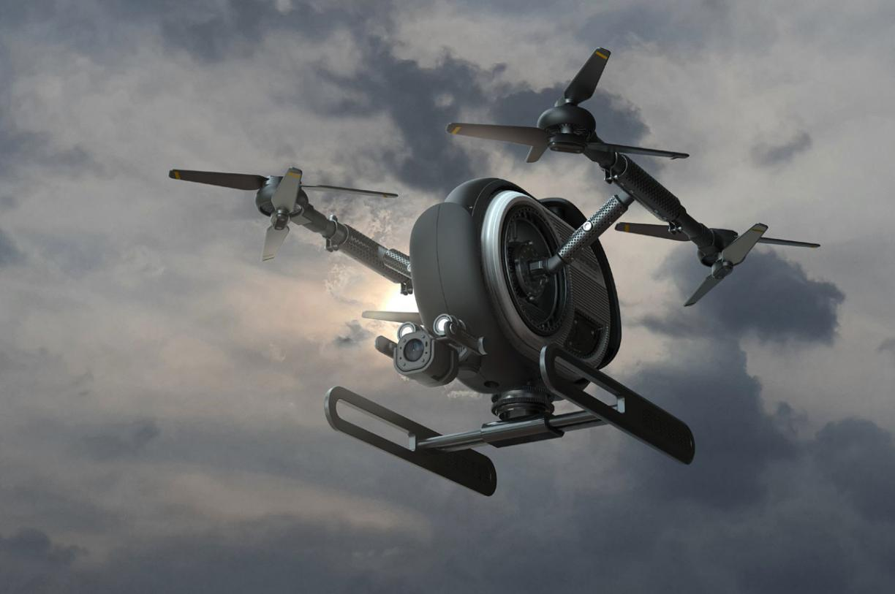

> 图注：图片源自 yanko design

当下，阻碍电动垂直起降飞机普及的主要因素是电池技术。

锂电池、固态电池，并不是电动飞行器的最优选项。因为电池能量密度太低，自身重量大，大部分能量消耗在克服自身重力做功上。eVTOL使交通换代升级，会极大地便利人们的中短途出行，飞行时速一般在200-300公里，不受地形限制，更不会“堵车”。对载人交通、空中物流、消防救援、紧急医疗等领域影响深远。

电动飞机的时速可达300公里以上。若以北京为中心，北京到丰宁坝上草原、秦皇岛、石家庄、山东德州、山西大同的距离均在300公里半径范围，坐时速300公里的电动飞机即可实现一小时通勤圈。

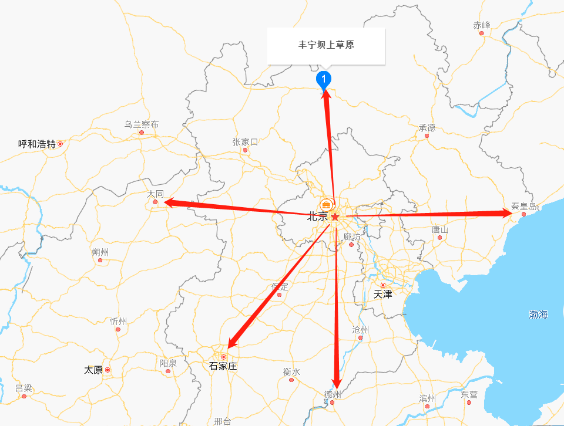

北京市2020年常住人口2153.6万人，居住半径30公里（天安门到机场T2航站楼的距离）。那么，300公里半径，100倍的面积，理论上居住20亿人是可以的。

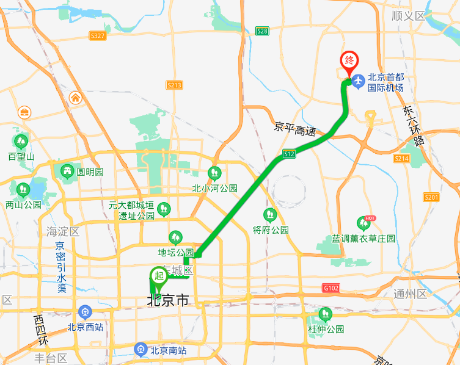

深圳市，30公里半径则是福田站到宝安国际机场

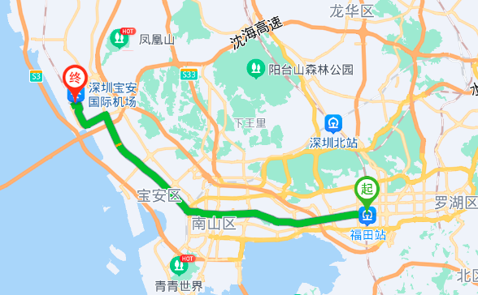

与其付昂贵的房租，不如把钱花在电动飞机通勤上。

300公里行程，氢燃料汽车的成本168元，电动飞机成本可能超出其两倍。但乘坐电动客机共享出行的话，费用可以大幅降低。根据Zunum Aero公司的电动飞行成本数据（官网可查），每座一英里的成本是8美分，即0.34元/座位公里。

> 图注：图片源自 https://zunum.aero/aircraft/

月工作日20.83天，每天往返通勤费204元，则月费用4249.32元。成本有点高，但低于北京五环内整租房子的价格不少。若居住半径选择在100公里，则月通勤费用1416.44元，大部分打工人应该能承受。

电动飞机时代非常令人向往，比自动驾驶汽车更值得期待，只是我们等待的时间可能比较久，国内大概在2030年之后吧。
