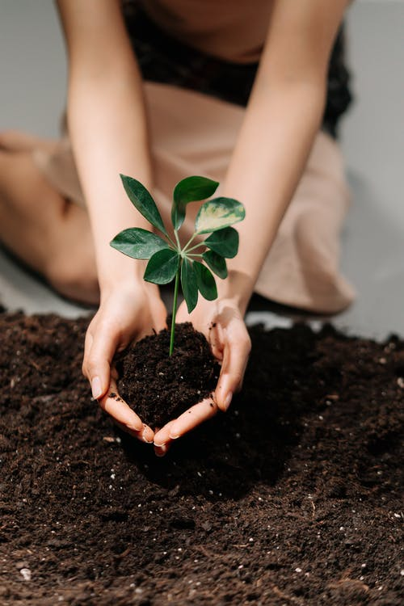
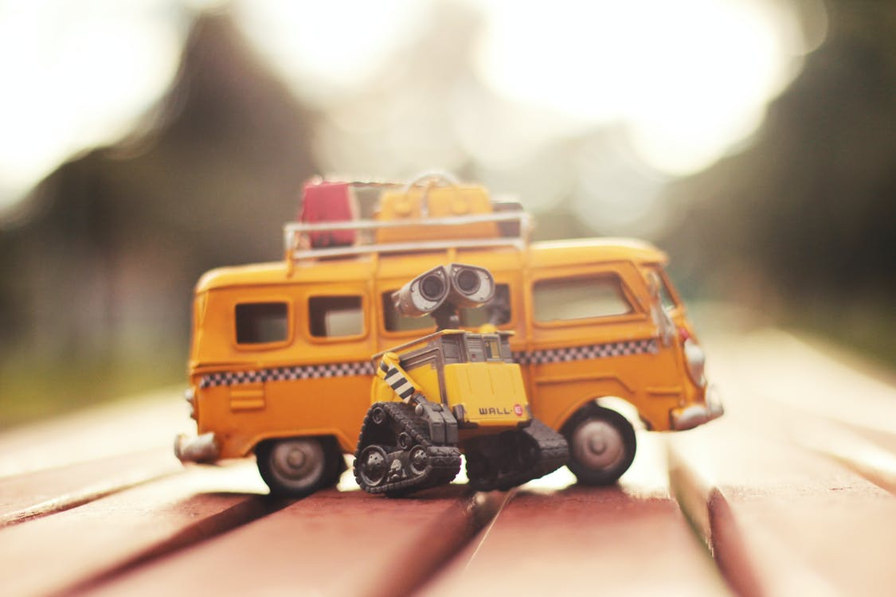
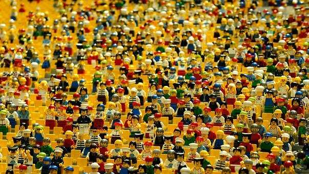
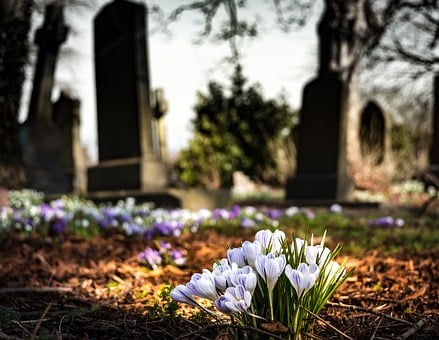

# 第8章 社会影响、风险与未来展望

> 收束全书，对社会影响、现实约束与作者性的结语进行整合。

## 社会影响

移动房对生活的影响

明清到民国时期，帝都曾有粪夫这个职业。这是一个为了生存，诠释“做不到视金钱如粪土，但可以视粪土如金钱”的职业。为争夺粪道，粪夫之间时常会爆发冲突。随着抽水马桶和下水道传入国内，渐渐退出了历史。

移动房时代，垃圾回收更加严格，对粪便单独进行回收再度具有可行性。若能形成规模效应，无论是对下水道系统，还是对过度使用化肥的农业都意义重大。

相比固定房，移动房自带储备水电，停水停电时，优势大到没朋友。当面临海啸、洪水等灾害预警时，能够快速拖家带房转移。

相比传统的厢式货车搬家，移动房搬家省时、省力、省钱。因为搬家时不再需要把各种家当打包，大幅降低了人力搬运和时间成本，预约一辆半挂卡车即可（待自动驾驶普及，司机也不用了）。从一个营地搬到同城另一个营地，仅需几小时。

房子移动化，带来的便利远不止这些。如果有孩子上学或者家人住院，可以把移动房停到学校或者医院周边的营地。

届时需要相应的政策来保障，比如学校周边的营地名额，优先给在校师生的家庭；医院周边的，优先给在院医护和病人家属。到期则清退收回，严防黄牛炒作。

移动住房时代，

在外漂泊的游子不再寄人鸽笼下。

不再连夜搬迁，

不再押一付三，

不再会被强拆。

远离高空抛物，

远离噪音污染。

可以安心坐月子，

可以自由换学校（拒绝校园霸凌），

可以随心从容地换工作，

可以告别奇葩物业。

无恒产者无恒心。没有安居，何谈乐业？

有了移动房，也许，我们可以陪伴着家人，又追寻着诗和远方了。

## 实施路径与产业条件

城镇化是越来越明显的趋势，年轻人为了有竞争力的优质教育，迁居城市；老人为了优质的医疗，也迁居城市。农村空心化势不可挡，这不是文化或市场发展的产物，而是政策引导的结果。靠基建的大拆大建，显然不符合“碳中和”的目标，移动房则能以相对环保的方式填充这个过程。

传统不动房的成本高，主要有三个因素：

1 垄断性地价

2 建造成本

3 中介差价

反之，移动房便宜，主要因素是：

1 不破坏地面，如同停车，黄金地价没有市场

2 工厂化生产，造房子比造车还简单，效率提升、生产成本下降

3 明码标价，厂商直销

移动房是工厂化生产，可以解决农民工再就业的问题，并保障落实他们的工资发放和社保缴纳。可以重新激活家电制造、建材、装修等行业，承接当前基建行业的过剩产能，实现经济软着陆。

## 风险与现实约束

移动住房与相关技术并不会自动完成社会替代，它仍受到政策、基础设施、公众接受度与技术成熟度的共同约束。

技术在不断革新，人们的生活方式也在变化。现代社会的人群流动，主要是劳动个体流动，而在移动住房时代，是以家庭为主的流动。更庞大的流动量，伴随着更巨大的消费需求。氢燃料电池+自动驾驶+移动房+电动飞机带动庞大的产业链，其经济体量比房地产更大，创造的就业岗位更多，经济结构也更加合理。

可能有的人对这种未来趋势感到恐慌。这很正常，未知即恐惧，人的一种本能反应。未知之后，会带来惊吓还是惊喜，取决于我们如何去面对。

离技术成熟还有较长一段时间，无论个人还是企业，筹备转型都还来得及。只是，对新事物难以适应的老年群体，社会各界应当给与更多的关照和包容。

抓住机遇猪上树，错失良辰白翻身。总之，我们不必对未来太焦虑，一天的忧虑一天担就够了。旧的岗位退出历史，会有更多新的岗位诞生。

## 未来展望与结语

结语

人一出生，会面临诸多未知，但有一件100%确定的事——会死亡。在此，笔者弱弱的问一句，倘若我们年轻时买了房子，等还清房贷，住进了养老院，还买得起墓地吗？

我们可以给儿女留下房子，但留不下工作。他们往往会因为求学、工作等原因离开。大部分80后、90后，每隔几年，都会面临搬家的抉择，房子移动化势在必行。在可预见的未来，文中涉及的价格和事件发生的时间，都多少会有偏差，但技术变革的大致方向不会错。相信也好，不信也罢，太阳不会因为很多人在装睡而延迟升起。

对于普通收入的人而言，一线城市买传统不动房的代价，和买移动房+电动垂直起降飞机差不多。如果你是，会选哪一种呢？

买房几何，请君随意。人生总要背负些东西，不背房贷，还有租房贷。翻过了几座山，还要越过几条河，所以不用急着赶路，歇一会儿，欣赏下沿途的风景吧 :)

无论高山或低谷，生活总有希望。

希望，是美好的，也许是人间至善，而美好的事物永不消逝。(电影《肖申克的救赎》台词)

看似昏暗的现在，正是黎明的前夕——破晓！

-----------------------------完-----------------------------

文中如有纰漏，欢迎指正，请发邮件至qsl\_hi@163.com
