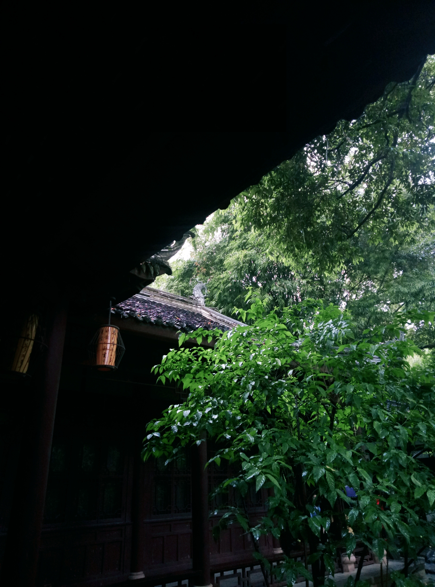
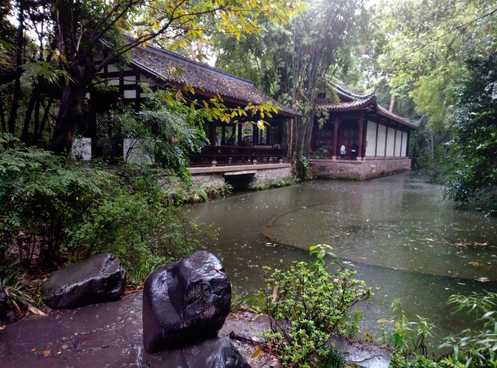
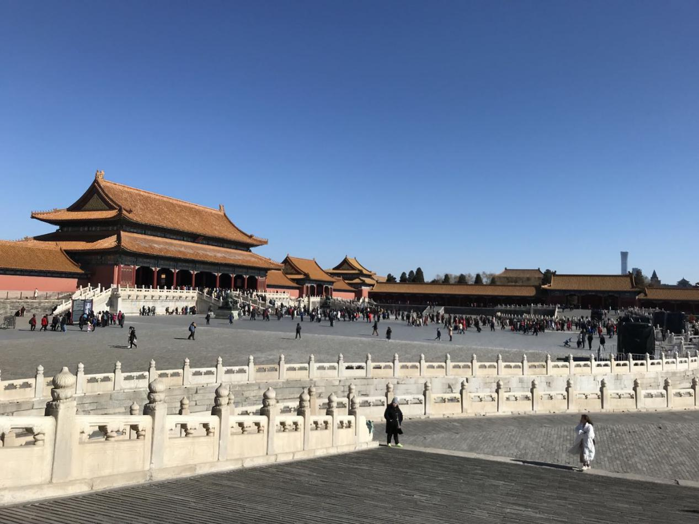

# 第1章 问题与愿景

> 从摘要与开篇引子入手，先回答这本书试图解决什么现实问题，以及为何需要一种新的住房形态。

## 摘要

摘 要

漂泊的游子，在市中心租房有可能低于1000元吗？

无论在何处上班，可以下班后步行几分钟就能到家吗？

父母可以让自动驾驶汽车接送孩子上下学吗？

飞屋环球旅行真的是遥不可及的梦想吗？

读完本书，这些问题你都会有个清晰的答案。

未来5到10年内，住房会变成什么样？交通工具什么样？

本书进行了合理预测，并给出成本可行性分析，对自动驾驶、电池等技术的当前进展汇总分析。

人工智能部分，是入门科普讲解，帮助零AI基础的读者理解其背后的大致原理。

本书尤其适合计划买房、租房的人群阅读，可能会改变一些人买房租房的传统观念；对电动汽车、房车等生产商也有一定参考价值。

若发现文中有错误纰漏，欢迎各位读者提醒指正，具体问题可发送至邮箱qsl\_hi@163.com，或者在github 的issues留言，在此表示诚挚的感谢！

> 图注：扫码下载试读版 github地址

## Abstract

Is it possible for wandering wanderers to rent a house in the city center for less than 1,000 yuan?

No matter where I go to work, can I walk home in a few minutes after get off work?

Can parents let self-driving cars transport their children to and from school?

Is flying house around the world really an unattainable dream?

After reading this book, you will have clear answers to these questions.

What will the housing be like in the next 5 to 10 years? What will the transportation be like?This book makes reasonable predictions and gives a cost feasibility analysis, and a summary analysis of current advances in technologies such as autonomous driving and batteries. The artificial intelligence section, an introductory science explanation, helps readers with zero AI foundation understand the general principles behind it.

This book is especially suitable for people who plan to buy or rent a house, which may change the traditional concept of buying and renting a house for some people; it also has some reference value for manufacturers of electric cars and RVs.

If you find any errors or omissions in the article, welcome to remind and correct them. You can send specific questions to qsl\_hi@163.com or leave a message on github issues. Thank you sincerely !

## 问题的提出

“安得广厦千万间，大庇天下寒士俱欢颜！”

——《茅屋为秋风所破歌》 杜少陵

公元 761 年 成都·浣花溪

2018.4.6清明 拍摄于杜甫草堂博物馆

公元761年，饱受流离之苦的杜老爷子曾发出如此感叹。和追求昆仑奴、新罗婢、菩萨蛮的长安子弟不同，他选择了为苍生代言，哪怕被扣上没有大局观、给敌对势力递刀子的帽子。

身处盛唐，老爷子的生活却相当窘迫，在友人的资助下才得以建成暂时栖身的草堂。6年前，他的小儿子活活饿死（《自京赴奉先县咏怀五百字》提及），成了他一生的痛。

随着科学技术的进步，天下寒士皆有居的这个千年梦想越来越有可能实现。

房子，

见证了王朝兴衰更替，

见证了历史沧桑变迁。

对于老百姓，

它是遮风挡雨的栖身之所；

对于高官富豪，

它是财富权力的象征；

对于历史，

它是悠悠岁月的痕迹。

> 图注：故宫
