# 第2章 移动住房的概念与基本形态

> 围绕四代住房演变、移动化/模块化/接口化与基础设计展开，是全书的概念核心。

## 住房的种类和功能

回顾民住房屋的发展史，演变过程大致如下：

| 类型 | 形式 | 主体材质 | 环保程度 |
| --- | --- | --- | --- |
| 第一代 | 茅草屋，木屋 | 干草，树木 | 非常环保 |
| 第二代 | 砖瓦房，土房 | 砖瓦土石 | 部分环保 |
| 第三代 | 高楼大厦 | 钢筋混凝土 | 不环保 |
| 第四代 | 移动房，房车 | 可循环材料 | 比较环保 |

> 图注：第一代

> 图注：第二代

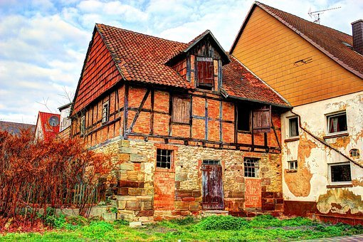

> 图注：第二代

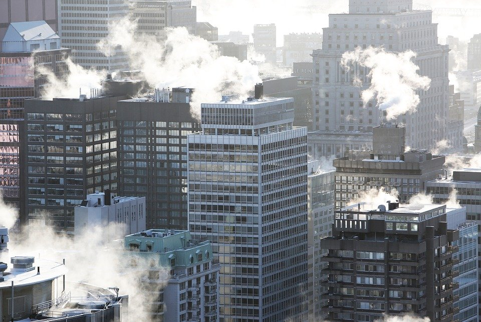

> 图注：第三代

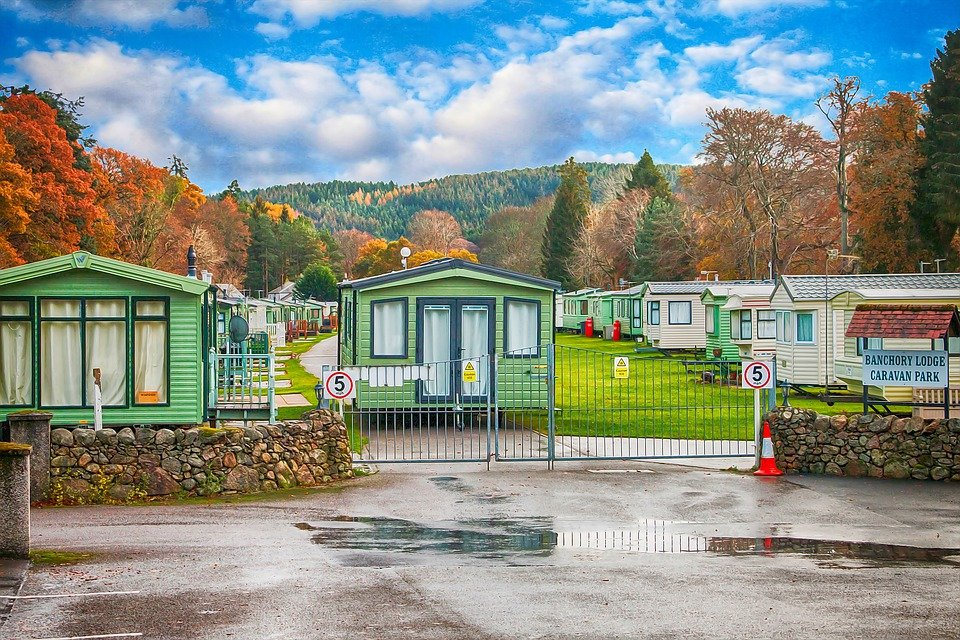

> 图注：第四代

> 图注：第四代

其他类型的住房暂不讨论。如爱斯基摩人的雪屋、游牧民族的毡房，这些没有普适性，而且舒适度很差。

## 移动房什么样？

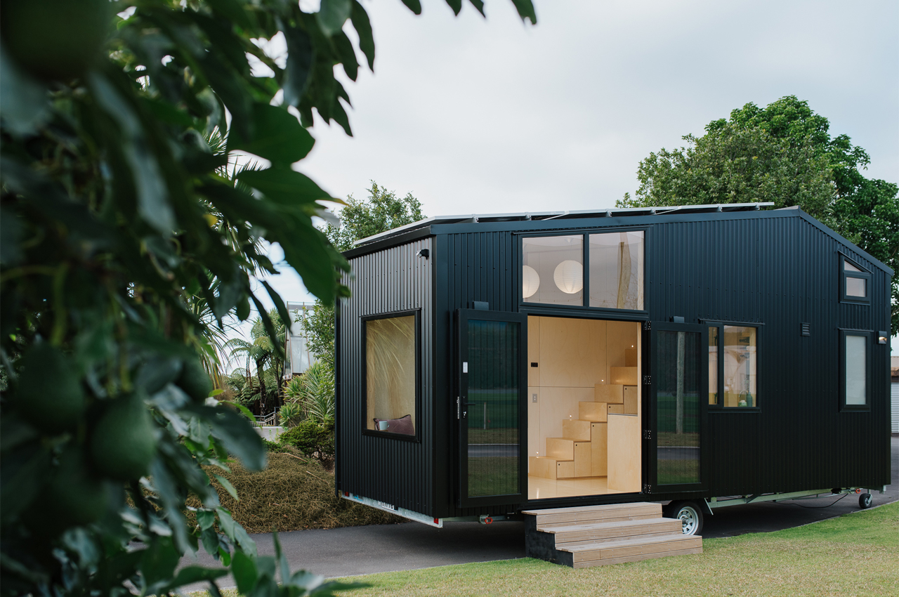

> 图注：图片源自 yanko design

> 图注：图片源自 yanko design

以上两张图是拖挂式房车，移动房和它基本一样，只是不需要有轮子。（符合理念的移动房图片没找到，因此用拖挂式房车代替）

真正意义上的移动房，至少应有三个特性：

### 1、移动化

自行式房车有良好的移动性，但引入了动力系统使成本大幅增加。长时间停放的话，动力系统是闲置的，资源浪费。

集装箱房自身没有移动性，借助拖车和起重机才可以移动。“需要起重机”这一点使其移动性打折，限制了移动场景。

### 2、模块化

移动房的墙体、水箱、管道等各部件都是可拆卸更换的模块，方便维修和配件升级。模块化设计能够避免一处损坏，全体换修的问题。这个优势足够吊打传统不动房，举个栗子：

高层建筑是钢筋混凝土浇筑的方式，各种管线和混泥土浇筑在一起。质量达标的混泥土使用30-50年没问题，可内部管线的寿命大都撑不到30年。所以，过了“保质期”，各类管线就会出现跑冒滴漏现象，维修起来难上加难。漏水了、漏电了、电梯故障了、墙体裂缝了，问题层出不穷。高楼大厦适合商用，不太适合民居。

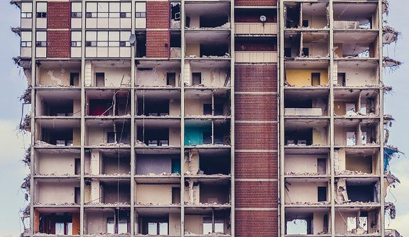

### 3、接口化

水、电、燃气、氢气、光纤，均为标准化接口，可以和营地接口桩或移动补给车连接。相同价格条件下，首选补给便捷的营地接口桩。没有接口桩的地方，可以预约补给车。补给净水、氢气、天燃气、回收污水和生活垃圾如同点外卖，大约一至两周一次。

房子的舒适度主要取决于三个因素:

1、保温性。保温好则能耗低，利于室温冬暖夏凉，体感和睡眠才会舒适。

2、空气质量和采光。通风和采光良好，使人呼吸顺畅，身心愉悦。当暖暖的阳光洒进室内，让人倍感治愈。

3、卫生间的质量。这一点，甚至是生活品质的决定性因素。曾有人说

厕所发展史=人类文明发展史，一点儿也不夸张。发达国家和发展中国家的差距，最直接的体现就是厕所水平，城乡差距也是如此。

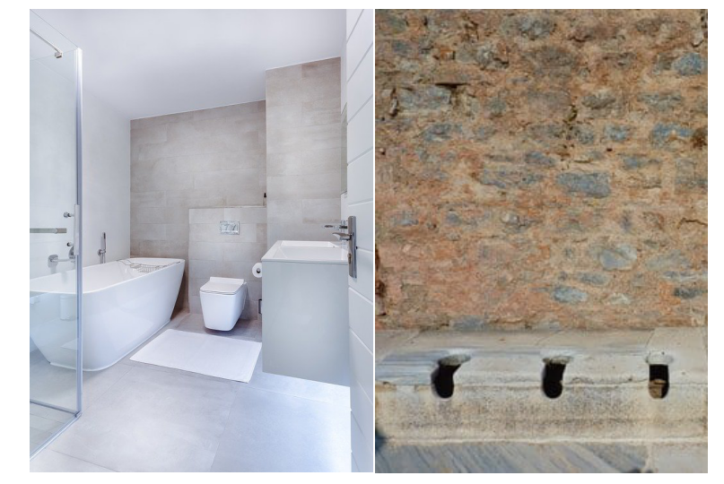

移动房若要普及，首先要价廉，动辄几十万起步的价格，只能让工薪阶层望房兴叹。其次要质优，具备完整的生活家居功能，有不亚于固定房的居住体验。

移动房的最佳应用场景在农村，放在自家院子里，想怎么整就怎么整，没有物业费。宅基地很重要，户口对高考而言没那么重要！

城市场景则是郊区的移动房营地，但居住不应像房车营地那样密集，缺乏隐私空间。应该带有栅栏和门禁，70+平米草地一户，安全和舒适俱备。

如上图所示的这种，栅栏无法阻挡视线，可能大多数人居住习惯上难以接受。为便于营地土地重复使用，不考虑水泥砖瓦的围墙——可以在栅栏周边种植月季、蔷薇等带刺植物，构成花刺墙，透风不透光。

此外，移动房上应装有夜视功能的监控摄像头，如果有陌生人或野兽闯入会自动发出警报。

移动房的造价，可以参考移动房概要设计的尺寸11\*2.5\*3 m来计算（价格估算的参考标准是网商平台的相似物品售价，取中等价位）。

1 房体钢架和管道布线成本，10000元。

2 墙体材料244.5平方米，每平米300元（板房建材，每平米不到100元），共73350元。

3 升降外围墙体的电机和滑轮、绞线，1000元。

4 水箱、过滤箱、增压泵，3000元。

5 五金锁扣、合页使用较多，估算100件，2000元。

综上，裸房成本8.9万元，人工成本和运输成本有2万+的溢价。

参考特斯拉经验，规模化生产后，有30%降价空间，即最终的销售价格区间应该在6—8万元。配置齐全各种普通家具家电，价格可以控制在20万以内，可使用年限30年以上。

移动房使用成本多少呢？普通三口之家，若每月电费220，水费100，燃气80，网费100，则年费用6000元。移动房营地年租金2000，城际搬家一次约1000。综上，在城市生活住房的年成本约1万元。

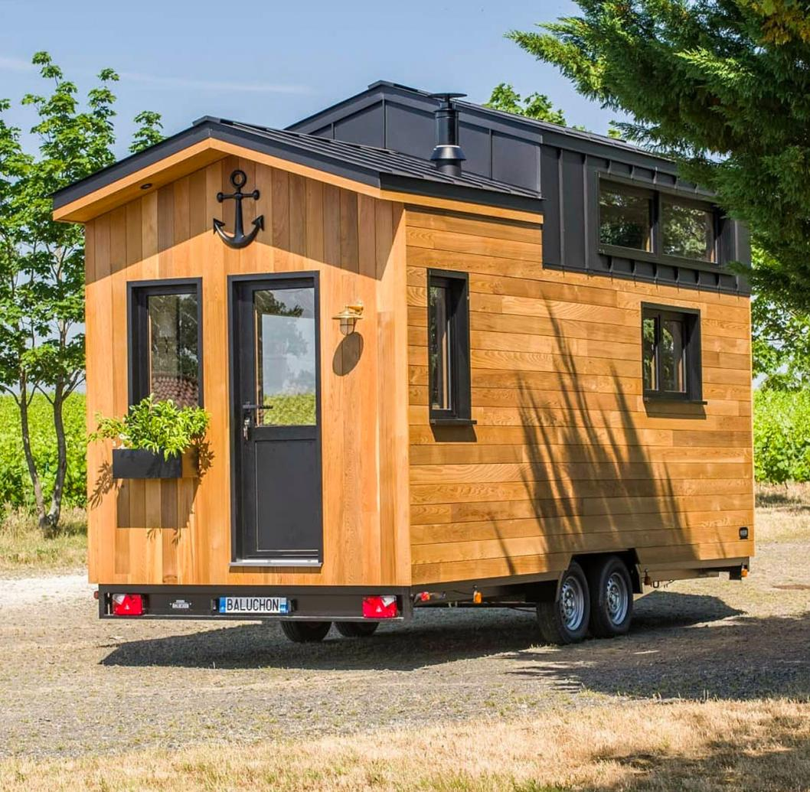

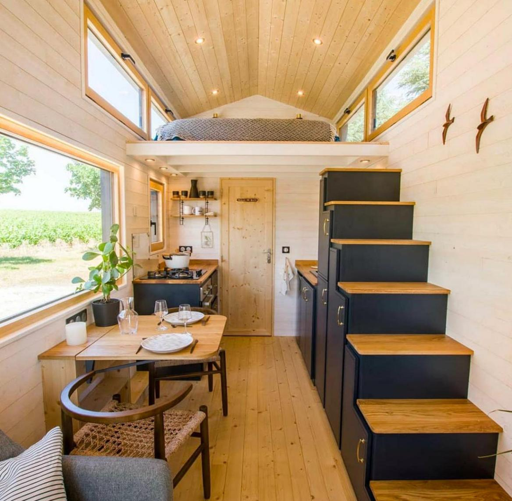

> 图注：图片源自 yanko design

移动房所需的生产工艺成熟，体积仅有公交车大小，因此生产、停放都不是瓶颈问题，难点是补给。

前期，标准化营地稀少，可以停路旁或者廉价的郊区空地。补给方式只有移动补给车这一种。天然气、氢气补给，大概两周一次。净水补给，生活垃圾和污水回收，每周一次。

中期，标准化营地增多，但价格可能会仍比较高，主因有以下几点：

1 未形成市场竞争体系，价格垄断

2 场地使用率低，无法覆盖运营成本

简单说，好比一个学校，招生越少就收费越贵。

等到后期，各种设施完善，价格实惠了，住在营地应该会成为主流选择。

2011年是智能手机爆发年，到如今持续了10年，硬件、软件、通信等层面都积累了大量技术，为下一个10年甚至20年——移动房时代做好了铺垫。

一图胜千言，先参观下现有的吧！

铝合金外壳，防锈坚固。室内分布如下

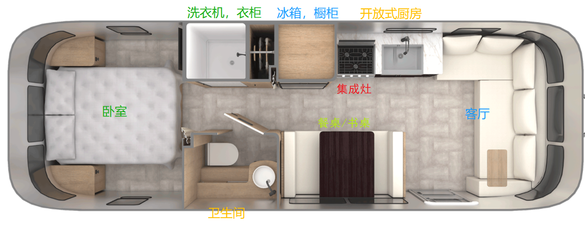

笔者认为这个布局还有改进空间，客厅可以更大。把卧室和客厅合并，床改成绳索升降的吊床，起床后被子不用叠，一键升起到车顶部就行了，睡觉前再降下来。这样，卧室部分就相当于半个客厅，如下图所示

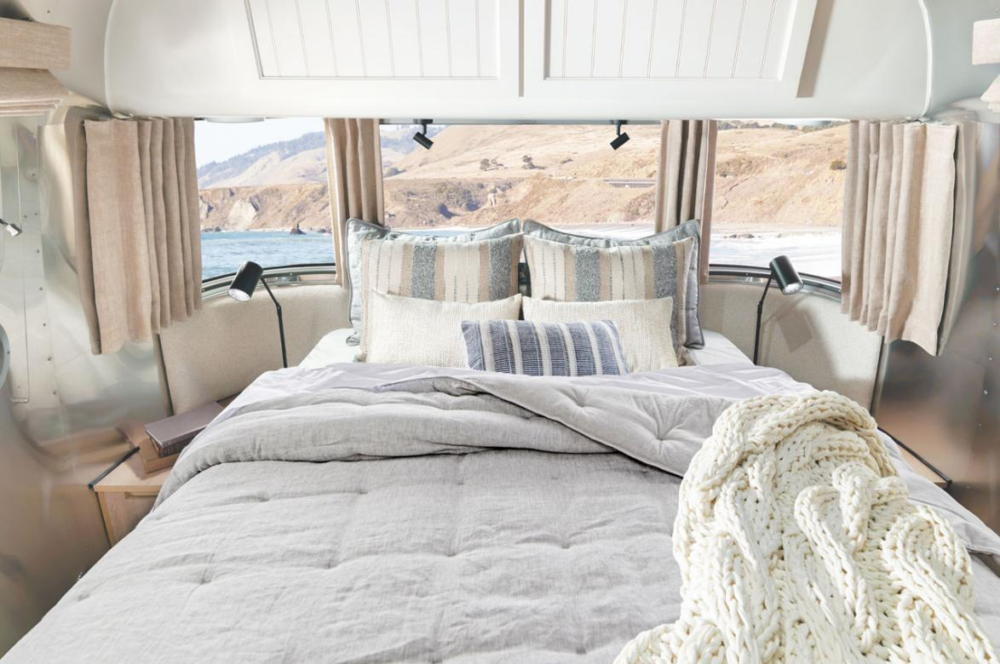

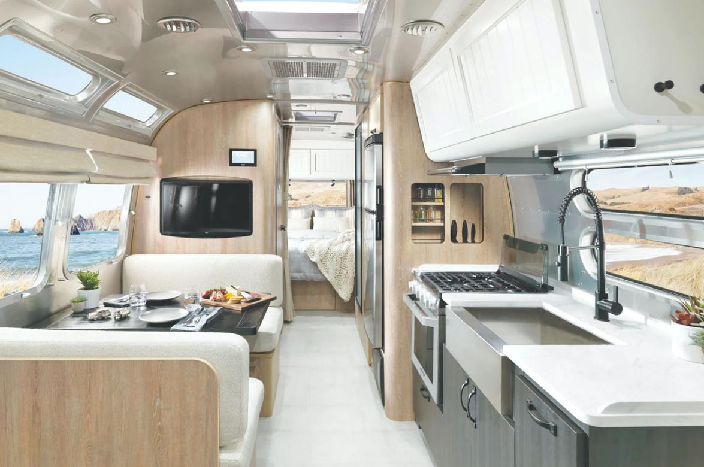

厨房有集成灶，不需要另配烤箱、蒸箱。

> 图注：图片源自 yanko design

## 移动房概要设计

移动房的特点是：移动化，模块化，接口化。现阶段的活动板房、集装箱房、房车，可以看作第四代住房的雏形。

| 类型 | 移动化 | 模块化 | 接口化 |
| --- | --- | --- | --- |
| 活动板房 | √ | × | × |
| 集装箱房 | √ | √ | × |
| 房车 | √ | × | √ |

活动板房优点是便宜，适合灾区临时搭建使用。缺点是：

1 墙体不够坚固，大多是铁皮夹泡沫，能用3-5年算不错了

2 隔音差，遇到雨打风吹的天气，自带音响

3 保温差，冬冷夏热，能耗高

房车优点是功能齐全，移动性最佳，适合旅游和单身人士。缺点是：

1 价格太贵，成本主要在动力系统

2 内部空间小，长时间居住会压抑

3 养护成本高

集装箱房优点是一体成型、坚固耐用。缺点是：

1 保温差，因为是钢体结构，冬冷夏热

2 没有通用的水电燃气模块化接口

3 隔音差

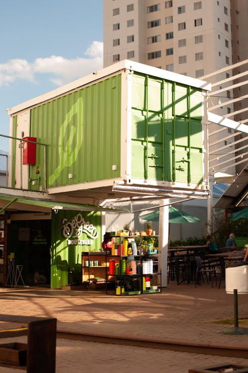

总而言之，集装箱房在三者中性价比最高，保养得当可用二三十年。目前，虽没有标准的移动房问世，但所需的技术条件基本成熟，只差临门一脚。

GB 1589-2016《汽车、挂车及汽车列车外廓尺寸、轴荷及质量限值》规定，半挂车最大长度13米，宽2.55米，高4米。

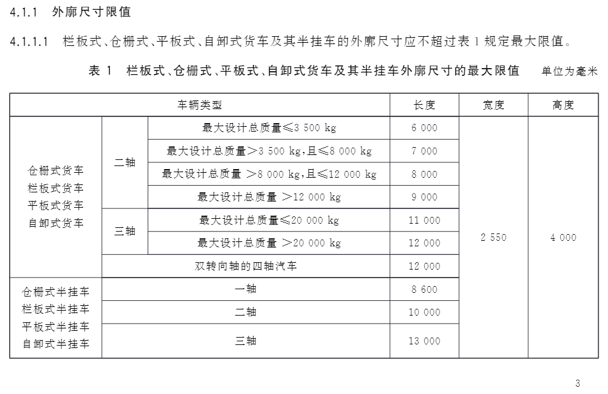

> 图注：图片源自国家标准|GB 1589-2016 (samr.gov.cn)

因此，在公路运输为主的时期，可以设计一款高3米的移动房，加上0.7—0.9m高的半挂车高度，总高度不超过4m。

设计原则：如无必要，勿增实体

长宽高尺寸：11000\*2500\*3000 mm

目标：可供三口之家居住，一厨两卫，两室两厅

墙体采用房车墙体流行的三明治结构，总厚度可以控制在50mm左右，防燃等级B1级。

最外层是铝合金或玻璃钢，坚固耐热；

中间层是聚氨酯硬泡板，保温、吸音；

内层是木塑板，防虫防潮。

构件间使用五金铰接，橡胶密封。

底盘分布草图如下：

底盘占据底部空间尺寸11000\*2500\*200mm，底部是 净水箱、中水箱、污水箱、粪水发酵箱 四种水箱，以及过滤箱（过滤中水）、增压泵、电机（升降墙体）、蓄电池组、氢气罐、天燃气罐、空气能热泵外挂机、支架、管线。

水箱外径尺寸1500\*1000\*200mm，除去保温层厚度，每个水箱的容积200L左右。净水箱3个，总容量600L；

中水箱2个，存储经过滤箱回收的洗衣、洗澡水，可以用来冲马桶、拖地、浇灌植物等，如果满了，可以就地无害化排放；

污水箱2个，存储厨房排水；

粪水发酵箱，存储马桶排放的粪水；

空气能热泵系统=水系统中央空调+地暖，一套系统可以做到热水、冷风都有，能耗更低，适合家用。

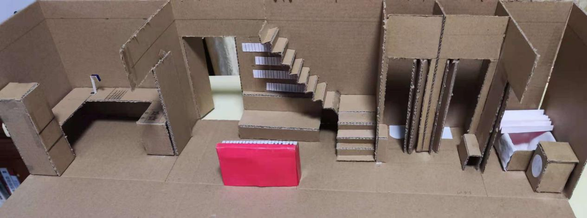

> 图注：内部模型图

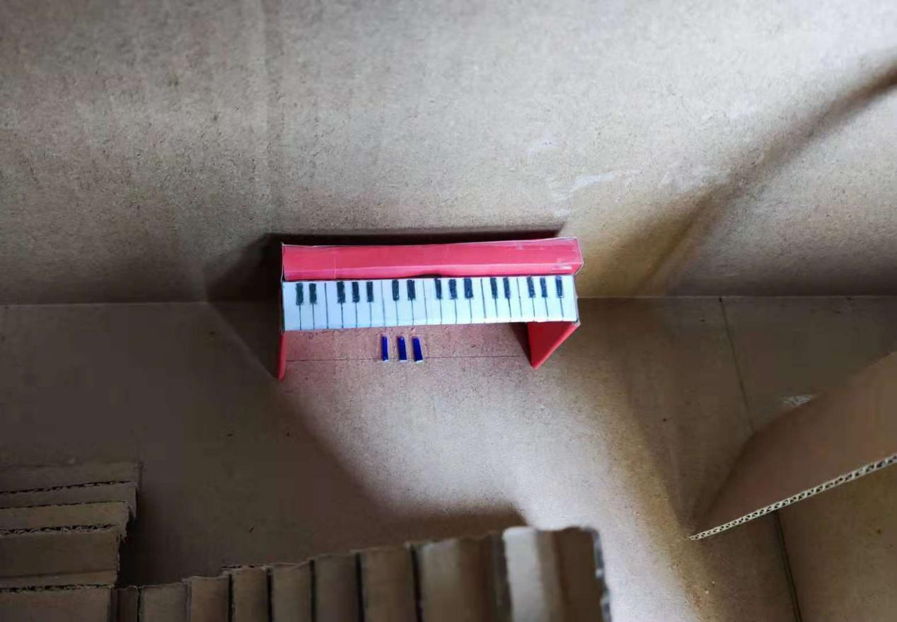

> 图注：客厅一角
