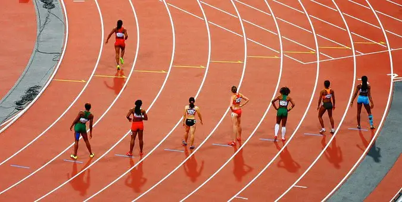
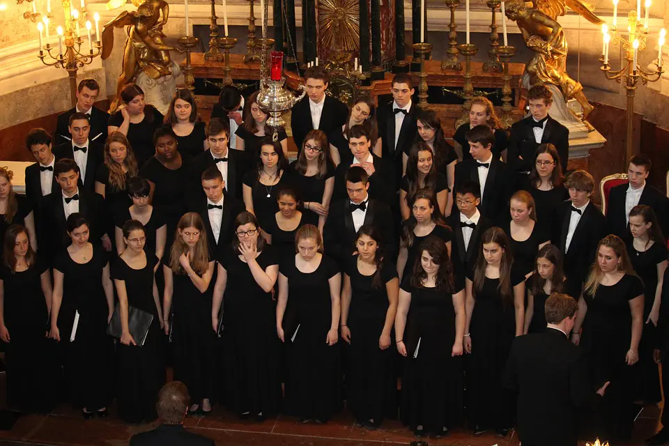
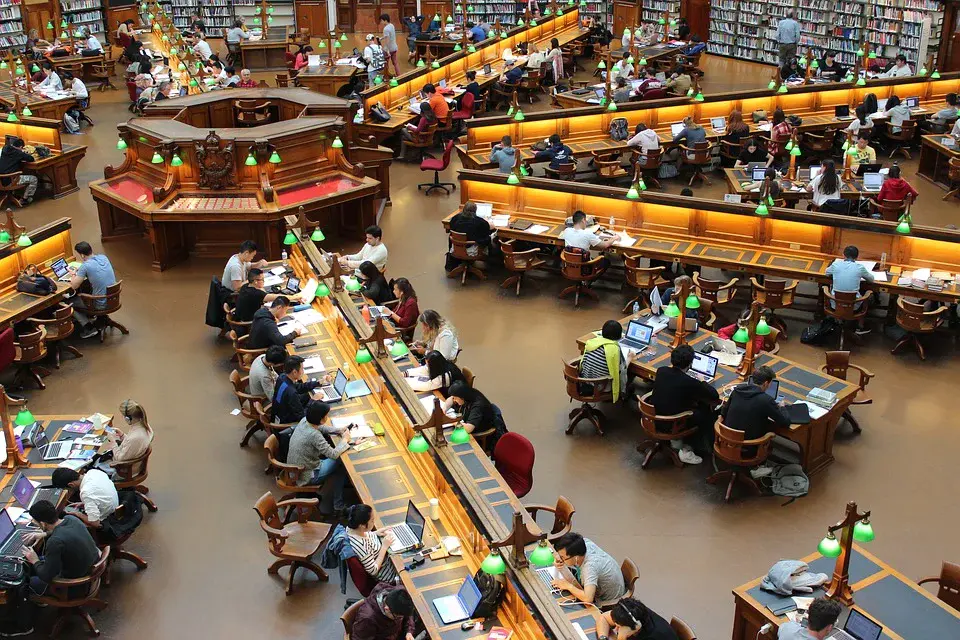

# 第3章 制度与人口流动约束

> 讨论户口、教育、高考与人口流动对居住方式选择的影响。

## 户口和户籍

家为户，人为口。公民在当地（居住、工作、求学等所在地）户口管理部门登记，在法律上才被认定为户。分农业户口，非农业户口两种，每种又分家庭户、集体户。

为防止人口超出城市承受范围，地方政府制定了限制迁入的名额，对新增户口征收高额的城市增容费，类似计划生育超生要征收社会抚养费。

> 图注：户口本

户籍，是国家户政机关制定的记载住户人口基本信息的法律文书，即户口本。 记录自然人的姓名、性别、出生/死亡日期、亲属关系、婚姻状况等信息，确定自然人的民事主体法律地位。

通俗来说，户口约等于户籍，一般指户口本这个法律凭证。

现在若没有户口，则没有相应的法律地位，没有身份证号，无法正常上学、工作、领证（护照、驾照、残疾证、结婚证等）。

> 图注：护照

为追求更好的工作和生活，年轻一代的农村人进城落户。但中老龄农村人进城落户，没有工作，没有能维持生计的社保，养老和医疗标准也很低，贸然落户城市，大概率会陷入农村回不去，城市留不下的两难困境。

户口政策在逐步放开，目前，只有四个国家实行限制自由迁徙的户籍制度——朝鲜、越南、贝宁（位于西非中南部）、中国，至于为什么这样。。。咱也不知道，咱也不敢问。

## 户口相关的资质

### 1. 车牌摇号

现在，各地市的户口对车牌摇号的影响很弱了，可以用社保或居住证替代，而且随着自动驾驶时代的临近，私家车的优势逐渐消失。车牌摇摇无期，不如坐等自动驾驶。

### 2. 房子

其实户口和房子不是必须关联的，但是有了房子比较容易落户；除了炒房客，很多家庭买房是为了落户，方便孩子上学、高考，居住是其次。

### 3. 教育

随着居住证和户口等同入学待遇的政策出台，教育这方面的优势不大了，高考限制还在。

买房落户，是众多家庭为孩子考上国内名校铺垫的第一步。进入公立学校后，还会报各种补习班、XX竞赛，其目的，都是为了加分，拿到更高的分数——名校的入场券。

综上来看，户口在各领域的垄断权逐渐丧失，仅存的最大价值是和高考的绑定。但高考制度，将来会变成什么样呢？

## 高考

参加高考没有学籍限制，不限年龄、婚否，允许社会人士以个人名义参加普通高考。分应届生（当年高三毕业的学生）和社会考生（应届生以外的考生）。社会考生除了不能报提前批的院校和部分专业，其高考试卷、录取分数、入学待遇和应届生是一样的。

高考和户口的绑定，刺激了楼市需求，进一步推升了房价。但谁曾想，由于高房价等原因年轻人不愿多生，人口增长明显放缓，使得“高考需求”减少，楼市增长少了一大助力。

除了高考，还有有中考、小升初，进入XX重点、XX附中、XX实验班，才有更大几率进入名校。

人往高处走，水往低处流。追求更好的教育资源、圈子，这无可厚非。只是，经费、师资等明显失衡，有失公允。如果能切实解决这些失衡，没有了激烈的择校竞争，各种培训班的热度想不降都难。

> 图注：不能输在起跑线

没有学区房就创造学区房，没有学校就创造学校，部分房地产商深谙此道。  
但当学校的真实目的不是为了教书育人，而是为了上市敛财，就必然出现掐尖抢生源、高薪抢老师的现象。

教师同区流动岗和高中名额平均分配，能够退学区房的烧，但解决不了城乡教育差距的问题。城乡差距，不单单在教育上，还存在医疗、就业、基础设施等层面，是个老大难题。

因此，从一定角度看，房价是靠教育利益链来推高的。这就不难理解为什么“双减”相关的政策对抑制房价如此有效。

### 高考路线

首先要明确，义务教育≠公立教育。  
走高考路线，可以在公立学校上学，也可以在私立学校或者其他地方。总之，能够进行人文和自然科学学习就行。

进不了好的公立学校，可以考虑进好的私立学校；  
如果好的私立学校也没有，或者太贵，干脆在家上网课，省下来的费用报些体音美兴趣班，既避免了学校霸凌、猥亵事件的发生，又能保持社交人际锻炼。

> 图注：足球

> 图注：合唱团

> 图注：水彩

高考之后，除了大学教育，还有职业技术教育，但国人认同度较低。有专家认为是“万般皆下品，惟有读书高”、“劳心者治人，劳力者治于人”这些旧观念导致。诚然，但两者在教学、管理等方面的差距也是无法回避的。  
同样是追求实用主义，德国的职业教育做的比较好，我们照抄了却相差甚远，值得深思。

### 非高考路线

不走高考路线的，可以考虑在线教育的大学，考试通过后同样能拿到毕业证。此外，考几个企业普遍认可的技能证书更好；

有一定经济基础的的家庭，可以留学。比如学习留德华（德国学费免费）；

日本、韩国的年费用10~15W（战狼请坐下，鲁迅先生当年留学日本，他就不爱国了吗？）；  
英语语种的考生，可以考虑新加坡，年费用20W+（学费+生活费），看似很贵但相比欧美便宜不少。

> 图注：图书馆

随着社会发展，户口、高考的角色不断在变化。无论怎么变，不变的是——想要保持社会竞争力，就得不断地努力奔跑，终身学习，随时充电转型。
