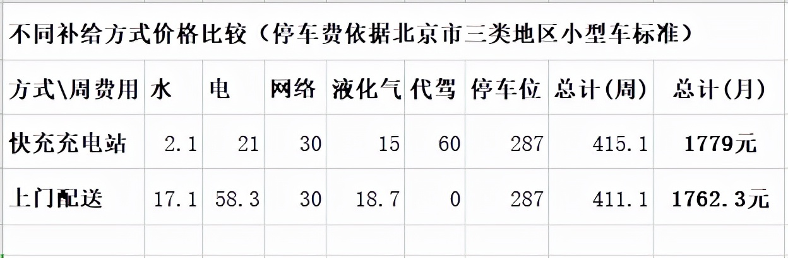
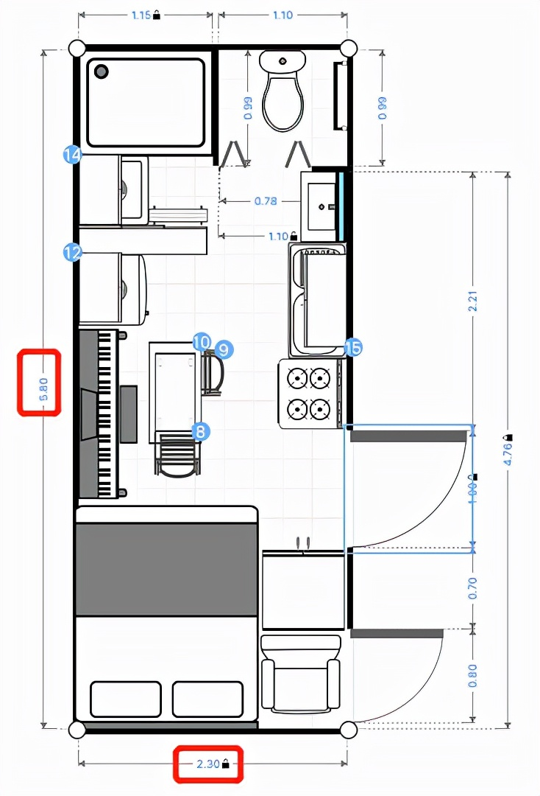
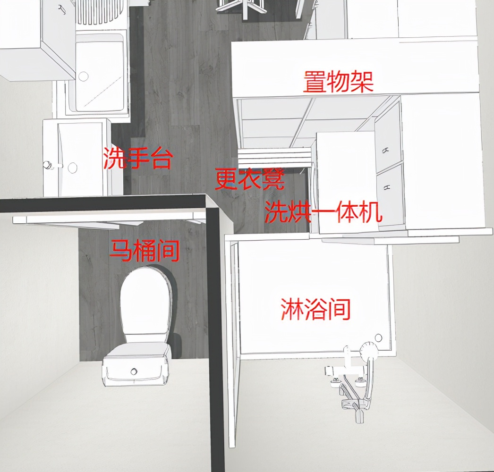
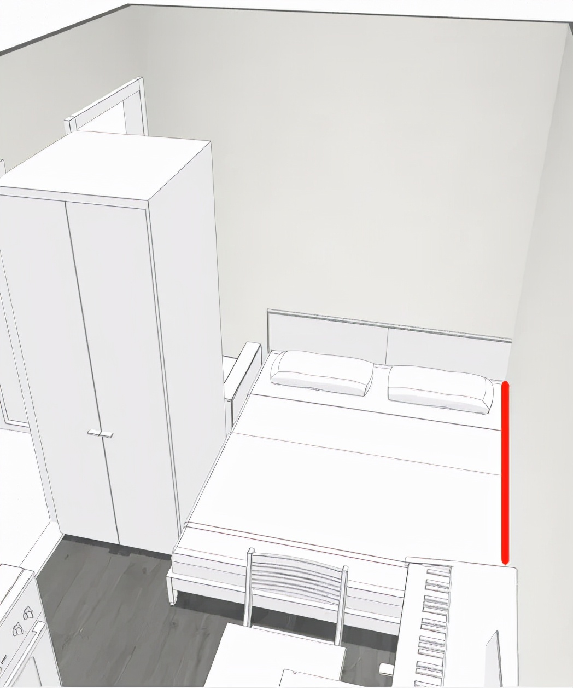
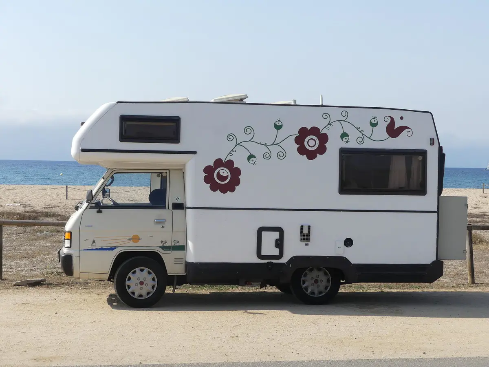
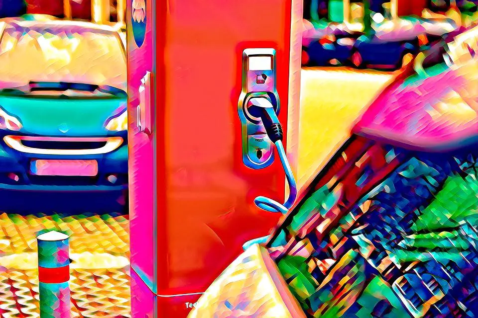
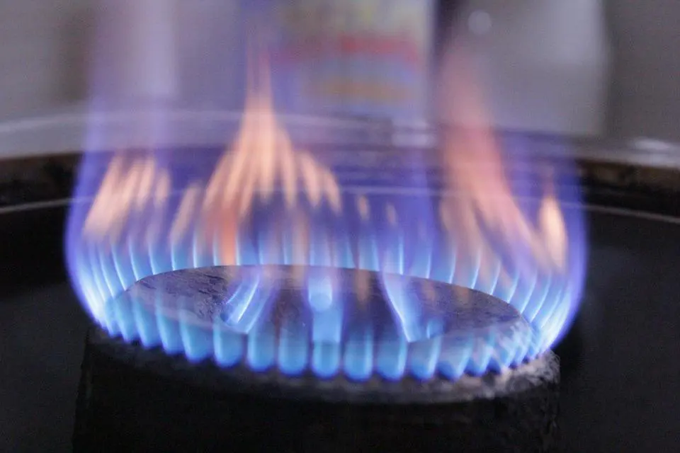

# 第4章 核心产品方案：电动房车公寓

> 集中呈现电动房车公寓的用户定位、内部设计、补给、驾驶、停放与通勤方案。

电动房车公寓

图片源自 yanko design

居住在房车，已经不是新鲜话题。看似方便，实则痛点不少，比如：

房车价格高，

水电补给难，

房车营地贵。  
在此，根据现有的技术条件和常见基础设施，笔者提出一个新型电动房车设计和居住方案，并给出经济成本可行性分析。

用户群体

适合单身一族，或者单亲带娃的家庭，新婚夫妻居住可能会略挤。即使没有驾照，也适合买这种电动房车（每周预约一次代驾，60元）。

居住成本费用明细表

不同补给方式价格比较（停车费依据北京市三类地区小型车标准）。

具体内容如下，仅供参考。任何个人或组织、企业请勿抄袭。

车内布局设计

相比电动房车这个名字，笔者更倾向于电动汽车，因为它的尺寸较小，C1驾照可驾驶。外径长宽高尺寸为5.95\*2.45\*2.8m，内部空间尺寸为5.8\*2.3\*2.2m。长度小于6m，根据中国机动车规格规定属于小型车，停车位按小型车计费。

驾驶位在右下角，用单人沙发表示，实际是隔离的封闭空间，既遵守新冠疫情的防控要求，又保护车主隐私不被代驾看到。

驾驶位，也是快递柜，内外均有摄像头，车门使用智能锁。网购后，把单号的后六位设置成有时限的一次性密码，如果不在家，快递员就可以打开放入。

内部主要分三个区域，三室分离卫生间、开放式厨房、卧室。

三室分离卫生间

更衣凳上脱掉衣物，扔进洗烘一体机里，然后直接进淋浴间洗澡。  
淋浴间有风暖系统和伸缩衣架，可以作室内阳台。

开放式厨房

气电两用集成灶是开放式厨房首选，油烟吸净率高达99%，具体优点在此不细述。至于做饭使用燃气还是电磁炉，看个人习惯。

如果担心安全问题——其实没有绝对的安全，燃气有泄漏的可能，而电磁炉有辐射。燃气泄漏的主因是构件老化，所以定期及时检修很重要。

现在，新一代的液化气钢瓶自带二维码，可以查到生产商和各零部件的使用寿命信息，每次何时、何地、何人充气或检修，均有记录，全链可查，准确溯源追责。

此外，室内应安装燃气泄漏报警器，监测到燃气泄漏时，会发出不低于80分贝的声光报警，并自动关闭阀门。

不同燃气的报警浓度

液化气爆炸的空气浓度范围是1.5% ~ 9.5%。

电动房车可以给燃气使用增加一层安全防护：  
报警器预警时自动启动空调和集成灶的油烟机，以最大功率通风换气，将危险消除于萌芽状态。（如果这时没电了。。。这运气也是没谁了，去买彩票吧）

卧室

红线标注部位是旋转轴，白天可以把床折叠收起，增大室内走动空间。

卧室--床铺折叠收起

车顶是平板型太阳能集热器，无惧冰雹；辅助加热功能，保证冬天也能正常使用。  
车底部是动力系统和电池组（60千瓦时），以及各种水箱。

车底净水箱尺寸2.0\*1.0\*0.2m，除去保温层，有效容积70%，容纳280L净水，可满足一周的洗衣、做饭、洗漱用水；  
带有水回收功能的10KG洗烘一体机，每次用水50L，每周两次，累计100L。每天洗菜、做饭用水20L，洗漱5L，一周175L。

中水箱同净水箱尺寸，存储过滤后的洗衣、洗澡水，可以拖地、冲马桶等；

热水箱尺寸1.0\*1.0\*0.2m，容纳140L热水，可满足一周的淋浴洗澡用水；每天20L，一周140L。

粪水发酵箱同热水箱尺寸，可容纳一至两周的卫生间粪水和厨余废水。

燃油房车

当前的各种房车，以燃油车为主，加上花里胡哨的内饰，大多售价较高。常见的内部设计，让人直不起腰的床暂且不说，卫生间设计得更是一副不想让人久住的样子，简直了呀。

此外，燃油房车用电不方便，使用的车载电器大多需要定制，成本更高。有的为解决用电问题，安装了燃油发电机，可是这样噪音很大，生活体验糟糕。

相比燃油汽车，电动汽车没有这些问题，而且构件简单，生产、使用、保养成本都更低。虽然现在已有十几万元的电动汽车，但还是太贵，至少要再降一半，降到平民价才能走向市场化。  
我国有6亿人月均收入不足1000元！

汽车发动机

燃油汽车主要成本在发动机，而电动汽车成本主要在电池。随着电池技术的井喷式发展，价格还有很大下降空间，锂电池并非是唯一选项。10万元以内的电动房车具备量产可能性。

水、电、燃气等怎么补充

居住面临的关键问题：水，电，燃气——用量多少，价格多少，怎么补给。

补给方式有两种：

定期代驾至快充充电站补给。

水电燃气上门配送。目前还没有氢燃料电池快充充电车，充电上门需等一等。

水

自来水每立方米价格5元，受限水箱体积，每次补给420L，充电站补给成本为2.1元。上门配送较贵，服务费10元起。  
中水和粪水有回收价值，会有厂商做低价回收，假设服务费5元。推荐在充电站免费排放至公共下水道系统。

电

充电桩

快充充电站或者换电站比较便宜（有的停车场自带电桩，用电充电更方便）。上门配送可以预约氢燃料电池快充充电车。  
氢燃料电池应用于移动快充充电车，相当于一个超级充电宝，一次加氢可满足几十辆电动车的充电需求，具备经济可行性（使用氢燃料快充充电车，每度电成本约为4 ~ 5元）。

单人生活月用电50千瓦时，夏季较多，可能超过80千瓦时，快充充电站每度电1.8元，电费90 ~ 144元。郊外没有电力设施的地方，可以预约氢燃料快充充电车上门充电，成本略高些，月电费250 ~ 400元（随着氢气燃料成本下降，还有很大下降空间）。

燃气

燃气灶

液化气站若和快充充电站紧邻，补给会方便很多。  
上门配送15KG的液化气罐，一次120元左右，可用一至两月。

冬季取暖

可以租用柜式可移动燃气取暖器（有倾倒保护、缺氧保护、熄火保护等装置，体积如同一个登机箱），以便检修和充丙烷，过了冬季不必再放在车里。（即便有缺氧保护，也应注意取暖时要保持空气流通）  
取暖成本约1元/小时，即用即开，一月720元。实际没这么高，可能连三分之一都不到，因为大部分人不会全天在家。

上网

使用车载4G/5G移动上网终端，费用和宽带相当，年费1500左右。

安全

一颗摄像头比两堵墙更有威慑力。如果有骚扰或威胁，先报警，再开车转移。尽量停在有安保服务的停车场。停郊区的道路停车位时，不要一个人住在太偏僻的地方，尤其是单身女性。

怎么驾驶

自动驾驶普及之前，每隔一两周可以让代驾去附近的快充充电站补给水电燃气。  
对代驾人员而言，20公里交通半径往返，加上水电燃气补给时间大约一小时，服务费60元，一天9单，月工作日21.75天，则收入11745元。

自动驾驶普及之后，自动驾驶功能可能收费较贵，届时和代驾相比看哪个更划算。

怎么停放

由于车身长度小于6m，停在市内较方便。房车营地补给方便，但是大多位置偏远，价格昂贵，不太推荐。

北京市

三类地区（五环路以外），停车占道收费标准为每天41元。月停车费1230元。  
停车场按月停车大都会有价格优惠，但是北京市区内停车场价格差异较大，玉渊潭附近的停车场包月150元；中关村西区包月则是500 ~ 800元。

居住在这种电动房车，停车成本决定租房成本，如果你能找到免费的停车位，那你的租房成本就是0。等买这种车的人多了，停车位会变得紧俏。对于届时停车费是否会乱涨，大家不必太过担心。  
涨是肯定会涨的，尤其是三环以内，但是停车费比不上房租，溢价难持久。  
从公共角度看，停车位紧张，应该加快立体停车场的建设步伐，而不是简单的禁停卡堵。

立体停车场

根据国家部门出台的《关于推动城市停车设施发展的意见》，不但对市场定价进行改革，还明确要求所有停车点的费用必须透明化，同时向社会全面公开。若不符合市场定价标准，则被视为扰乱社会的违规经营。

如何减少上班通勤的时间？

公司周边的道路停车位或停车场，夜间一般都是空的，晚上包月价格100多元。  
预约好代驾，早上上班后让代驾开到便宜的停车场，晚上再开回来。代驾费用+车辆耗电成本 约80元，低于市区一类地区白天停车价格。每月有21.75天需要这样，费用支出1740元，略贵，但节省的通勤时间很可观。  
实际上，不少公司附近的停车场全天包月是低于这个价格的，不必这么麻烦。
