# 第6章 关键支撑技术

> 把自动驾驶、人工智能与电池/氢能重新组合为支撑移动住房普及的技术底座。

## 自动驾驶

自动驾驶分类等级

五年前，李世石对战AlphaGo败北，标志着着机器学习进入了新时代。受益于此，汽车自动驾驶领域的研发不断突破。相比人开车，自动驾驶优势很明显：

不会疲劳分心，

不会违反规则，

更加灵敏精准。

自动驾驶的发展分两大阶段：

第一阶段——载物，主要应用在物流行业；

第二阶段——载人。物流验证升级后，自动驾驶技术和法规更加安全完善，开始载人。

现在是两个阶段的过渡期，国家市场监督管理总局对自动驾驶制订出了《汽车驾驶自动化分级》国家推荐标准(GB/T 40429-2021)，2022年3月1日起正式实施。

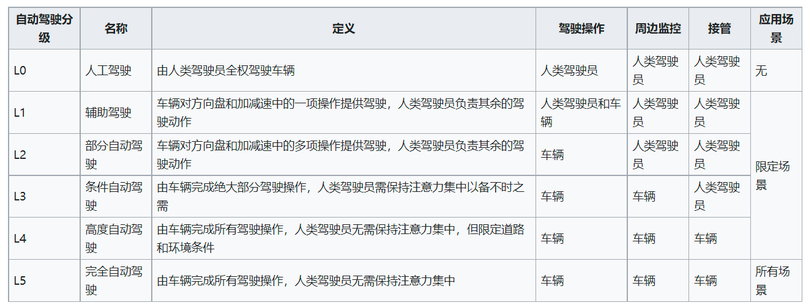

国际汽车工程师学会标准

L4级的自动驾驶足以胜任大部分城市路况，谷歌Waymo、特斯拉、百度Apollo等都宣称自己达到了L4水平。笔者虽然持怀疑态度，但所期不远。

对于车企急功近利，把L3级的辅助驾驶系统兜售成L4级的自动驾驶，不断发生事故，这是违反法律和道德的问题，不是技术问题。

如同手机的迭代更新，自动驾驶汽车的成本也在快速下降。已经应用自动驾驶的是物流行业，以前局限在港口或封闭园区内，鲜为人知，现在逐渐扩展到了物流配送末端。美团、京东、阿里、百度都在测试自己的无人配送车或无人机。

受新冠疫情影响，由于自动驾驶能有效减少人际接触，相关政策审批有所加速。

当前自动驾驶普及的障碍主要有两个：

1、政策法规

2、量产成本

此外，还有个隐形障碍——自动驾驶相关企业的职场无间道频频上演，技术核心人物容易出走创业，延迟了商业化进程。

自动驾驶会优先在公交和出租车行业推广，私家车最后效仿。但那时普通私家车可能没有了存在的必要——自动驾驶的网约车能够24小时随叫随到，恶劣天气不会大幅减少，更不会乱涨价，使用成本也比自己买车养车低很多。

打败私人自行车的不是摩托车，也不是电动车，而是——共享单车。汽车行业大概率会经此一劫吧。

值得提醒的是，自动驾驶的载体——电动汽车并不等于清洁能源车，因为我国目前的电力结构主要是火电。此外，废旧电池的回收是个大问题。锂电池回收成本高、污染严重，对环境的污染比塑料还甚。只关心生产销售而忽视回收，实际上是在断子孙后路。

自动驾驶带来的便利

自动驾驶会大幅减少停车场的使用，改变以往的停车模式。以前人们要付费停车，而自动驾驶时代，不再需要这样——空闲时间可以当网约车去载客赚钱。此外，自动驾驶使交通半径进一步扩大，更多人会愿意租在性价比高的郊区，因此可以降低人们的租房成本。

30公里的通勤，坐公交需要一个小时，打车半小时左右。自动驾驶的打车费用会比现在便宜很多。相比住在市中心，通勤费用虽然增长了，但节省下来的房租更多。

图片源自 https://toyota.jp/mirai/

使用成本方面，可以参考氢燃料电池汽车——丰田二代Mirai，氢气容量为5.6公斤，可供电70多千瓦时。目前在日本每公斤氢气的价格为1100日元（人民币65元，零售价格，含税，含存储运输费用），加满氢气的成本为364元人民币，续航里程约650KM，相当于每公里0.56元人民币。这样的成本与国内的燃油家用车相当。

按照特斯拉的自动驾驶方案，马斯克给出的自动驾驶出租车每英里成本为0.18美元(每公里约7毛5)，考虑到运营成本，估算1元一公里(目前出租车成本一公里3元)。

假设张麻子住在北京沙河，五道口附近上班，不想挤公交地铁，我们可以算下往返通勤成本多少。

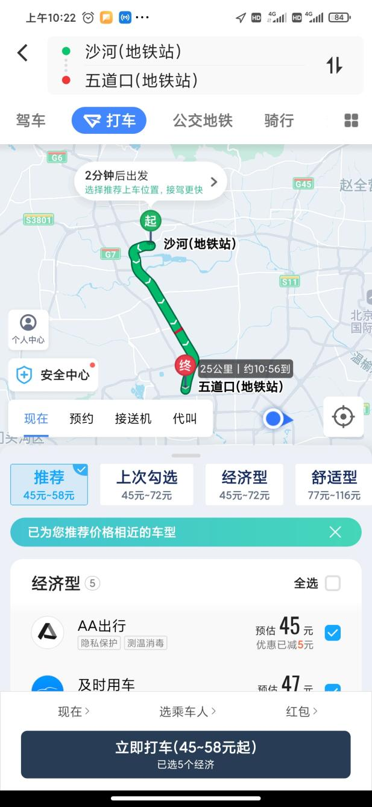

通勤距离约30公里，在拥堵的高峰期乘坐自动驾驶车辆单程时间大约45分钟，月工作日20.83天，打车费累计1249.8元。若采用会员制预约通勤，有20%的降价空间，约合999.84元。这是通勤不拼车的价格。

自动驾驶会使人们的生活更加安全便捷，带来的社会效益非常多，降低房租只是冰山一角。举两个栗子：

1 女性在夜间独自乘车的安全性大大提升，不会发生司机或乘客被打劫害命之类的事件。

2 父母不必亲自接送孩子上下学，在家门口把孩子送上车就行，通过车内视频设备和孩子互动。车开到学校内部的停车区，由其班级助教身份认证后打开。

图片源自 yanko design

自动驾驶技术路线和进展

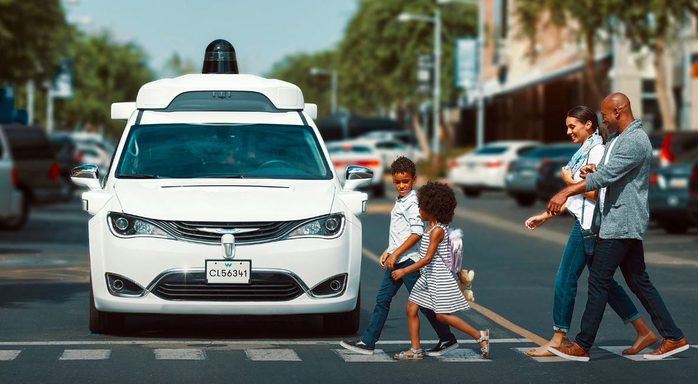

自动驾驶的开路先锋当属Alphabet（谷歌）公司旗下的Waymo，于2009年作为谷歌的自动驾驶汽车项目启动，2016年独立成为子公司。Waymo的训练方式除了现实世界道路测试，还有仿真软件的虚拟世界测试。截至2020年，路测累计2000万英里（3200万公里），仿真里程超过100亿英里（160亿公里），测试地覆盖美国25个城市。

其第五代无人车平台——Waymo Driver，针对四大使用场景：打车服务、卡车运输、货物递送和私人乘用车。摄像头、雷达、激光雷达等传感器和AI计算芯片都接近顶配，仅摄像头就有29颗，此外还配备了清洁和加热系统。硬件配置虽然豪华，但Waymo官方只说性能多么好，对具体参数和实际成本则保持沉默。

2020年10月9日，Waymo正式宣布通过旗下的叫车服务软件Waymo One在凤凰城提供完全无人驾驶服务。

Waymo立意高远，目标是L4以上的无人化自动驾驶。但太过于追求完美导致迟迟无法大规模商用，陷入尴尬境地。虽然是自动驾驶领域的领头羊，市场却被竞争对手占据的更多。可谓成也萧（完）何（美），败也萧何。

不是所有公司都像Waymo一样惹人注目，自动驾驶领域有一个隐形高手——Mobileye，一家以色列汽车科技研发公司，其单目视觉的高级驾驶辅助系统 (ADAS)市场占有率高达70-80%。1999年创立，2017年3月被英特尔以150亿美元并购。目前，全球已超过6000万辆汽车上安装了Mobileye高级驾驶辅助系统。奥迪、宝马、菲亚特克莱斯勒、通用汽车、本田、现代/起亚、日产、大众等全球各大汽车制造商在上百个车型中均有采用。为什么这么受欢迎呢？

自然是产品真的香啊。

该公司的Powered by Mobileye 产品专为从事高级驾驶辅助系统（ADAS）的制造商而设计。系统包括了一个多合一印刷电路板，由EyeQ2®提供技术支持，是一款专用型视觉计算芯片系统（SoC）。EyeQ2芯片每秒能执行260亿次操作，功率消耗却仅有6瓦。

同时该系统还包括一个摄像头，可以与汽车制造商的其他系统集成，客户用最低限度的软件开发能力便可实现自定义的高级驾驶辅助系统（ADAS）功能。

从技术角度看，自动驾驶分两大路线：

一个是多种传感器融合路线，激光雷达的精准测距，结合毫米波雷达、高分辨率摄像头等多种传感器。设计上冗余较多，说是安全（成本高），大部分厂商采用的是该方案。这种方案看似安全，实际上有不少潜在风险。

首先是数据量更庞杂，难以实时融合且处理费时，导致反应速度偏慢，为减少风险只能慢吞吞地跑；其次，当摄像头和雷达判断发生冲突，无法确定哪个更靠谱，这时汽车就懵了——到底听谁指挥？

另一种是纯视觉路线，即仿生路线（人类司机驾驶就是纯视觉）。摄像头模拟眼睛感知路况信息，AI神经网络系统模拟大脑进行导航决策。看似简单，传感器少，实现却最难。目前只有特斯拉走纯视觉路线，一枝独秀，其他厂商则是观望态度。特斯拉这么做并非单纯的成本考量，更大的愿景是开发出纯视觉通用型自动驾驶系统，可以普及到非汽车领域。比如机器人领域，在汽车上安装一大堆传感器可以，但机器人不行，成本、续航、耐用性都会受到严重影响。

特斯拉早期曾跟Mobileye 合作，在2014年10月推出了L2级自动驾驶系统 AutoPilot，沿用到了2016年。和Mobileye分手后，特斯拉陆续发布了自研的自动驾驶解决方案——Hardware 2.0（HW2.0），基于 HW2.0 的 Enhanced Autopilot（增强自动辅助驾驶，EAP）和Full Self Driving（全自动驾驶能力，FSD）。目前，最新一代是与博通合作研发的 HW 4.0 自动驾驶芯片，采用台积电 7 nm 工艺制造，预计2021年第四季度开始生产。

纵观特斯拉的自动驾驶产品线，不但软件自研，芯片硬件也自研，简直像汽车界的苹果，软硬通吃。不过，有新闻称苹果公司早在2014年就开始了自动驾驶Apple Car 的研发，计划在2025年推全自动驾驶、无方向盘/踏板的汽车。能否如期实现很难说，但增加一个特斯拉的强力竞争对手，对消费者而言是好事。

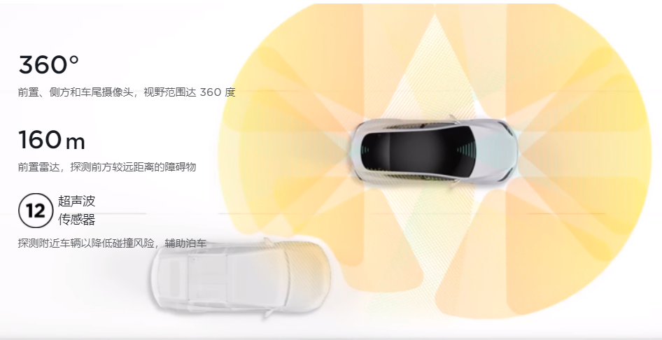

特斯拉起初走的不是纯视觉方案，在发生多次撞车白色卡车事故后，其技术团队分析后确认是毫米波雷达拖累导致，便考虑放弃毫米波雷达。众所周知，早期激光雷达比较昂贵，马斯克曾多次唱衰激光雷达，坚持不用。不少人以为特斯拉不用激光雷达主要是考虑成本，等激光雷达成本降下来，肯定会用。

然而，事情的发展出乎意料，特斯拉非但没用激光雷达，连毫米波雷达也放弃了——宣布使用纯视觉方案。一时在业内引起轩然大波，有的甚至批评特斯拉太激进，置用户安全于不顾。

特斯拉敢于这么做并不是疯了。FSD能利用多相机融合感知汽车周边的环境，以8个摄像头输入的数据为基础绘制3D模型鸟瞰视图，加上时间标签形成4D的空间道路信息，为车辆规划出最优驾驶路径。根据特斯拉 AI 高级总监 Andrej Karpathy在2021 年计算机视觉与模式识别大会上演示的案例，纯视觉方案在功能上已经达到并有望超越激光雷达和毫米波雷达。

总而言之，纯视觉的自动驾驶难度很高，还需要一段时间完善，但前景广阔；多传感器融合的自动驾驶依赖高精地图和激光雷达，目前技术上基本成熟，占据先跑优势，但是后期不行，没有低成本的普及性。

笔者认为，依赖于高精地图的自动驾驶和远程遥控驾驶没有本质区别。真正的自动驾驶，应当可以在断网的情况下，凭自身的离线地图和陀螺仪辅助定位实现自主导航。至于车路协同方案，那纯粹是画饼圈钱的手段，扔掉拐杖才有奔跑的可能。

在前的，将要在后，在后的，将要在前。

诚然，自动驾驶再牛，也做不到绝对安全，但百分之百比人类安全。笔者并非特斯拉的铁粉，但比较欣赏它务实的风格——干就完了，做比嘴炮重要，哪怕跳票打脸，Done is better than perfect。

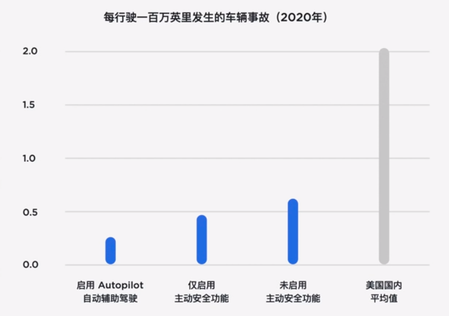

参考特斯拉在美国的运营数据，在启用自动辅助驾驶功能的驾驶活动中，特斯拉车辆平均每行驶一百万英里发生的事故为 0.2 起，而美国境内车辆平均每行驶一百万英里发生 2.0 起事故，是特斯拉车辆的 10 倍。

总之，无论部分媒体怎么唱衰，属于自动驾驶的那一天必将来临。

## 人工智能

人工智能

人工智能（Artificial Intelligence，简称AI），属于计算机科学的一个分支，本质上是⼀种计算机程序，模拟实现人类的推理、分析、交流、规划等智力行为。这个词概念很宽泛，甚至太大太空，敢贴这个标签的公司，要么是业界的科研领头羊，要么是善于包装圈钱的骗子。

人工智能、机器学习、神经网络之间的关系如下图所示

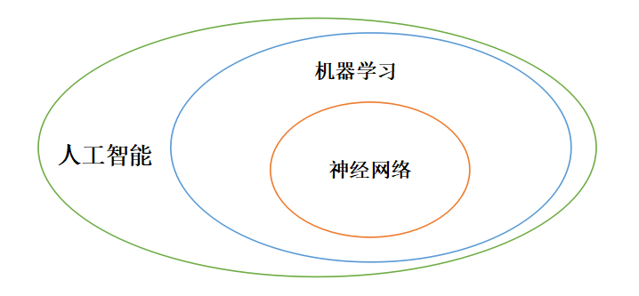

最近几年比较火的卷积神经网络是神经网络算法的改良版。

名词解释 算法：通过计算机指令，按照数学逻辑实现的解题方法。

例如：如何把大象放进冰箱？

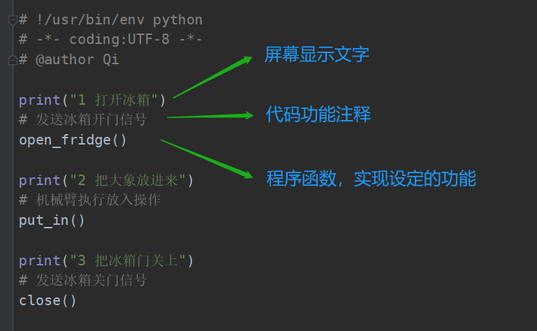

可能有的人不了解什么是 程序函数，举个自定义的加法函数栗子：

执行程序，输出结果（键盘输入的是绿色数字）

程序员用编程语言写的代码（又名 程序），需要编译器编译一下计算机才能执行。程序代码好比不同语言（python，java，C）的人话，编译器则将这些程序代码翻译成计算机能“读懂”的汇编代码，最底层的硬件可以把汇编代码自动转换成可执行的机器码。

编译器 也是一种程序，可以把程序翻译成计算机能执行的机器指令。

用户运行某程序，就是让程序告诉计算机执行某种指令，产生不同的电磁信号操作，从而达到想要的功能。

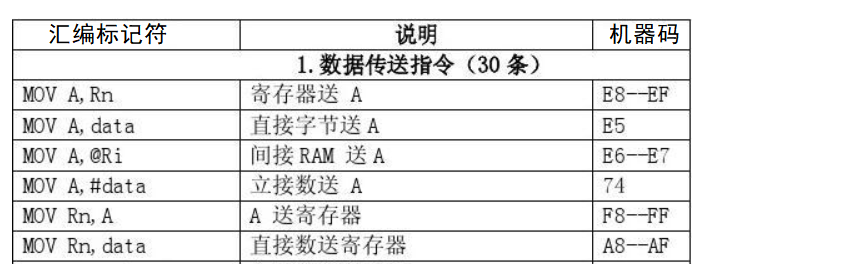

以输出“Hello”字符为例（下图红框部分是汇编代码，黄色区域是机器码）

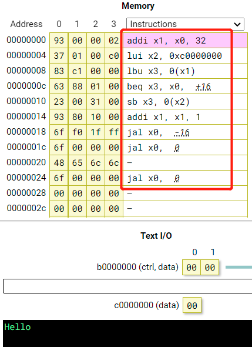

示例来自 http://tice.sea.eseo.fr/riscv/

人工智能的水平等价于模拟人类的程度，模拟程度越高则人工智能水平越高。不过，即便人工智能达到了以假乱真的地步，依然无法改变一个事实——人工智能不具有真实的思维能力，不会独立思考，更不会有梦想。它只是在人设定的功能范围内模拟人类的反应。这就像仿真机器人，无论多么逼真、多么厉害，终究不是生命体。

随着人工智能技术的进步，仿真机器人拟人化程度会越来越高，声音、表情、动作、甚至情绪都能模仿得惟妙惟肖。不知那时，会有多少人提出把机器人和人同等对待。

把人当机器，是没人性；

把机器当人，是另一种没人性。

颠倒秩序，把孙子当成爷爷，客人当成主人，这种伪“平等”正是左流所热衷的。所以，为了保护我们和子孙后代的健全人格，对这种行为或呼声我们应以实际行动抵制，而不是沉默。

0和1的二元世界

二进制

比特流数据

在计算机的眼中，所有的数据都是以二进制的形式表达的，即只有0和1，没有0.5之类的第三者。通过解析转码，然后显示成不同类型的数据。计算机之所以采用二进制，主要是因二元状态对电子元件来说比较容易表达——电路的开关，电压的高低，磁性的南北，平面的凹凸等，都适合二进制的形式表达。

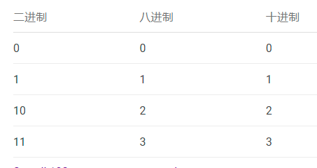

二进制由德国数学家莱布尼茨于1679年以论文的形式提出创立；1689年，他游历于意大利，结识了耶稣会派遣于清朝的传教士闵明我；1697年10月，莱布尼茨和耶稣会另一名法国传教士白晋开始了书信，白晋向他介绍了中国的《周易》，说伏羲（人面蛇身的神话人物）六十四卦的排列与莱布尼茨的二进制记数法的顺序雷同，并在书信中附带了伏羲六十四卦方位图（实际是宋朝邵雍的作品）。

也（瞎）许（编）是担心被告抄袭吧，毕竟周易比他早了上千年，所以，那一年，莱布尼茨没敢发表二进制相关的论文。

对于这段往事，有些人找到了骄傲自豪感——厉害了我的祖宗，几千年前就奠定了二进制的理论基础！其实，不单二进制，计算机的发明也是，连专家都说世界上最早的计算机是老祖宗发明的——算盘，只不过功能单一了点儿。

1位数字代表1比特（bit），8比特 = 1字节（byte）。数据在不同设备或元件之间以比特或字节的形式传输，如同水流，故被称作比特流或字节流。

我们在通信运营商办理宽带或者光纤服务，会涉及到“带宽”这个概念，这里的带宽指的就是bit位，即每秒能传输多少比特位的数据。这个“带宽”除以8，就是我们通常拷贝文件的速度（文件大小的单位是 字节）。简单说，如果你在运营商购买了10M（bit）的宽带服务，那么网络流畅的情况下，下载文件的速度是1M（byte）多一点。

二进制在通信领域的最早应用也许是摩尔斯电码，在电话诞生之前的电报机时代，风靡了全世界，二战期间使用尤为广泛。（由于摩尔斯电码是时通时断的信号，把停顿也当作一种信息，有人认为它不是二进制通信）

除去停顿，摩尔斯电码的信号单元有点（·）和划（—）两种，发送信号时也就是短按和长按的区别，因此我们可以看作0和1。

1832年，41岁的塞缪尔·摩尔斯（Samuel Finley Breese Morse）放弃了已小有成就的绘画事业，努力学习电磁领域的知识，在贫困潦倒中坚持研发电报机。

1844年5月24日，他发出了人类历史上第一份电报。谦逊如牛顿，他认为自己只是发现了规律，而不是创造了规律本身，因此电报内容是：“上帝创造了何等奇迹！”。那时的电报传输还是线缆的方式，不是无线电，但足矣称得上是人类通讯方式的一次巨大飞跃。

随着电磁技术的不断突破和电子元件的微型化，电话、网络、计算机接连诞生，信息的传递方式更加丰富便捷。

在计算机和网络中，数据以比特流的形式传输，而比特流在硬件层面实际上是以电信号的方式传递的。居民日常使用的是交流电——电流强度和方向会周期性地变化，通常波形为正弦曲线，加以处理就能作为一种信号载体。

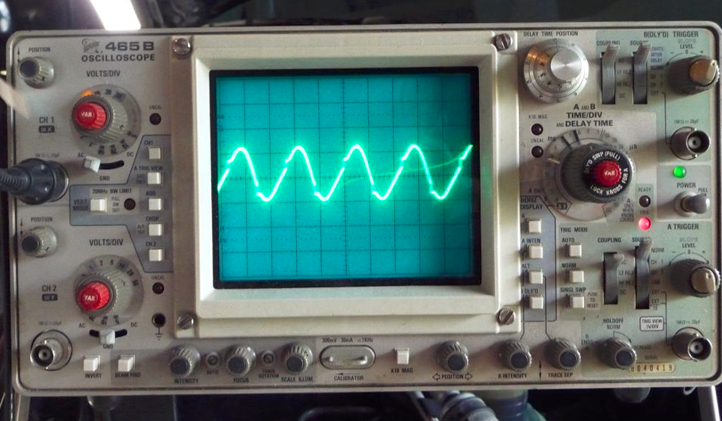

示波器屏幕

电信号可以借助示波器以图形的形式表现出来，可以观察到是一个连续的波浪形状，改变其振幅或频率就可以传递信息，我们称之为模拟信号；通过模数变换器，将它“方块儿”化，高位代表1，低位代表0，这时我们称之为数字信号。光纤通信的原理与此类似，只是用到的设备元件不一样。

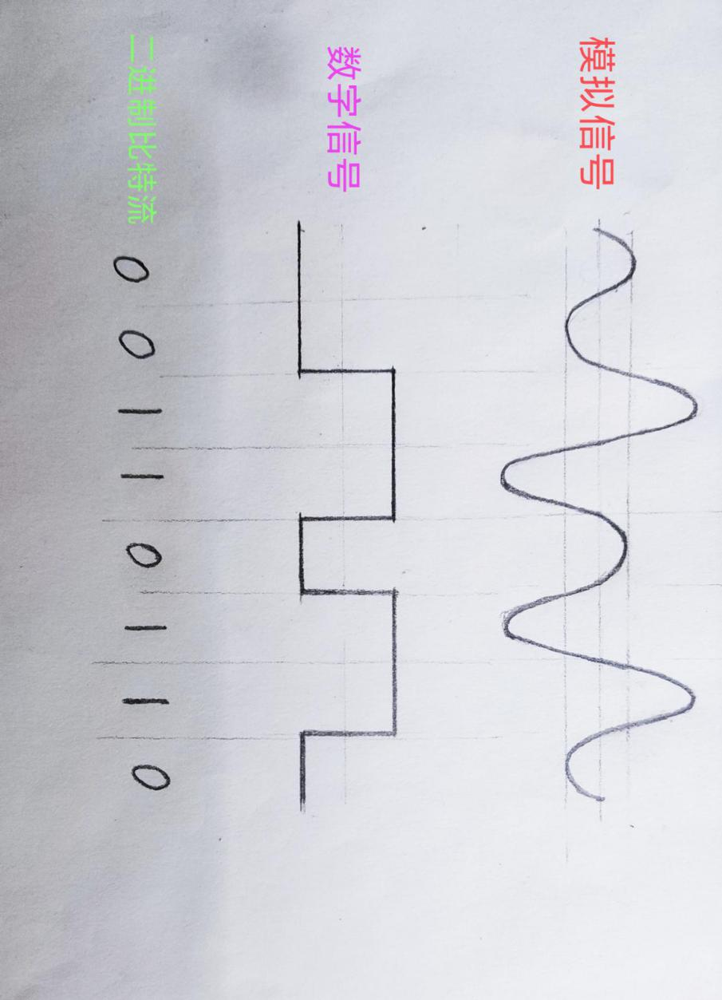

一个字节的比特流

我们日常生活中见到的条形码、二维码，也是基于二进制。条形码由多个宽度不等的黑条和空白组成，有对应的编码规则。黑色和白色反射率相差很大，所以当扫描器发出的光在条形码上反射后，扫描器内部的光电转换器能把强弱不同的反射光信号转换成相应的电信号，最终转换成0和1的比特流。

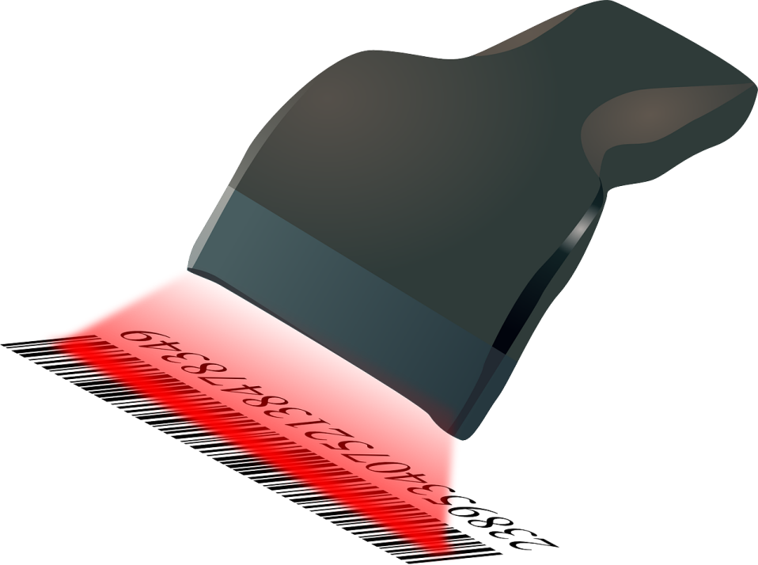

二维码利用很多黑点白点表示二进制数据，相比一维的条形码数据量更大，可以表达更复杂的数据，如网址、文字、图片等。此外，二维码还有两个特性：

1 定位标记。这使读码机器无论从哪个方向扫描，都能够快速地识别解读。

2 容错机制。即便二维码有污损，在信息缺失不大的情况依然能被正确解读。

文字编码类型

电子设备之间的信息通过发送数据包传递。我们可以把数据包看作设备之间的“虚拟快递”，数据包的头部信息包含

IP、MAC编号、端口号、校验码 等信息，如同快递单上的

地址、手机号、姓名、商品重量 等信息。

数据包中的文本数据经过不同格式的编码解码，最终以人能看懂的字符形式在屏幕上显示出来。最常见的是ASCII 码，可以表示大小写字母、数字、以及一些符号，共计128种字符；中文字符有7万多个，无法通过ASCII码表达，有专属的一些编码方式，如GB2312、GBK、GB18030等。

不同语言需要不同编码，这就导致同样的数字可能被解读成不同的含义。比如，有时文档中会出现一些莫名奇妙的乱码，这就是编码错误的问题。

为此，计算机领域制定了一个公认的标准编码——Unicode码，又称万国码，为每种语言中的每个字符设定了唯一的二进制编码，以满足跨语言、跨平台的文本转换需求。Unicode码的单个字符长度是ASCII 码的两倍，两个字节（16 bit）。

下图以ASCII 码为例（只看第1列和第5列即可）

声音、图片、视频，如何表示

声音本质上是一种能量波，由物体振动产生。

当一个物体收到击打时，实际上会有很多具体部位同时振动，因此人听到的声音是很多波的叠加效果。将声波分解，就会像下图这样（实际更复杂）

话筒可以将声音转换成电信号。声音引起话筒的振膜振动，继而引起磁场或电容变化，产生不同强度的微弱电流。之后，音频电子设备便将电信号转换二进制的比特流。类似文字有不同编码，声音的比特流也有不同编码，如MP3，AAC，WAV，WavPack(WV)等。

电子屏幕上显示出来的图片实际由很多“像素点”组成，放大看的话是肉眼难以察觉的细小方格。如显示分辨率为2340 x 1080的手机，屏幕就是2340 x 1080个像素点。分辨率数值越大，所能表现的图片清晰度就越高。

电子设备的显示屏可以精确控制每一个像素点，每个像素的颜色和亮度由对应的红、绿、蓝三种光元件叠加控制（详细参考RGB颜色标准）。每个颜色的光元件电信号取值范围在0 - 255之间，占8个比特位（1字节）。

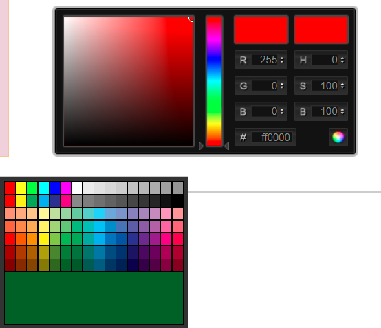

实际应用中常以16进制的数字代表RGB的具体颜色

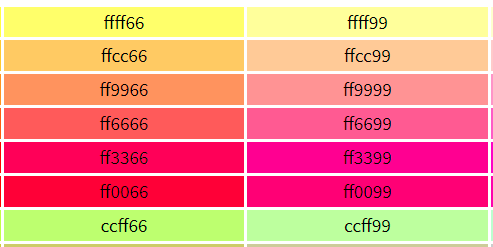

数字代表RGB颜色，可以代表一个像素，而众多像素组成一张图片。因此，电子图片实际上就是一定格式的数字，对计算机而言就是0和1的比特流。

图片也有不同类型的编码，常见的有jpg，png，gif，svg，psd等。

视频由一系列静态图片依次快速显示形成，这些图片又被成为“帧”，帧率（FPS，每秒帧数）超过24时人眼便难以察觉出静态图片，帧率越大动作画面就越流畅，其中的差别较大的几张图片称为“关键帧”。

图片构成视频，因此，视频对计算机而言也是0和1的比特流。

视频常见的编码格式有mkv、mp4、mpeg、avi、mov、wmv等。

从二进制，到文字、声音、图片、视频，啰嗦了这么多，都是为了下面这几句话做铺垫：

一句语音，可以录音转换成音频文件，经过压缩提取变成非常短的比特流，得到音频特征；

和语音内容相同或相近的文字，经过压缩提取变成非常短的比特流，得到文本特征。

把这个音频特征和文本特征相匹配，就是语音转文字或文字转语音。

把一种语言的文本特征和相同含义的另一种语言的文本特征相匹配，就是翻译。

图片也类似，先黑白化处理去掉颜色信息，再经压缩提取变成非常短的比特流，得到图片特征。把图片特征和对应的文字标签相匹配，就是图像识别。而图像识别的准确率是上一章介绍的自动驾驶的命门。

机器学习

机器学习是人工智能的核心，涉及高等数学、线性代数、概率统计等多种学科。使用各种算法解析和分类数据，然后对具体的某件事做出最优决策或预测。它涉及的算法非常多，不同算法擅长解决不同类型的问题。

翻译成人话，机器学习就是计算机自动确定感知机参数的过程（稍后介绍什么是感知机）。

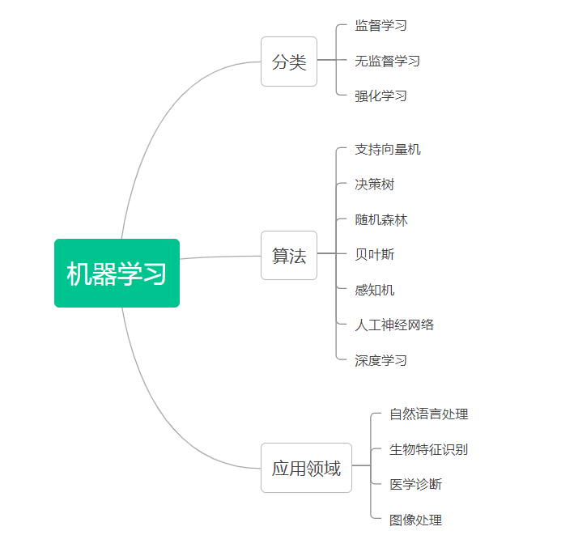

监督学习从人工标记好的训练数据集中设计出一个函数（或者叫做程序模型），当新的数据到来时，可以根据这个函数预测结果。

无监督学习与监督学习基本类似，不同的是训练数据未经人工标记或分类，程序自行去分类识别。结果难以预测，效果无法量化评估，但有助于发现异常的数据，有时会有意外收获。

强化学习也被称为近似动态规划，不同于监督学习和无监督学习，最大的特点是在学习过程中没有正确答案，通过不断试错，得到奖励（加分）或惩罚（减分）来学习，为某一问题（比如下棋、电子游戏）制定最优策略。强化学习主要包含两种模拟对象，一个是决策者（有的称之为智能体），另一个是环境。决策者面对环境，根据观测条件作出动作，会从环境得到奖励和反馈。

感知机

感知机是对生物神经突触的简单模拟，也被称为单层的人工神经网络。可以接受多个输入参数，但输出只有一个信号。下图是有两个输入参数的感知机，圆圈代表神经元，箭头代表神经网络。

感知机

x1、x2是输入信号，y是输出信号，w1、w2是信号的权重，权重越大，对应的信号的重要性越高。输出的结果只有两种，我们可以赋予它不同含义，比如 0代表否，1代表是。可以用函数表示为：

θ是一个临界值，超出这个值则代表“激活神经”。

下面，我们先设计一个判断是否是猫的 感知机，x1、x2代表两个描述特征，

w1=0.6、w2=0.3、θ=0.55（当然也可以是其他值）

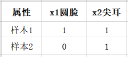

输入样本1的数据（x1=1，x2=1），根据函数计算1x0.6+1x0.3 > 0.5，故y=1，样本1被感知机判断为 是猫。

感知机的特点适合模拟与门、或门等逻辑电路，通过复杂的组合甚至可以模拟计算机处理器（CPU）。感知机的网络（图中表示权重的线或箭头）只有一层，如果改进一下，增加一层，它的功能会有很大提升。

神经网络

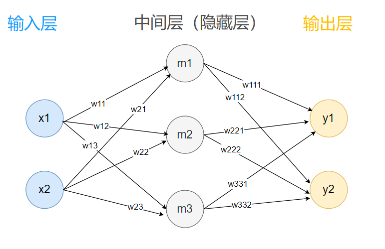

神经网络

上图是一个简单的两层神经网络，形状看起来像多层感知机。两者的区别主要有以下几点：

1 感知机的权重由人工设定、调整，从而达到符合预期的输出；神经网络的权重由它自己从数据中学习得出，最终找到合适的权重。

2 感知机只有一层网络；神经网络有两层以上网络，输入层和输出层之间的为隐藏层。

3 感知机的神经元之间传递的是0或1的二元信号；神经网络中传递的是连续的实数值信号。因此，两者使用的函数也不一样，神经网络用到的更加复杂多样。

依然以上图为例，输入样本1的数据（x1=1，x2=1），隐藏层m1、m2、m3这些神经元的值可能是小数，无需关注，输出值也不再局限为0或1。随便假设一个结果，如y1=0.8 代表喜欢挠东西的概率，y2=0.33 代表喜欢摇尾巴的概率。

神经网络

实际应用中，神经网络非常庞大，其权重参数高达几十万甚至几十亿个，这就比较考验计算机的性能了。神经网络的分布特点恰好适合矩阵运算，用矩阵来代表神经元和权重参数的值。

矩阵运算可以分布式并行计算（请参考《线性代数》），而并行计算是图形处理器（GPU，又称显卡）的强项，所以有些公司为追求更高的性能，干脆自己设计适合机器学习的芯片。他们所说的训练模型或自主学习，指的就是神经网络中确定合适权重参数的过程。

卷积神经网络

卷积神经网络（Convolutional Neural Networks, CNN）适合图像识别、语音识别等任务。正如它的名字，算法过程确实很卷，而且是内卷。相比神经网络多了卷积层、池化层，通俗地说，它会对图片先做缩略处理，假设300\*300像素的图片，一直缩略（内卷）到3\*3=9像素，最终的这9个像素点便可以看作原图片的特征值，当作神经网络的9个输入参数。若两个图片相似，其特征值也会比较相似。举个假设栗子：

两张手写体数字1的图片特征分别是：

010 010 010,

010 010 011

两张手写体数字3的图片特征分别是：

011 011 111,

111 011 111

两张手写体数字7的图片特征分别是：

111 001 000,

111 001 010

可以看出来，同类数字的特征值“长得比较像”，不同类的差别就会大些。

数字1和3的特征：

010 010 010，

011 011 111

数字1和7的特征：

010 010 010，

111 001 000

苹果官网有一些可免费下载的机器学习模型，感兴趣的读者可以去看一下

机器学习 - Apple Developer

https://developer.apple.com/cn/machine-learning/

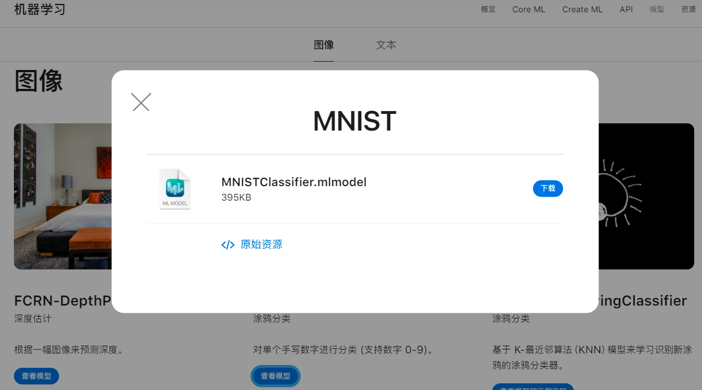

机器学习 - 模型 - Apple Developer

关于深度学习，笔者了解不深。它的定义目前没有统一标准，姑且理解为 很多层神经网络构建成的模型吧，数学上把它看作一个多变量复合函数。根据逼近论，一个复杂的函数可以通过复合多个简单的函数来逼近（代替）。

一般的神经网络只有几层，深度学习则高达到十几层，参数数量爆炸式增长（假如每个神经元有10条分支，第10层就是1010 =100亿）。

深度神经网络的调参是一项比较艰巨的任务，不但需要经验，还需要运气。因为一个参数的调整有可能牵一发而动全身，引发模型“雪崩”，分分钟让你回到解放前。

AI寄语

人工智能（AI）的发展进入新世纪，掀起了新的“淘金热”。不少人燃起了淘金梦，以为有快钱，不过大都成了群体狂欢之下的炮灰。因此，不要盲目跟风互联网+、AI+，贸然进入大概率会搭进去身家。大多数普通人不是富二代，没有很多试错机会，迈入新的领域步子应当小一些。

AI是一个助手工具，不是到处抢人类饭碗的竞争者。它会提高人类的工作效率，将人们从机械繁琐的重复性工作中解脱出来，投入到更有意义的事情当中。如果无视新岗位的涌现，那么就会理所当然地认为AI使很多人失业。

蒸汽机时代，大量手工纺织者失业了；

内燃机时代，很多人力车夫失业了；

互联网时代，很多纸媒报社倒闭了。

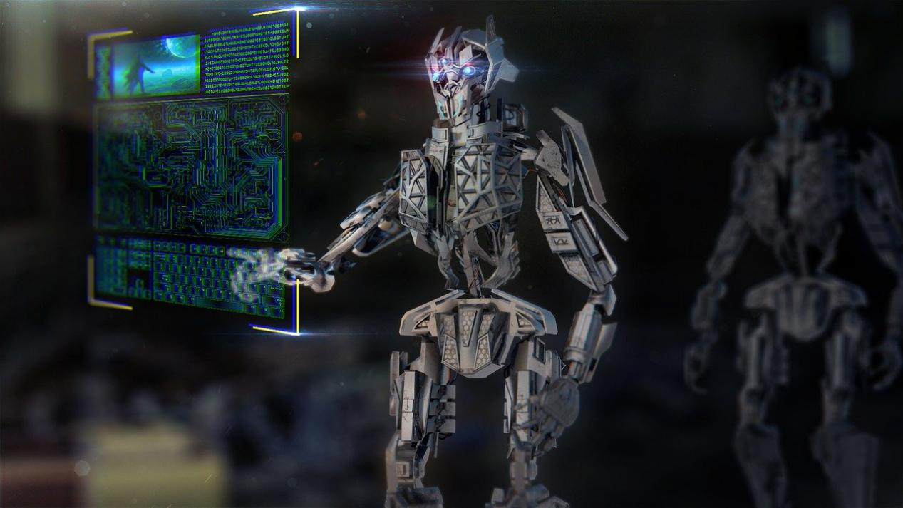

人类相比AI，仍有一些无法替代的优势，比如人际沟通、社交、运动、设计创造等。AI可以帮你更好的运动，告诉你哪个动作不对，但无法替你运动；可以帮你做跨语言的翻译，但无法替你沟通；可以帮你更快速地渲染、上色，但无法替你去创造设计。

AI的功能很强大，但它没有法律意识和道德感，放任自流的话会变成暴走的野兽。因此主导权不能交给它自己，需要限制在人手中、法律伦理的框架之内。

时代在变，一次充电终身放电的年代已经落幕。天地万物，日月星辰尚且不断变化，人类如何能置身事外呢？

## 电池与氢能

电池的种类繁多，本书仅介绍主流的化学电池，其他的略过。当前电池技术的总趋势是 使用寿命、能量密度稳步提升的同时成本逐步下降。

锂电池家族

能量密度(Energydensity)指单位体积或质量的物质中储存能量的大小。对电池而言，能量密度越高，意味更小的体积、更多的能量存储，但受限于技术条件和安全控制水平，实际低于理论值。锂电池的能量密度不是最高，但在生产工艺、成本、使用寿命等方面优势明显，成了电池领域的佼佼者。

锂电池是以含锂的化合物作正极，石墨或其他碳材料作为负极的一种可充电电池。按正极材料分类的话，主要有镍钴锰（三元）锂电池，磷酸铁锂电池，钴酸锂电池，锰酸锂电池等（均已商用）。

其中，能量密度的最高的是三元锂电池，低温性能相对较好；磷酸铁锂安全性高，成本低，但是能量密度也低，低温性能差。

此外，有个更具前景的锂系电池崭露头角——锂硫电池。理论能量密度是三元电池的5倍以上，且更加环保廉价，低温性能良好。受限于一些技术难点，目前还无法量产，好在捷报连连，有望比氢燃料电池更早一步商用。

举两个具体例子：

Li-S电池的两个电极具有不稳定性，导致电池的循环寿命短。对此，莫纳什大学Mainak Majumder教授团队提出了一种糖基粘结剂体系。通过设计实验，验证了该体系可大幅提高Li-S电池的性能，Li-S电池在循环达到1000次(9个月)后，硫利用率可达到97%，且容量保持约为700 mAh/g。

相关研究成果以“A saccharide-based binder for efficient polysulfide regulations in Li-S batteries”为题发表在Nature Communications上。

材料公司Lyten（官网https://lyten.com）推出LytCell EV™锂硫电池，能量密度是传统锂电池的三倍，约900Wh/kg；充电速度快，不超过20分钟；可在零下30至零上60摄氏度的环境下安全有效地运行。

技术核心是Lyten 3D石墨烯®，可以解决多硫化物穿梭问题，原型设计超过1400次循环。

总之，这家公司的锂硫电池性能参数描述的非常诱人，但又是3D又是石墨烯，仅凭查到的部分资料笔者无法确认该公司的可信度，姑且保留些怀疑。

锂电池的应用非常广泛，比如手机、平板、笔记本电脑等移动设备中的电池部件。随着它的生产成本下降，拓展到了电动汽车领域。目前电动汽车每度（千瓦时）电的电池储能成本是1400元左右。50千瓦时的电池组价格高达7万元。

十年间（2010年起），锂电池的市场售价下降了89%，平均每年下降20%，这一状态未来仍会持续。2025年，50千瓦时的电池组价格有望降至2.3万元。

这并不是盲目乐观，因为当前主流的电池设计方案，约有1/2的体积和1/3的重量没用来存储能量，改进空间很大。

把锂电池在汽车上发扬光大的是特斯拉，它具有非常强大的工程设计能力，在2020年发布了锂电池中的杠把子——4680电池，预期2022年量产，是第一款真正意义上使电动汽车比燃油车更具成本优势的电池。

电动汽车在历史上曾经有过辉煌时代。

1900年，以蒸汽、电力或汽油为动力的汽车在4200辆汽车中分别占比40%、38%和22%。1905年，电动车辆的占比超过50%。传统观点认为，汽油车胜出是因为更低的成本，但有新的证据分析表明，电力基础设施是电动汽车当时推广受限和发展停滞的关键。

2015年，国务院发布了《中国制造2025》，对动力电池的发展做出规划：2020年，电池能量密度达到300Wh/kg；2025年，电池能量密度达到400Wh/kg；2030年，电池能量密度达到500Wh/kg。

尤其值得期待的是400Wh/kg，这是电池在航空飞行器上商用的一个基本条件。马斯克曾表示，电池达到400Wh/kg的能量密度才能实现可行的商业电动飞行，并且他认为，这将在3 - 4年内成为可能。

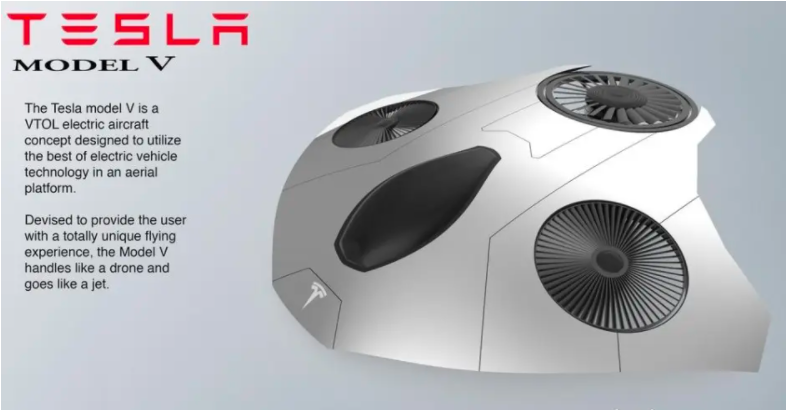

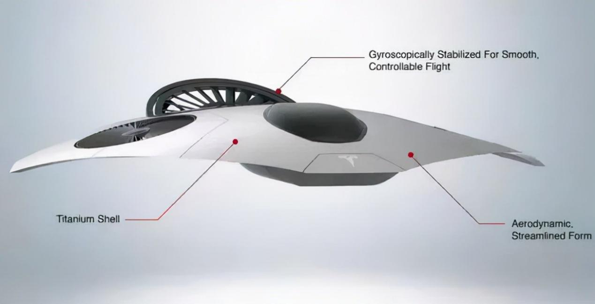

氢燃料电池

燃料电池，是通过氧化还原反应将燃料的化学能直接转换成电能的装置，有很多种类，按电解质分类有：

碱性氢燃料电池（AFC）、质子交换膜氢燃料电池（PEMFC）、磷酸氢燃料电池（PAFC）、熔融碳酸盐氢燃料电池（MCFC）、固体氧化物氢燃料电池（SOFC）等。现在多指以纯氢为燃料的固体高分子型质子交换膜燃料电池（PEMFC），技术最成熟，具有能量转化率高、噪音低、低温启动、环保等优点。

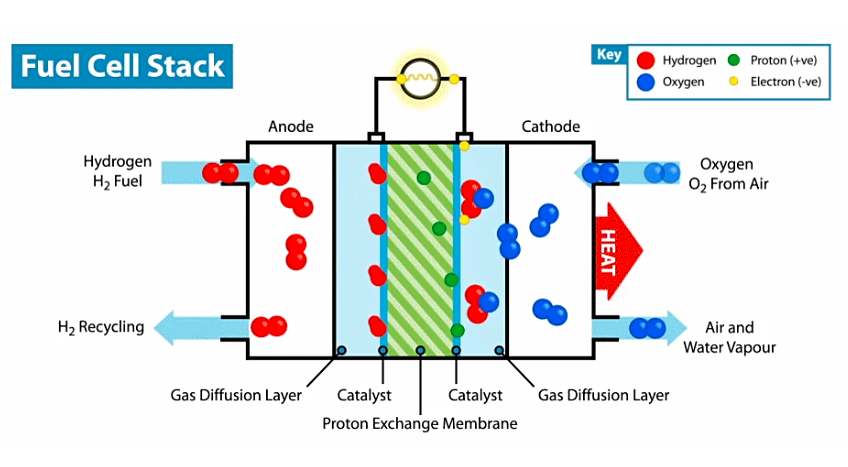

氢燃料电池最近几年才走进大众视野，不过它很早就诞生了，1969年载人登月的阿波罗飞船就用到了它。如今过去了半个世纪，燃料电池的成本大幅下降，它将从航天领域走进千家万户，书写人类能源的新篇章。

与锂电池产业链相比，氢燃料电池产业涉及范围更广，经济体量更大，创造的就业岗位更多。既符合我国碳中和战略，又有利于解决我国能源安全问题，非常值得大力发展。

车载氢燃料电池系统，一般采用质子交换膜燃料电池（PEMFC）技术。由燃料电池堆、氢气储罐、动力电池、直流升压转换器、动力控制器和电机等部件组成。目前成本最高的部分是电池堆（尤其是使用贵金属铂的质子交换膜）和储氢罐。

氢燃料电池的成本目前高于锂电池，但是它的续航里程、补充燃料速度、使用寿命、低温性能等方面具有明显优势。因此，氢燃料电池正在卡车、公交等领域逐步取代传统燃油车，赶超电动汽车。

电量的存储对各个国家来说都是老大难问题。由于无法长时间有效存储，2020年我国全国弃风电量166.1亿千瓦时，弃光电量为52.6亿千瓦时，弃水电量301亿千瓦时。而氢气是目前公认的最为理想的能量载体和清洁能源，热值是汽油的2.8倍，应该可以有效解决过剩电量无处安放的问题。

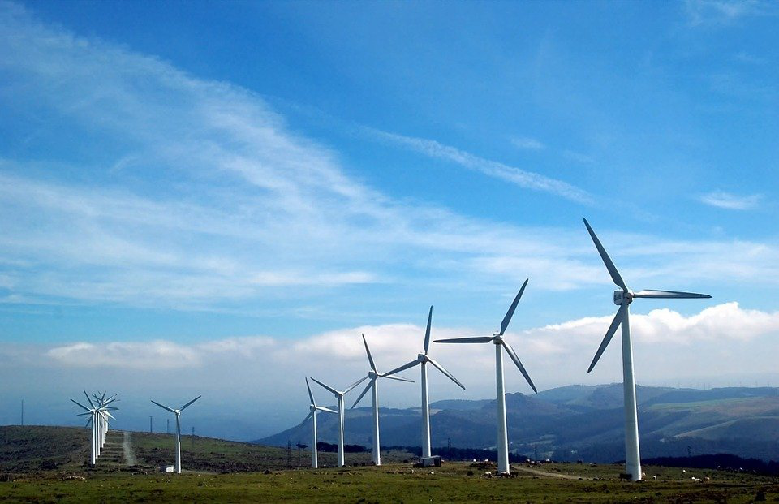

当前瓶颈：制氢，运氢，储氢，电堆。

从一定角度看，氢燃料是一种未来时代的能源，未来的超导电机和液氢燃料电池更是绝配，二者结合有可能使交通工具发生质的飞跃。

制氢的方式主要有：化石燃料制氢、化工副产制氢、生物制氢、电解水制氢等。前两种是目前的主要制氢方式，后两种虽然对环境友好，但工艺还需提升。

我国工业氢气提纯具备充足的氢资源，年产氢约2200万吨，占世界氢产量的三分之一，是世界第一产氢大国。

氢气的运输方式有多种，短距离最适合管道运输，长途适合LOHC（液态有机氢载体）方式，管束车或低温液态输氢也可以，但是成本较高。

不少业内人士看好电解制氢方向，认为清洁、可持续的太阳能光电制氢可能是终极制氢方案。当用电价格为0.50元/kWh时，电解水制氢的成本和汽油相当。低于此价格时便能确立成本优势。如果加氢站分布式电解制氢，能进一步减少运输环节的成本。

截至2021年3月末，我国加氢站已建成131座，在建65座，规划中122座，加氢站建设进入快速发展阶段。

其他电池

铅酸电池

电极主要由铅及其氧化物制成，电解液是硫酸溶液。放电状态下，正极主要成分为二氧化铅，负极主要成分为铅；充电状态下，正负极的主要成分均为硫酸铅。优点是电压稳定、价格便宜；缺点是能量密度低、重量大、使用寿命短。老式铅酸蓄电池一般寿命在2年左右，而且需定期检查电解液的高度并添加蒸馏水。

由于成本低廉，这种电池在照明、通讯基站、电动两轮/三轮车等领域应用广泛。

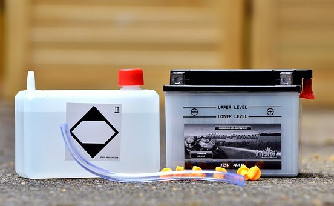

一次性干电池（又叫锌锰电池）

干电池有100多种种，如锌-锰干电池、镁-锰干电池、锌-空气电池、锌-氧化汞电池、锌-氧化银电池、锂-锰电池等。锌锰干电池是以糊状电解液来产生直流电的一次性化学电池。中心是正极碳棒，外包石墨和二氧化锰的混合物。最外层是负极金属锌皮筒。常用于手电筒、收音机、遥控器、电子钟表、玩具等。

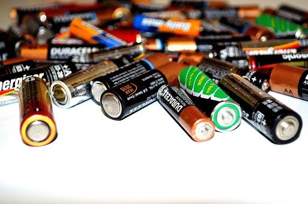

早期的干电池含汞等有毒重金属，不过国家出台了政策，从2005年起停止生产含汞量大于0.0001%的碱性锌锰电池。如今，随着技术和生产工艺的进步，大多数干电池主要含铁、锌、锰等元素，已不再含汞、铅等重金属。

固态电池

是一种使用固体电极和固体电解质的电池。由于不含任何液体，相比于传统的锂离子电池，安全性和能量密度都更高。不过，当前固态电池还停留在实验室阶段，造价高昂。

固态电池颇具前景，是锂电池时代后群雄逐鹿的新战场。中日韩和欧美国家对此均有各自的发展目标和产业技术规划：2020 - 2025年着力提升电池能量密度并向固态电池转变，2030年研发出商业化全固态电池。

钠离子电池

能量密度与磷酸铁锂电池相近，在低温性能和快充方面更具优势。工作原理与锂离子电池相似，使用钠离子在正极和负极之间移动来存储或释放电能。钠离子电池使用的电极材料主要是钠盐，相较锂盐而言储量更丰富，价格更低廉。目前工艺技术基本成熟，有望在大规模储能中取代传统铅酸电池。

镁电池

以镁为负极，某些金属或非金属氧化物为正极的电池。现在常见的种类有镁锰干电池和储备型电池（使用时加清水或海水使之活化，活化后半小时内即可使用，主要供军事通信、气象测候仪、海难救生等使用）。

铝离子电池

工作原理与锂离子电池相似，使用铝离子在正极和负极之间移动来存储或释放电能。优点是超快充电、安全性高、成本低廉。

铝离子电池由于其多电子转移反应具有较高的理论比容量，但研究还处于初期阶段。目前的大多数研究都集中在正极反应，特别是针对碳基材料及过渡金属硫化物。虽然正极材料的比容量及循环稳定性已有所突破，但尚无法满足商业化的需求。

钾离子电池

钾离子电池的工作原理与锂离子电池类似。钾（地壳总量的2.6％）的储存量远高于锂（地壳总量的0.0065%），并且钾的金属、碳酸盐和层状氧化物比锂的金属、化合物的价格更便宜，因此被视为锂离子电池的合适替代品之一。

钾离子电池优点是成本低、工作电压高，具有大规模储能的潜力。缺点是低比能（单位质量所具有的能量），循环寿命和安全性较差，实现商业化仍有巨大挑战。

生物燃料电池

生物燃料电池是利用酶或者微生物组织作为催化剂，将有机物燃料的化学能转化为电能的装置。

1911 年,英国植物学家 Potter 用酵母和大肠杆菌进行实验，宣布利用微生物可以产生电流，标志着生物燃料电池的开始。

2007年，索尼宣布开发出了一种生物电池，利用酶作为催化剂，通过活性有机体产生能量，在碳水化合物（糖类）中生成电流。该款电池以葡萄糖溶液为燃料，体积39立方毫米，输出功率为50毫瓦。

航天领域对生物燃料电池也颇为青睐——用航天员的尿液来发电，一举两得。

生物燃料电池对环境十分友好，安全无污染，只是目前绝大多数研究停留在实验室阶段，商用还很遥远。

太阳能电池

可以把太阳的光能直接转化为电能的电池，分类有硅太阳能电池、有机化合物太阳能电池、无机化合物半导体太阳能电池等。

太阳能电池（又名光伏电池）应用范围地域广泛，从遥远的太空到荒凉的沙漠，有阳光的地方就能发电，绿色无污染（不计电池板的生产环节）。缺点是容易受天气影响，发电效率低，占地面积大，成本回收周期长。

有确切文字记载的人类发展史有三千多年，人类至今仍无法仿制出媲美一片树叶的电池。笔者认为，最环保高效的“太阳能板”是植物的绿叶，具有高效的空间布局和多样化的覆盖方式；最安全的储能物质则是植物合成的糖、脂肪、淀粉等，不会短路，也不会爆炸。当然，这么说有点儿不公平，毕竟植物本身就代表了绿色环保，谁能赢得过裁判？
